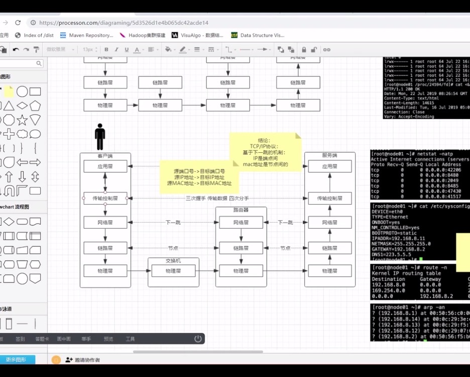
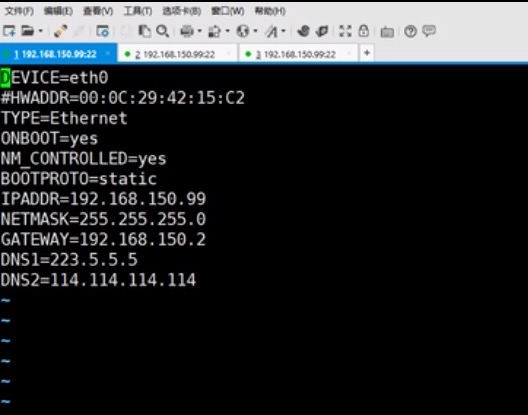

# 概述

1. 内核是什么与工程师的关系？
2. 网络通信原理？
3. tcpdump抓包验证网络通信流程？
4. IO和内核/网络的关系？


# 1.硬件与内核

计算机结构和内核：


> 1. 计算机程序执行需要将程序从硬盘读取到内存中，然后加载入缓存供cpu加载执行；
>
> 2. 内存在系统启动后会分空间：内核空间（内核态）、用户空间（用户态），操作系统会被加载到内核空间，然后会有一个GDT（[Global Descriptor Table](https://link.zhihu.com/?target=http%3A//wiki.osdev.org/GDT)）全局描述表，在x86cpu架构中用来存储内存的分段信息，GDT可以放置在内存中的任意位置，Inter设计者提供了一个寄存器GDTR用来存储GDT的入口地址，程序员将GDT存放入内存中某个位置后，可以通过`LGDT`指令将GDT的入口地址存放入GDTR中，之后CPU就可以根据GDTR中存放的地址来访问GDT了，GDTR中存放的是GDT在内存中的基地址和其表长界限；
>
>    操作系统将GDT注册入寄存器中，内核态的级别高于用户态，内核态可以访问用户态，用户态不能随便访问内核态。
>
>    内核向外暴漏syscall，而操作系统api的是对syscall的进一步封装，Java的native方法就是调用操作系统c的api接口。
>
>    查看内核的syscall：
>
>    ```shell
>    yum install man man-pages
>    man 2 read   #查看2类文档是系统调用的
>    ```
>
>    
>
>    > 参数fd（file description）表示一个文件描述符，操作系统由于和Java不同不是面向对象的，通常使用一个数字代表一个IO；
>
>    当用户应用程序要做一些如io的操作时要调用syscall交给内核去操作硬件完成。
>
>    
>
> 3. 用户态和内核态切换
>
>    以tomcat应用程序为例，tomcat启动和运行过程中会不断进行io操作，这个io操作在Java底层最终调用native方法，是操作系统用c封装的api，交给kernal执行，这就是一个用户态和内核态的切换。
>
>    在多任务操作系统中，任务交替执行。切换原理：cpu中有一个硬件“晶振”，当电流流过后，固定的每秒震动n次，cpu根据这个震动进行时间中断来切换任务，当震动n次后cpu会将kernal注册的调度程序（调度算法）读起，此时如果tomcat在运行，cpu就会进行保护现场，将tomcat在缓存中的数据刷回内存中，将调度程序读入缓存，并计算任务数然后随机选择一个进行调度将其恢复现场。
>
> 4. 零拷贝
>
>    内核态和用户态的切换以及保护和恢复现场效率低，当用户程序读取一个磁盘的文件内容时通常是：
>
>    应用程序调用syscall，进行内核态和用户态切换（应用程序阻塞内核执行），此时kernal去磁盘读取文件到内核空间中，然后将文件再拷贝到用户空间。
>
>    查看零拷贝
>
>    `man 2 sendfile`
>
>    
>
>    sendfile这个syscall传入一个输入和输出文件描述，如果是网卡和磁盘间，直接读取磁盘文件到内核态，然后发送网卡，不需要再拷贝到用户空间。
>
> 5. 网络连接
>
>    再linux中一切皆文件，一个io流也是映射成一个文件，而io流有三种：标准输入0、标准输出1、错误流2。
>
>    ```shell
>    cd /proc/$$/fd		#prod表示操作系统内核映射的一个路径，$$表示当前的进程，fd表示文件描述符
>    ll					#会输出文件描述符，任何应用程序都有三个0，1，2
>    exec 8<> /dev/tcp/www.baidu.com/80		#<>表示输入输出，8表示当前建立tcp连接的文件描述符
>    echo -e "GET / HTTP/1.0\n" >& 8			#向8发送http请求
>    cat 0<& 8								#8返回请求结果输入到0，打印再屏幕
>    ```
>
>    
>
>    通过`cd /proc/$$/fd`进入当前进程文件描述符目录，列出当前目录的文件描述符，0，1，2是任何一个进程都有的。
>
>    然后执行`exec 8<> /dev/tcp/www.baidu.com/80`向百度建立tcp连接，可以看到该目录下多了一个8的文件描述符，用来映射表示连接百度的tcp。
>
>    
>
>    建立连接后，通过`echo -e "GET / HTTP/1.0\n" >& 8`命令，通过8这个tcp连接，向百度发送一个http请求，然后通过`cat 0<& 8`命令，将8的返回信息通过标准输出流文件描述符0打印到屏幕。
>
> 

# 2.计算机网络

> OSI七层网络模型，分层用于解耦，每层只负责该层任务。


> TCP/IP协议是实际的计算机网络实现，分5层。
>
> 应用层：运行再用户空间，是各应用（tomcat等）使用的协议层，具体协议如HTTP、FTP等。
>
> 传输控制层、网络层、链路层、物理层：运行在内核空间，是操作系统提供的能力。



## 2.1 应用层HTTP协议

应用层不做传输功能，只负责按照协议拼接好字符串，然后调用传输层。

编程过程中，服务端要new一个ServerSocket，客户端要new一个Socket，然后通过socket即将信息发送出去。因此应用层有一个字符串要发送也要先阻塞，要先去调用内核建立tcp连接。

## 2.2 传输控制层协议TCP/UDP协议

> TCP是可靠的面向连接的协议：面向连接指所有的请求都有一个确认的反馈（确认机制）。**面向连接表示可以理解为通过三次握手之后，两端开启了对象和资源。可靠指在传输过程中的请求-确认机制。**
>
> 无连接和面向连接的区别：两个概念都不是指具体的物理介质本身，而是指在物理介质上如何传输数据。**对无连接来说，每个数据分组都独立于其他数据分组。而面向连接指的是，面向连接的协议实现了维护与后续分组有关的状态信息。**
>
> 无连接：分组叫做数据报（datagram），网络会尽最大努力传送每一份数据报，但不保证数据包不丢失、不延迟或者不错续传输。
>
> 面向连接：面向连接的协议则维护了分组之间的状态，使用这种协议的应用程序通常会进行长期对话。记住这些状态，协议就可以提供**可靠传输**。

### 2.2.1 TCP三次握手和四次分手

[TCP三次握手四次分手详解](https://baijiahao.baidu.com/s?id=1654225744653405133&wfr=spider&for=pc)


> 三次握手后会建立tcp连接：
>
> - 序号（sequence number）：Seq序号，占32位，用来标识从TCP源端向目的端发送的字节流，发起方发送数据时对此进行标记。
>
> - 确认号（acknowledgement number）：Ack序号，占32位，只有ACK标志位为1时，确认序号字段才有效，Ack=Seq+1。
>
> - 标志位（Flags）：共6个，即URG、ACK、PSH、RST、SYN、FIN等。
>
> 1. 应用层调用需要建立一个连接，此时客户端传输控制层就会产生一个SYN握手包，发送给服务端；
>    - 标记为为SYN，表示请求建立一个新连接；
>    - 序号Seq=X（X通常为1）；
>    - 随后客户端进入SYN-SEND阶段；
> 2. 服务器端接收到来自客户端的TCP报文之后，结束LISTEN阶段。并返回一段TCP报文，其中：
>    - 标志位为SYN和ACK，表示“确认客户端的报文Seq序号有效，服务器能正常接收客户端发送的数据，并同意创建新连接”（即告诉客户端，服务器收到了你的数据）；
>    - 序号为Seq=y；
>    - 确认号为Ack=x+1，表示收到客户端的序号Seq并将其值加1作为自己确认号Ack的值；随后服务器端进入SYN-RCVD阶段。
> 3. 客户端接收到来自服务器端的确认收到数据的TCP报文之后，明确了从客户端到服务器的数据传输是正常的，结束SYN-SENT阶段。并返回最后一段TCP报文。其中：
>    - 标志位为ACK，表示“确认收到服务器端同意连接的信号”（即告诉服务器，我知道你收到我发的数据了）；
>    - 序号为Seq=x+1，表示收到服务器端的确认号Ack，并将其值作为自己的序号值；
>    - 确认号为Ack=y+1，表示收到服务器端序号Seq，并将其值加1作为自己的确认号Ack的值；
>    - 随后客户端进入ESTABLISHED阶段。

三次握手原因：通信是双向的，为了防止服务器端开启一些无用的连接增加服务器开销以及防止已失效的连接请求报文段突然又传送到了服务端，因而产生错误。

> 四次分手：
>
> 
>
> 计算机操作系统的端口号是6535个数量是有限的，Java中的io都现象映射成操作系统的文件描述符，1G内存大概可以创建10w个文件描述符，因此有在不适用时要释放资源。
>
> 通信是双向的，再加上tcp可靠传输的基石——”请求-确认“机制，断开连接双发都要发送一个请求，而另一方要对请求回一个确认，因此要四次分手后才断开连接释放资源。

### 2.2.2 抓包展示

安装抓包工具tcpdump   `yum tcpdump`

打开两个窗口，其中一个窗口执行：`curl www.baidu.com`

另一个窗口执行`tcp -nn -i eth0 port 80`  （-n直接使用ip地址而通过域名服务器 ，-i表示interface监听eth0接口）


可以看到有三次握手，和数据请求确认以及四次分手。

查看所有socket连接：`netstat  -natp` (-n表示禁止使用http和80端口直接使用ip而不通过)域名服务器；-a表示显示所有连线中的Socket；-t表示显示tcp协议的连线状况；-p显示正在使用socket的程序识别码和程序名称。）


> 一个socket可以简单理解为“ip:port”,因此一个连接有四个维度，在BIO中一个连接会抛给一个线程执行，在上图可以看到sshd的几个连接进程，上图有LISTEN进程，当一个连接来后会fork一个进程，一个连接映射到操作系统上是进程级的（对应进程号PID）。左边是本机socket地址，右边是连接到的socket地址。


## 2.3 网络层

传输控制层，只负责产生握手包等，真正的数据传输，传输控制层会丢给网络层。

从网络层开始，之后每层都有一张表。

在网络层的协议是IP，IP可以表示网络中设备的地址；

查看网卡配置，`/etc/sysconfig/network-scripts`表示网卡配置目录，ifcfg-eth0表示“接口配置-以太网卡0"




> ip地址也叫点分字节，每个字节表示0-255，ip地址有两部分组成：网络号和主机号（ip地址前n位为网络地址，后m位为主机地址。子网掩码可以计算出m和n子网掩码1的个数为n）
>
> 上图表示第零号以太网卡配置信息，有以下几个重要维度：
>
> - IPADDR表示网络层的ip地址
> - NETMASK表示子网掩码：一台设备的地址包括其所在的网络地址（互联网表示网络互联）和主机地址，ip地址和子网掩码做按位与运算得到设备的网络地址。
> - GATEWAY网关，用于实现不同网络间通信
> - DNS域名解析

### 2.3.1 路由判定

查看路由表：`route -n`


路由表记录下一跳地址，第一条由网卡配置信息计算得到，网络层如何确定信息发送到哪里，主要通过”下一跳“方式，在网络中主机只要知道网络的跳点，将信息发送到下一个网络最终到达目标地址。**而网关Geteway就表示下一跳地址**。


> 例如访问百度，如何计算下一跳？
>
> ping百度域名可以看到百度ip地址为：61.135.169.125，拿这个ip地址和路由表条目的掩码做按位与运算，如果得到的结果和Destination一致，则下一跳就是该条路由记录的Gateway。
>
> 上图可以看到结果与第三条匹配，于时下一跳地址是：同局域网的192.168.150.2机器，由它做处理，这条路由记录也是默认网关。

这里产生了两个ip地址，网络层数据包只记录目标ip的地址，跳点地址需要丢给链路层。

## 2.4 数据链路层

链路层使用arp协议，查看链路层表，可以看到网关地址对应一个mac地址（网卡地址）：

`arp -an`如上图

因此数据传输最外层套的是网关mac地址，按照这个mac地址丢给网关，网关收到数据包后，再根据网络层目标地址计算出下一条地址记录在链路层中对给他的下一跳。

> arp开机时也是空的，开机后会走一个arp请求，最后得到arp网关信息。
>
> 
>
> 路由表通常会有一个默认的记录，记录这网关地址，在一个局域网内，链路层会向交换机发送一个arp请求，交换机的mac地址默认时全f，然后交换机会广播，最终对应网关的机器接受广播并返回一个mac地址给交换机，交换机再返回给请求主机。然后就有了默认的arp信息。

因此互联网中通信，各层是要阻塞等待下一层完成后才能继续。

通常，传输控制层产生握手包后阻塞 -> 然后网络层计算网关路由判定后阻塞 -> 链路层通过arp得到网关mac地址；之后再回到传输控制成拼接握手包，然后网络层准备数据包最后，最后链路层发出。

### 2.4.1 arp协议展示

首先删除arp结果记录：`arp -d 192.168.150.2`


然后发起http请求：


最后查看抓包结果：


> 可以看到在握手前先走了arp协议获取网关mac。

总结：IP地址时端到端的不变，mac地址是绑定网关的地址，每下一跳都要更换。


# 3.通信I/O

## 3.1 I/O概述

BIO 、NIO 、AIO是由内核决定的，语言依靠内核提供的能力来进行网络I/O通信；

较原始的系统只提供了BIO的方式，一个连接走完计算机网络的四层，在内核中创建了一个socket，然后socket会调用tomcat，tomcat会抛出一个线程去专门处理这个连接，每一个连接都对应一个线程进行处理。或者操作系统fork出一个进程来处理这个连接。（这是一种同步阻塞的模型）

在NIO中，系统提供了一个select的系统调用(syscall),select会监控连接的文件描述符状态，看哪些是ready状态有数据到达。

通过`man 2 select`查看系统调用，该系统调用接受一个fd集合，并返回也给fd集合。


NIO流程：


上图是一个NIO连接处理过程：

当多个连接过来后，在内核中映射出一个fd，内核中一个syscall的select监控这些fd，被调用后会返回一个fd的集合，然后程序会有一个keys，拿到keys后然后在拿到channel进行处理。

当tomcat调用这个syscall时，会阻塞等待返回，返回后可以使用线程单独执行。

select和epoll的区别：


1. select和epoll区别在于select需要将监控的fd集合从用户空间拷贝进内核空间，当fd非常大时效率非常低，而epoll通过内核与用户空间mmap同一块内存实现的。

2. 同时select有限制连接描述符的大小为FD_SETSIZE=2048，而epoll没有限制，1G通常可以有10w个。

3. select每次回线程扫描全部集合的fd，而epoll只会对活跃的socket进行操作，。


