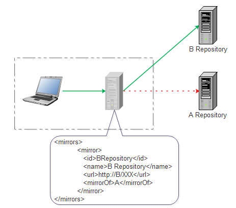

# 1.Maven（专家）基础

## 1.1 介绍

1. apache组织提供的一个顶级项目（apache项目由Java开发，顶级项目是根目录）；
2. maven是一个由Java开发的工具；
3. 作用：
   - 管理项目构建生命周期
   - 管理项目中的jar
   - 管理项目基础信息（文档管理、测试报告）


## 1.2 项目构建生命周期

- 一般流程：开发 、编译、打包、发布

  - 打包：jar包和war包

- 专业流程：

  清理(clean) -> 编译(compile) -> 测试(test) -> 报告 -> 打包 -> 发布

- Maven构建生命周期定义了一个项目构建跟发布的过程：
- 一个典型的Maven构建（build）生命周期是由一下几个阶段的序列组成的：
  - validate：验证——验证项目——验证项目是否正确且所有必须信息是可用的。
  - compile：编译——执行编译——源代码编译在此阶段完成
  - test：测试——测试——使用适当的单元测试框架（例如JUnit）运行测试；
  - package：包装——打包——创建JAR/WAR包，如在pom.xml中定义提及的包；
  - verify：检查——检查——对集成测试的结果进行检查，以保证质量达标；
  - install：安装——安装——安装打包的项目到本地仓库，以供其他项目使用；
  - deploy：部署——部署——拷贝最终的工程包到远程仓库中，以共享给其他开发人员或工程。
- Clean生命周期：
  - pre-clean：执行一些需要在clean之前完成的工作；
  - clean：移除所有上一次构建生成的文件；
  - post-clean：执行一些需要在clean之后立刻完成的工作；
  - 当我们执行mvn post-clean命令时，Maven调用clean生命周期，它包含以下阶段
- Default（build）生命周期：
  - 在开发环境中，使用下面的命令去构建、安装工程到本地仓库；
  - `mvn install`
  - 这是Maven的主要生命周期，被用于构建应用，包含23个阶段
  - 命令行调用；
- Site生命周期
  
  - Site插件一般用来创建新的报告文档，部署站点等；

## 1.3 项目中jar管理

1. jar包管理难度：
   - 定位较难
   - jar包之间依赖较难
   - jar之间冲突
   - jar管理

## 1.4 Maven如何管理jar(仓库)

[本地仓库] -> [局域网私服仓库] -> [中央仓库]

- 在 Maven 中，任何一个依赖、插件或者项目构建的输出，都可以称之为构件
- Maven 仓库能帮助我们管理构件（主要是JAR），它就是放置所有JAR文件（WAR，ZIP，POM等等）的地方

可配置镜像仓库


[repository和mirror区别](https://www.cnblogs.com/bollen/p/7143551.html)

mirror相当于一个拦截器，可以拦截对中央仓库的访问，并定向到指定的镜像仓库。<mirrorof>标签配置要被镜像的repository的id。



maven仓库的搜索顺序

当我们执行 Maven 构建命令时，Maven 开始按照以下顺序查找依赖的库 ：

- **步骤 1** － 在本地仓库中搜索，如果找不到，执行步骤 2，如果找到了则执行其他操作
- **步骤 2** － 在中央仓库中搜索，如果找不到，并且有一个或多个远程仓库已经设置，则执行步骤 4，如果找到了则下载到本地仓库中以备将来引用
- **步骤 3** － 如果远程仓库没有被设置，Maven 将简单的停滞处理并抛出错误（无法找到依赖的文件）
- **步骤 4** － 在一个或多个远程仓库中搜索依赖的文件，如果找到则下载到本地仓库以备将来引用，否则 Maven 将停止处理并抛出错误（无法找到依赖的文件）

## 1.5 maven项目信息管理

- 生成api文档
- 生成测试报告

一般测试人员使用，开发不用。

## 1.6 Maven安装于配置

1. 【安装】:解压即可使用，复制到没有中文和空格目录下
2. 【配置】：
   - 【JAVA_HOME】环境变量配置
   - 【MAVEN_HOME】配置到maven的b安装目录下
   - 【path】添加path %MAVEN_HOME%\bin

## 1.7 maven本地仓库

常用maven命令：`mvn clean`、`mvn compile`、`mvn package`

默认仓库位置在当前用户系统目录下的.m2/repository/，这个仓库在maven安装时不会创建，而是在maven命令第一次执行后创建。

Maven 本地仓库默认被创建在 %USER_HOME% 目录下。要修改默认位置，在 %M2_HOME%\conf 目录中的 Maven 的 settings.xml 文件中定义另一个路径。在`<localRepository></localRepository>`下指定仓库路径。

## 1.8 重新设置MAVEN本地仓库地址

maven安装目录下/conf/setting.xml中定位<localRepository>标签，配置本地仓库位置。

## 1.9 MAVEN工程结构

1. MAVEN可以管理工程，必须按照【约定结构】来创建

2. 结构（重点）：

   src目录:  (源代码)

   ​	|_main(主要开发)

   ​		|_java (开发Java文件)

   ​		|_resource （开发配置文件）

   ​	|_test （主要进行测试）

   ​		|_java (测试Java文件)

   ​		|_resource （测试配置文件）

   target目录: (编译后的class文件，在创建项目时，不需要创建。MAVEN命令执行时自动创建)

   pom.xml文件 （核心配置文件，从mavan中引入jar包）

## 1.10 MAVEN常见命令（项目构建周期）

1. `mvn clean`：删除当前工程中target

2. `mvn compile`：将当前工程中main文件夹下的所有Java编译为class，并输送到当前工程中的target中

3. `mvn test`：调用test文件夹下所有测试类总的所有测试方法，并生成测试报告。

4. `mvn package`：将工程中test文件夹下所有的Java测试类的方法调用执行进行测试生成【测试报告】

   如果测试成功，将main目录下的所有class文件打成指定格式包送到当前工工程的target目录下。

5. `mvn install`:于package命令执行基本一致，只是将打好的包推送到maven的本地仓库中。

6. `mvn deploy`:推送到远程仓库。

## 1.11 MAVEN坐标

用于唯一定位jar包

<groupId>域名反写</groupId>

<artifactId>项目名</artifactId>

<version>项目版本号</version>


# 2.Maven高级

## 2.1 解决jar包冲突

当在pom中通过坐标引入依赖时，如引入一个spring的依赖，此时会导入多个依赖包，当单独引入引入一个独立的包时会产生冲突

如下：spring-context依赖于spring-core,会自动导入一个5.0.2.REALEASE版本的spring-core。

而spring-beans也依赖于spring-core,而这个spring-core是4.2.4版本。

```xml
<dependencies>
    <dependency>
    	<groupId>org.springframework</groupId>
        <artifactId>spring-beans</artifactId>
        <version>4.2.4.RELEASE</version>
        <!--排除spring-core依赖-->
        <exclusions>
        	<exclusion>
            	<groupId>org.springframework</groupId>
                <artifactId>spring-core</artifactId>
            </exclusion>
        </exclusions>
    </dependency>
	<dependency>
        <groupId>org.springframework</groupId>
        <artifactId>spring-context</artifactId>
        <version>5.0.2.RELEASE</version>
    </dependency>
</dependencies>
```

> maven工程要导入jar包的坐标，就必须要考虑解决jar包冲突。
>
> 1. 方式一：
>
>    第一声明优先原则：哪个jar包的坐标在靠上的位置，这个jar包就是先声明的（这时就在项目中引入这个版本的先声明版本的jar包），先声明的jar包坐标下的依赖包，可以优先进入项目中。
>
> 2. 方式二：
>
>    - maven导入jar包中的一些概念：
>
>      - 直接依赖：项目中直接导入的jar包，就是该项目的直接依赖包；
>      - 传递依赖：项目中没有直接导入的jar包，可以通过项目直接依赖jar包传递到项目中去。
>
>    - 路径近者优先原则：
>
>      直接依赖路径比传递依赖路径近，那么最终项目进入的jar包会是路径近的直接依赖jar包。（如果项目中同一个jar包即存在直接依赖，又存在传递依赖，此时项目中进入的是直接依赖版本的jar包）。
>
> 3. 方式三：
>
>    直接排除法：（**推荐使用**）
>
>    当要排除某个jar包下的依赖包，在配置exclusions标签时，内部可以不写版本号，因为依赖包此时使用的版本号和本jar包版本一样。

当要引入一个新的jar包时，要关注新jar包的依赖包，然后观察maven依赖管理中当前对应改包的版本。

## 2.2 pom标签讲解

1. pom

   - POM(Project Object Model)项目对象模型，是maven工作的基本单元，是一个xml配置文件。
   - 包含了项目的基本信息，用于描述项目如何构建，声明项目依赖等；
   - pom中可以指定一下配置：
     - 项目依赖
     - 插件
     - 执行目标
     - 项目构建profile
     - 项目版本
     - 项目开发者列表
     - 项目邮件列表信息

   示例：

   ```xml
   <project>
   	<!--模型版本-->
       <modelVersion>4.0.0</modelVersion>
       <!--公司或者组织的唯一标志，并且配置生成的路径也是由此生成，如:com.companyname.project-project-group,maven会将该项目打成的jar包放本地路径：/com/companyname/project-group-->
       <groupId>com.companyname.project-group</groupId>
       <!--项目唯一ID，一个groupId下面可能多个项目，就是靠artifactId来区分的-->
       <artifactId>project</artifactId>
       <!--版本号-->
       <version>1.0</version>
   </project>
   ```

   - 所有POM文件都需要project元素和三个必须字段：groupId,artifactId,versin.

   - > projecct:工程的根标签；
     >
     > modelVersion:模型版本；
     >
     > groupId：这是工程组织的标识。它在一个组织或者项目中通常是唯一的。
     >
     > artifactId：这是工程的标识。通常是工程的名称。
     >
     > version：这是工程的版本号。在artifact的仓库中，它用来区分不同的版本。

   

2. pom标签大全

   ```xml
   <project xmlns="http://maven.apache.org/POM/4.0.0" xmlns:xsi="http://www.w3.org/2001/XMLSchema-instance"
       xsi:schemaLocation="http://maven.apache.org/POM/4.0.0http://maven.apache.org/maven-v4_0_0.xsd">
       <!--父项目的坐标。如果项目中没有规定某个元素的值，那么父项目中的对应值即为项目的默认值。 坐标包括group ID，artifact ID和 
           version。 -->
       <parent>
           <!--被继承的父项目的构件标识符 -->
           <artifactId />
           <!--被继承的父项目的全球唯一标识符 -->
           <groupId />
           <!--被继承的父项目的版本 -->
           <version />
           <!-- 父项目的pom.xml文件的相对路径。相对路径允许你选择一个不同的路径。默认值是../pom.xml。Maven首先在构建当前项目的地方寻找父项 
               目的pom，其次在文件系统的这个位置（relativePath位置），然后在本地仓库，最后在远程仓库寻找父项目的pom。 -->
           <relativePath />
       </parent>
       <!--声明项目描述符遵循哪一个POM模型版本。模型本身的版本很少改变，虽然如此，但它仍然是必不可少的，这是为了当Maven引入了新的特性或者其他模型变更的时候，确保稳定性。 -->
       <modelVersion>4.0.0</modelVersion>
       <!--项目的全球唯一标识符，通常使用全限定的包名区分该项目和其他项目。并且构建时生成的路径也是由此生成， 如com.mycompany.app生成的相对路径为：/com/mycompany/app -->
       <groupId>asia.banseon</groupId>
       <!-- 构件的标识符，它和group ID一起唯一标识一个构件。换句话说，你不能有两个不同的项目拥有同样的artifact ID和groupID；在某个 
           特定的group ID下，artifact ID也必须是唯一的。构件是项目产生的或使用的一个东西，Maven为项目产生的构件包括：JARs，源 码，二进制发布和WARs等。 -->
       <artifactId>banseon-maven2</artifactId>
       <!--项目产生的构件类型，例如jar、war、ear、pom。插件可以创建他们自己的构件类型，所以前面列的不是全部构件类型 -->
       <packaging>jar</packaging>
       <!--项目当前版本，格式为:主版本.次版本.增量版本-限定版本号 -->
       <version>1.0-SNAPSHOT</version>
       <!--项目的名称, Maven产生的文档用 -->
       <name>banseon-maven</name>
       <!--项目主页的URL, Maven产生的文档用 -->
       <url>http://www.baidu.com/banseon</url>
       <!-- 项目的详细描述, Maven 产生的文档用。 当这个元素能够用HTML格式描述时（例如，CDATA中的文本会被解析器忽略，就可以包含HTML标 
           签）， 不鼓励使用纯文本描述。如果你需要修改产生的web站点的索引页面，你应该修改你自己的索引页文件，而不是调整这里的文档。 -->
       <description>A maven project to study maven.</description>
       <!--描述了这个项目构建环境中的前提条件。 -->
       <prerequisites>
           <!--构建该项目或使用该插件所需要的Maven的最低版本 -->
           <maven />
       </prerequisites>
       <!--项目的问题管理系统(Bugzilla, Jira, Scarab,或任何你喜欢的问题管理系统)的名称和URL，本例为 jira -->
       <issueManagement>
           <!--问题管理系统（例如jira）的名字， -->
           <system>jira</system>
           <!--该项目使用的问题管理系统的URL -->
           <url>http://jira.baidu.com/banseon</url>
       </issueManagement>
       <!--项目持续集成信息 -->
       <ciManagement>
           <!--持续集成系统的名字，例如continuum -->
           <system />
           <!--该项目使用的持续集成系统的URL（如果持续集成系统有web接口的话）。 -->
           <url />
           <!--构建完成时，需要通知的开发者/用户的配置项。包括被通知者信息和通知条件（错误，失败，成功，警告） -->
           <notifiers>
               <!--配置一种方式，当构建中断时，以该方式通知用户/开发者 -->
               <notifier>
                   <!--传送通知的途径 -->
                   <type />
                   <!--发生错误时是否通知 -->
                   <sendOnError />
                   <!--构建失败时是否通知 -->
                   <sendOnFailure />
                   <!--构建成功时是否通知 -->
                   <sendOnSuccess />
                   <!--发生警告时是否通知 -->
                   <sendOnWarning />
                   <!--不赞成使用。通知发送到哪里 -->
                   <address />
                   <!--扩展配置项 -->
                   <configuration />
               </notifier>
           </notifiers>
       </ciManagement>
       <!--项目创建年份，4位数字。当产生版权信息时需要使用这个值。 -->
       <inceptionYear />
       <!--项目相关邮件列表信息 -->
       <mailingLists>
           <!--该元素描述了项目相关的所有邮件列表。自动产生的网站引用这些信息。 -->
           <mailingList>
               <!--邮件的名称 -->
               <name>Demo</name>
               <!--发送邮件的地址或链接，如果是邮件地址，创建文档时，mailto: 链接会被自动创建 -->
               <post>banseon@126.com</post>
               <!--订阅邮件的地址或链接，如果是邮件地址，创建文档时，mailto: 链接会被自动创建 -->
               <subscribe>banseon@126.com</subscribe>
               <!--取消订阅邮件的地址或链接，如果是邮件地址，创建文档时，mailto: 链接会被自动创建 -->
               <unsubscribe>banseon@126.com</unsubscribe>
               <!--你可以浏览邮件信息的URL -->
               <archive>http:/hi.baidu.com/banseon/demo/dev/</archive>
           </mailingList>
       </mailingLists>
       <!--项目开发者列表 -->
       <developers>
           <!--某个项目开发者的信息 -->
           <developer>
               <!--SCM里项目开发者的唯一标识符 -->
               <id>HELLO WORLD</id>
               <!--项目开发者的全名 -->
               <name>banseon</name>
               <!--项目开发者的email -->
               <email>banseon@126.com</email>
               <!--项目开发者的主页的URL -->
               <url />
               <!--项目开发者在项目中扮演的角色，角色元素描述了各种角色 -->
               <roles>
                   <role>Project Manager</role>
                   <role>Architect</role>
               </roles>
               <!--项目开发者所属组织 -->
               <organization>demo</organization>
               <!--项目开发者所属组织的URL -->
               <organizationUrl>http://hi.baidu.com/banseon</organizationUrl>
               <!--项目开发者属性，如即时消息如何处理等 -->
               <properties>
                   <dept>No</dept>
               </properties>
               <!--项目开发者所在时区， -11到12范围内的整数。 -->
               <timezone>-5</timezone>
           </developer>
       </developers>
       <!--项目的其他贡献者列表 -->
       <contributors>
           <!--项目的其他贡献者。参见developers/developer元素 -->
           <contributor>
               <name />
               <email />
               <url />
               <organization />
               <organizationUrl />
               <roles />
               <timezone />
               <properties />
           </contributor>
       </contributors>
       <!--该元素描述了项目所有License列表。 应该只列出该项目的license列表，不要列出依赖项目的 license列表。如果列出多个license，用户可以选择它们中的一个而不是接受所有license。 -->
       <licenses>
           <!--描述了项目的license，用于生成项目的web站点的license页面，其他一些报表和validation也会用到该元素。 -->
           <license>
               <!--license用于法律上的名称 -->
               <name>Apache 2</name>
               <!--官方的license正文页面的URL -->
               <url>http://www.baidu.com/banseon/LICENSE-2.0.txt</url>
               <!--项目分发的主要方式：repo，可以从Maven库下载 manual， 用户必须手动下载和安装依赖 -->
               <distribution>repo</distribution>
               <!--关于license的补充信息 -->
               <comments>A business-friendly OSS license</comments>
           </license>
       </licenses>
       <!--SCM(Source Control Management)标签允许你配置你的代码库，供Maven web站点和其它插件使用。 -->
       <scm>
           <!--SCM的URL,该URL描述了版本库和如何连接到版本库。欲知详情，请看SCMs提供的URL格式和列表。该连接只读。 -->
           <connection>
               scm:svn:http://svn.baidu.com/banseon/maven/banseon/banseon-maven2-trunk(dao-trunk)
           </connection>
           <!--给开发者使用的，类似connection元素。即该连接不仅仅只读 -->
           <developerConnection>
               scm:svn:http://svn.baidu.com/banseon/maven/banseon/dao-trunk
           </developerConnection>
           <!--当前代码的标签，在开发阶段默认为HEAD -->
           <tag />
           <!--指向项目的可浏览SCM库（例如ViewVC或者Fisheye）的URL。 -->
           <url>http://svn.baidu.com/banseon</url>
       </scm>
       <!--描述项目所属组织的各种属性。Maven产生的文档用 -->
       <organization>
           <!--组织的全名 -->
           <name>demo</name>
           <!--组织主页的URL -->
           <url>http://www.baidu.com/banseon</url>
       </organization>
       <!--构建项目需要的信息 -->
       <build>
           <!--该元素设置了项目源码目录，当构建项目的时候，构建系统会编译目录里的源码。该路径是相对于pom.xml的相对路径。 -->
           <sourceDirectory />
           <!--该元素设置了项目脚本源码目录，该目录和源码目录不同：绝大多数情况下，该目录下的内容 会被拷贝到输出目录(因为脚本是被解释的，而不是被编译的)。 -->
           <scriptSourceDirectory />
           <!--该元素设置了项目单元测试使用的源码目录，当测试项目的时候，构建系统会编译目录里的源码。该路径是相对于pom.xml的相对路径。 -->
           <testSourceDirectory />
           <!--被编译过的应用程序class文件存放的目录。 -->
           <outputDirectory />
           <!--被编译过的测试class文件存放的目录。 -->
           <testOutputDirectory />
           <!--使用来自该项目的一系列构建扩展 -->
           <extensions>
               <!--描述使用到的构建扩展。 -->
               <extension>
                   <!--构建扩展的groupId -->
                   <groupId />
                   <!--构建扩展的artifactId -->
                   <artifactId />
                   <!--构建扩展的版本 -->
                   <version />
               </extension>
           </extensions>
           <!--当项目没有规定目标（Maven2 叫做阶段）时的默认值 -->
           <defaultGoal />
           <!--这个元素描述了项目相关的所有资源路径列表，例如和项目相关的属性文件，这些资源被包含在最终的打包文件里。 -->
           <resources>
               <!--这个元素描述了项目相关或测试相关的所有资源路径 -->
               <resource>
                   <!-- 描述了资源的目标路径。该路径相对target/classes目录（例如${project.build.outputDirectory}）。举个例 
                       子，如果你想资源在特定的包里(org.apache.maven.messages)，你就必须该元素设置为org/apache/maven /messages。然而，如果你只是想把资源放到源码目录结构里，就不需要该配置。 -->
                   <targetPath />
                   <!--是否使用参数值代替参数名。参数值取自properties元素或者文件里配置的属性，文件在filters元素里列出。 -->
                   <filtering />
                   <!--描述存放资源的目录，该路径相对POM路径 -->
                   <directory />
                   <!--包含的模式列表，例如**/*.xml. -->
                   <includes />
                   <!--排除的模式列表，例如**/*.xml -->
                   <excludes />
               </resource>
           </resources>
           <!--这个元素描述了单元测试相关的所有资源路径，例如和单元测试相关的属性文件。 -->
           <testResources>
               <!--这个元素描述了测试相关的所有资源路径，参见build/resources/resource元素的说明 -->
               <testResource>
                   <targetPath />
                   <filtering />
                   <directory />
                   <includes />
                   <excludes />
               </testResource>
           </testResources>
           <!--构建产生的所有文件存放的目录 -->
           <directory />
           <!--产生的构件的文件名，默认值是${artifactId}-${version}。 -->
           <finalName />
           <!--当filtering开关打开时，使用到的过滤器属性文件列表 -->
           <filters />
           <!--子项目可以引用的默认插件信息。该插件配置项直到被引用时才会被解析或绑定到生命周期。给定插件的任何本地配置都会覆盖这里的配置 -->
           <pluginManagement>
               <!--使用的插件列表 。 -->
               <plugins>
                   <!--plugin元素包含描述插件所需要的信息。 -->
                   <plugin>
                       <!--插件在仓库里的group ID -->
                       <groupId />
                       <!--插件在仓库里的artifact ID -->
                       <artifactId />
                       <!--被使用的插件的版本（或版本范围） -->
                       <version />
                       <!--是否从该插件下载Maven扩展（例如打包和类型处理器），由于性能原因，只有在真需要下载时，该元素才被设置成enabled。 -->
                       <extensions />
                       <!--在构建生命周期中执行一组目标的配置。每个目标可能有不同的配置。 -->
                       <executions>
                           <!--execution元素包含了插件执行需要的信息 -->
                           <execution>
                               <!--执行目标的标识符，用于标识构建过程中的目标，或者匹配继承过程中需要合并的执行目标 -->
                               <id />
                               <!--绑定了目标的构建生命周期阶段，如果省略，目标会被绑定到源数据里配置的默认阶段 -->
                               <phase />
                               <!--配置的执行目标 -->
                               <goals />
                               <!--配置是否被传播到子POM -->
                               <inherited />
                               <!--作为DOM对象的配置 -->
                               <configuration />
                           </execution>
                       </executions>
                       <!--项目引入插件所需要的额外依赖 -->
                       <dependencies>
                           <!--参见dependencies/dependency元素 -->
                           <dependency>
                               ......
                           </dependency>
                       </dependencies>
                       <!--任何配置是否被传播到子项目 -->
                       <inherited />
                       <!--作为DOM对象的配置 -->
                       <configuration />
                   </plugin>
               </plugins>
           </pluginManagement>
           <!--使用的插件列表 -->
           <plugins>
               <!--参见build/pluginManagement/plugins/plugin元素 -->
               <plugin>
                   <groupId />
                   <artifactId />
                   <version />
                   <extensions />
                   <executions>
                       <execution>
                           <id />
                           <phase />
                           <goals />
                           <inherited />
                           <configuration />
                       </execution>
                   </executions>
                   <dependencies>
                       <!--参见dependencies/dependency元素 -->
                       <dependency>
                           ......
                       </dependency>
                   </dependencies>
                   <goals />
                   <inherited />
                   <configuration />
               </plugin>
           </plugins>
       </build>
       <!--在列的项目构建profile，如果被激活，会修改构建处理 -->
       <profiles>
           <!--根据环境参数或命令行参数激活某个构建处理 -->
           <profile>
               <!--构建配置的唯一标识符。即用于命令行激活，也用于在继承时合并具有相同标识符的profile。 -->
               <id />
               <!--自动触发profile的条件逻辑。Activation是profile的开启钥匙。profile的力量来自于它 能够在某些特定的环境中自动使用某些特定的值；这些环境通过activation元素指定。activation元素并不是激活profile的唯一方式。 -->
               <activation>
                   <!--profile默认是否激活的标志 -->
                   <activeByDefault />
                   <!--当匹配的jdk被检测到，profile被激活。例如，1.4激活JDK1.4，1.4.0_2，而!1.4激活所有版本不是以1.4开头的JDK。 -->
                   <jdk />
                   <!--当匹配的操作系统属性被检测到，profile被激活。os元素可以定义一些操作系统相关的属性。 -->
                   <os>
                       <!--激活profile的操作系统的名字 -->
                       <name>Windows XP</name>
                       <!--激活profile的操作系统所属家族(如 'windows') -->
                       <family>Windows</family>
                       <!--激活profile的操作系统体系结构 -->
                       <arch>x86</arch>
                       <!--激活profile的操作系统版本 -->
                       <version>5.1.2600</version>
                   </os>
                   <!--如果Maven检测到某一个属性（其值可以在POM中通过${名称}引用），其拥有对应的名称和值，Profile就会被激活。如果值 字段是空的，那么存在属性名称字段就会激活profile，否则按区分大小写方式匹配属性值字段 -->
                   <property>
                       <!--激活profile的属性的名称 -->
                       <name>mavenVersion</name>
                       <!--激活profile的属性的值 -->
                       <value>2.0.3</value>
                   </property>
                   <!--提供一个文件名，通过检测该文件的存在或不存在来激活profile。missing检查文件是否存在，如果不存在则激活 profile。另一方面，exists则会检查文件是否存在，如果存在则激活profile。 -->
                   <file>
                       <!--如果指定的文件存在，则激活profile。 -->
                       <exists>/usr/local/hudson/hudson-home/jobs/maven-guide-zh-to-production/workspace/
                       </exists>
                       <!--如果指定的文件不存在，则激活profile。 -->
                       <missing>/usr/local/hudson/hudson-home/jobs/maven-guide-zh-to-production/workspace/
                       </missing>
                   </file>
               </activation>
               <!--构建项目所需要的信息。参见build元素 -->
               <build>
                   <defaultGoal />
                   <resources>
                       <resource>
                           <targetPath />
                           <filtering />
                           <directory />
                           <includes />
                           <excludes />
                       </resource>
                   </resources>
                   <testResources>
                       <testResource>
                           <targetPath />
                           <filtering />
                           <directory />
                           <includes />
                           <excludes />
                       </testResource>
                   </testResources>
                   <directory />
                   <finalName />
                   <filters />
                   <pluginManagement>
                       <plugins>
                           <!--参见build/pluginManagement/plugins/plugin元素 -->
                           <plugin>
                               <groupId />
                               <artifactId />
                               <version />
                               <extensions />
                               <executions>
                                   <execution>
                                       <id />
                                       <phase />
                                       <goals />
                                       <inherited />
                                       <configuration />
                                   </execution>
                               </executions>
                               <dependencies>
                                   <!--参见dependencies/dependency元素 -->
                                   <dependency>
                                       ......
                                   </dependency>
                               </dependencies>
                               <goals />
                               <inherited />
                               <configuration />
                           </plugin>
                       </plugins>
                   </pluginManagement>
                   <plugins>
                       <!--参见build/pluginManagement/plugins/plugin元素 -->
                       <plugin>
                           <groupId />
                           <artifactId />
                           <version />
                           <extensions />
                           <executions>
                               <execution>
                                   <id />
                                   <phase />
                                   <goals />
                                   <inherited />
                                   <configuration />
                               </execution>
                           </executions>
                           <dependencies>
                               <!--参见dependencies/dependency元素 -->
                               <dependency>
                                   ......
                               </dependency>
                           </dependencies>
                           <goals />
                           <inherited />
                           <configuration />
                       </plugin>
                   </plugins>
               </build>
               <!--模块（有时称作子项目） 被构建成项目的一部分。列出的每个模块元素是指向该模块的目录的相对路径 -->
               <modules />
               <!--发现依赖和扩展的远程仓库列表。 -->
               <repositories>
                   <!--参见repositories/repository元素 -->
                   <repository>
                       <releases>
                           <enabled />
                           <updatePolicy />
                           <checksumPolicy />
                       </releases>
                       <snapshots>
                           <enabled />
                           <updatePolicy />
                           <checksumPolicy />
                       </snapshots>
                       <id />
                       <name />
                       <url />
                       <layout />
                   </repository>
               </repositories>
               <!--发现插件的远程仓库列表，这些插件用于构建和报表 -->
               <pluginRepositories>
                   <!--包含需要连接到远程插件仓库的信息.参见repositories/repository元素 -->
                   <pluginRepository>
                       <releases>
                           <enabled />
                           <updatePolicy />
                           <checksumPolicy />
                       </releases>
                       <snapshots>
                           <enabled />
                           <updatePolicy />
                           <checksumPolicy />
                       </snapshots>
                       <id />
                       <name />
                       <url />
                       <layout />
                   </pluginRepository>
               </pluginRepositories>
               <!--该元素描述了项目相关的所有依赖。 这些依赖组成了项目构建过程中的一个个环节。它们自动从项目定义的仓库中下载。要获取更多信息，请看项目依赖机制。 -->
               <dependencies>
                   <!--参见dependencies/dependency元素 -->
                   <dependency>
                       ......
                   </dependency>
               </dependencies>
               <!--不赞成使用. 现在Maven忽略该元素. -->
               <reports />
               <!--该元素包括使用报表插件产生报表的规范。当用户执行"mvn site"，这些报表就会运行。 在页面导航栏能看到所有报表的链接。参见reporting元素 -->
               <reporting>
                   ......
               </reporting>
               <!--参见dependencyManagement元素 -->
               <dependencyManagement>
                   <dependencies>
                       <!--参见dependencies/dependency元素 -->
                       <dependency>
                           ......
                       </dependency>
                   </dependencies>
               </dependencyManagement>
               <!--参见distributionManagement元素 -->
               <distributionManagement>
                   ......
               </distributionManagement>
               <!--参见properties元素 -->
               <properties />
           </profile>
       </profiles>
       <!--模块（有时称作子项目） 被构建成项目的一部分。列出的每个模块元素是指向该模块的目录的相对路径 -->
       <modules />
       <!--发现依赖和扩展的远程仓库列表。 -->
       <repositories>
           <!--包含需要连接到远程仓库的信息 -->
           <repository>
               <!--如何处理远程仓库里发布版本的下载 -->
               <releases>
                   <!--true或者false表示该仓库是否为下载某种类型构件（发布版，快照版）开启。 -->
                   <enabled />
                   <!--该元素指定更新发生的频率。Maven会比较本地POM和远程POM的时间戳。这里的选项是：always（一直），daily（默认，每日），interval：X（这里X是以分钟为单位的时间间隔），或者never（从不）。 -->
                   <updatePolicy />
                   <!--当Maven验证构件校验文件失败时该怎么做：ignore（忽略），fail（失败），或者warn（警告）。 -->
                   <checksumPolicy />
               </releases>
               <!-- 如何处理远程仓库里快照版本的下载。有了releases和snapshots这两组配置，POM就可以在每个单独的仓库中，为每种类型的构件采取不同的 
                   策略。例如，可能有人会决定只为开发目的开启对快照版本下载的支持。参见repositories/repository/releases元素 -->
               <snapshots>
                   <enabled />
                   <updatePolicy />
                   <checksumPolicy />
               </snapshots>
               <!--远程仓库唯一标识符。可以用来匹配在settings.xml文件里配置的远程仓库 -->
               <id>banseon-repository-proxy</id>
               <!--远程仓库名称 -->
               <name>banseon-repository-proxy</name>
               <!--远程仓库URL，按protocol://hostname/path形式 -->
               <url>http://192.168.1.169:9999/repository/</url>
               <!-- 用于定位和排序构件的仓库布局类型-可以是default（默认）或者legacy（遗留）。Maven 2为其仓库提供了一个默认的布局；然 
                   而，Maven 1.x有一种不同的布局。我们可以使用该元素指定布局是default（默认）还是legacy（遗留）。 -->
               <layout>default</layout>
           </repository>
       </repositories>
       <!--发现插件的远程仓库列表，这些插件用于构建和报表 -->
       <pluginRepositories>
           <!--包含需要连接到远程插件仓库的信息.参见repositories/repository元素 -->
           <pluginRepository>
               ......
           </pluginRepository>
       </pluginRepositories>
   
   
       <!--该元素描述了项目相关的所有依赖。 这些依赖组成了项目构建过程中的一个个环节。它们自动从项目定义的仓库中下载。要获取更多信息，请看项目依赖机制。 -->
       <dependencies>
           <dependency>
               <!--依赖的group ID -->
               <groupId>org.apache.maven</groupId>
               <!--依赖的artifact ID -->
               <artifactId>maven-artifact</artifactId>
               <!--依赖的版本号。 在Maven 2里, 也可以配置成版本号的范围。 -->
               <version>3.8.1</version>
               <!-- 依赖类型，默认类型是jar。它通常表示依赖的文件的扩展名，但也有例外。一个类型可以被映射成另外一个扩展名或分类器。类型经常和使用的打包方式对应， 
                   尽管这也有例外。一些类型的例子：jar，war，ejb-client和test-jar。如果设置extensions为 true，就可以在 plugin里定义新的类型。所以前面的类型的例子不完整。 -->
               <type>jar</type>
               <!-- 依赖的分类器。分类器可以区分属于同一个POM，但不同构建方式的构件。分类器名被附加到文件名的版本号后面。例如，如果你想要构建两个单独的构件成 
                   JAR，一个使用Java 1.4编译器，另一个使用Java 6编译器，你就可以使用分类器来生成两个单独的JAR构件。 -->
               <classifier></classifier>
               <!--依赖范围。在项目发布过程中，帮助决定哪些构件被包括进来。欲知详情请参考依赖机制。 - compile ：默认范围，用于编译 - provided：类似于编译，但支持你期待jdk或者容器提供，类似于classpath
                   - runtime: 在执行时需要使用 - test: 用于test任务时使用 - system: 需要外在提供相应的元素。通过systemPath来取得 
                   - systemPath: 仅用于范围为system。提供相应的路径 - optional: 当项目自身被依赖时，标注依赖是否传递。用于连续依赖时使用 -->
               <scope>test</scope>
               <!--仅供system范围使用。注意，不鼓励使用这个元素，并且在新的版本中该元素可能被覆盖掉。该元素为依赖规定了文件系统上的路径。需要绝对路径而不是相对路径。推荐使用属性匹配绝对路径，例如${java.home}。 -->
               <systemPath></systemPath>
               <!--当计算传递依赖时， 从依赖构件列表里，列出被排除的依赖构件集。即告诉maven你只依赖指定的项目，不依赖项目的依赖。此元素主要用于解决版本冲突问题 -->
               <exclusions>
                   <exclusion>
                       <artifactId>spring-core</artifactId>
                       <groupId>org.springframework</groupId>
                   </exclusion>
               </exclusions>
               <!--可选依赖，如果你在项目B中把C依赖声明为可选，你就需要在依赖于B的项目（例如项目A）中显式的引用对C的依赖。可选依赖阻断依赖的传递性。 -->
               <optional>true</optional>
           </dependency>
       </dependencies>
       <!--不赞成使用. 现在Maven忽略该元素. -->
       <reports></reports>
       <!--该元素描述使用报表插件产生报表的规范。当用户执行"mvn site"，这些报表就会运行。 在页面导航栏能看到所有报表的链接。 -->
       <reporting>
           <!--true，则，网站不包括默认的报表。这包括"项目信息"菜单中的报表。 -->
           <excludeDefaults />
           <!--所有产生的报表存放到哪里。默认值是${project.build.directory}/site。 -->
           <outputDirectory />
           <!--使用的报表插件和他们的配置。 -->
           <plugins>
               <!--plugin元素包含描述报表插件需要的信息 -->
               <plugin>
                   <!--报表插件在仓库里的group ID -->
                   <groupId />
                   <!--报表插件在仓库里的artifact ID -->
                   <artifactId />
                   <!--被使用的报表插件的版本（或版本范围） -->
                   <version />
                   <!--任何配置是否被传播到子项目 -->
                   <inherited />
                   <!--报表插件的配置 -->
                   <configuration />
                   <!--一组报表的多重规范，每个规范可能有不同的配置。一个规范（报表集）对应一个执行目标 。例如，有1，2，3，4，5，6，7，8，9个报表。1，2，5构成A报表集，对应一个执行目标。2，5，8构成B报表集，对应另一个执行目标 -->
                   <reportSets>
                       <!--表示报表的一个集合，以及产生该集合的配置 -->
                       <reportSet>
                           <!--报表集合的唯一标识符，POM继承时用到 -->
                           <id />
                           <!--产生报表集合时，被使用的报表的配置 -->
                           <configuration />
                           <!--配置是否被继承到子POMs -->
                           <inherited />
                           <!--这个集合里使用到哪些报表 -->
                           <reports />
                       </reportSet>
                   </reportSets>
               </plugin>
           </plugins>
       </reporting>
       <!-- 继承自该项目的所有子项目的默认依赖信息。这部分的依赖信息不会被立即解析,而是当子项目声明一个依赖（必须描述group ID和 artifact
           ID信息），如果group ID和artifact ID以外的一些信息没有描述，则通过group ID和artifact ID 匹配到这里的依赖，并使用这里的依赖信息。 -->
       <dependencyManagement>
           <dependencies>
               <!--参见dependencies/dependency元素 -->
               <dependency>
                   ......
               </dependency>
           </dependencies>
       </dependencyManagement>
       <!--项目分发信息，在执行mvn deploy后表示要发布的位置。有了这些信息就可以把网站部署到远程服务器或者把构件部署到远程仓库。 -->
       <distributionManagement>
           <!--部署项目产生的构件到远程仓库需要的信息 -->
           <repository>
               <!--是分配给快照一个唯一的版本号（由时间戳和构建流水号）？还是每次都使用相同的版本号？参见repositories/repository元素 -->
               <uniqueVersion />
               <id>banseon-maven2</id>
               <name>banseon maven2</name>
               <url>file://${basedir}/target/deploy</url>
               <layout />
           </repository>
           <!--构件的快照部署到哪里？如果没有配置该元素，默认部署到repository元素配置的仓库，参见distributionManagement/repository元素 -->
           <snapshotRepository>
               <uniqueVersion />
               <id>banseon-maven2</id>
               <name>Banseon-maven2 Snapshot Repository</name>
               <url>scp://svn.baidu.com/banseon:/usr/local/maven-snapshot</url>
               <layout />
           </snapshotRepository>
           <!--部署项目的网站需要的信息 -->
           <site>
               <!--部署位置的唯一标识符，用来匹配站点和settings.xml文件里的配置 -->
               <id>banseon-site</id>
               <!--部署位置的名称 -->
               <name>business api website</name>
               <!--部署位置的URL，按protocol://hostname/path形式 -->
               <url>
                   scp://svn.baidu.com/banseon:/var/www/localhost/banseon-web
               </url>
           </site>
           <!--项目下载页面的URL。如果没有该元素，用户应该参考主页。使用该元素的原因是：帮助定位那些不在仓库里的构件（由于license限制）。 -->
           <downloadUrl />
           <!--如果构件有了新的group ID和artifact ID（构件移到了新的位置），这里列出构件的重定位信息。 -->
           <relocation>
               <!--构件新的group ID -->
               <groupId />
               <!--构件新的artifact ID -->
               <artifactId />
               <!--构件新的版本号 -->
               <version />
               <!--显示给用户的，关于移动的额外信息，例如原因。 -->
               <message />
           </relocation>
           <!-- 给出该构件在远程仓库的状态。不得在本地项目中设置该元素，因为这是工具自动更新的。有效的值有：none（默认），converted（仓库管理员从 
               Maven 1 POM转换过来），partner（直接从伙伴Maven 2仓库同步过来），deployed（从Maven 2实例部 署），verified（被核实时正确的和最终的）。 -->
           <status />
       </distributionManagement>
       <!--以值替代名称，Properties可以在整个POM中使用，也可以作为触发条件（见settings.xml配置文件里activation元素的说明）。格式是<name>value</name>。 -->
       <properties />
   </project>
   ```

   

3. dependencyManagement

   用于锁定jar包版本：

   maven工程是可以分父子依赖关系的。

   凡是依赖别的项目后，拿到的别的项目的依赖包，都属于传递依赖。（父项目的dependencies下的依赖包都会传递给子项目）

   如果在子项目中再导入一套jar包，这套jar包属于直接依赖，会覆盖掉传递依赖。

   dependencyManagemant用于解决这个问题，可以把父项目中主要jar包锁住，这样当子项目即便有同名jar包的直接依赖也无法覆盖。

   dependencyManagement只起到锁定jar包的作用，不会实际给工程中导入jar包，实际导入jar包由dependencies完成，因此当要锁定一个jar包时，不能删除dependencies中引入的。

4. 统一管理jar包版本

   ```xml
   <properties>
   	<spring.version>...</spring.version>
       <slf4j.version>...</slf4j.version>
       ...
   </properties>
   ```

   然后可以使用EL表达式引用`${spring.version}`

   


# 3.工程的拆分与聚合

## 3.1 介绍

在一个项目中，不同部分可能会重用相同的代码，如一个商城系统，买家和卖家查询商品使用的dao层代码是相同的，如果在卖家和买家模块同时写两份dao层代码的话，就会造成代码难以维护。

maven解决代码可重用和便于维护问题的解决方式：

> maven把一个完整的项目，分成不同的独立模块，这些模块都有各自独立的坐标。那个地方需要其中某个模块，就直接引用该模块的坐标即可。
>
> 今后开发项目，先考虑的问题不是如何编写dao、service、controller、utils。而是要考虑，这些模块是否已经存在，如果存在直接引用，这就是maven拆分的思想。
>
> 把拆零散的模块聚合到一起编写一个完整的项目，就是maven聚合思想。

## 3.2 父子工程

- 创建步骤：

1. idea中新建一个project，工程下可以只保留pom和.idea文件
2. 在工程下创建module，根据需求创建module。

创建后父工程的pom文件中会出现：

```xml
<modules>
	<module>子模块名</module>
    ...
</modules>
```

子模块中的pom文件会出现：

```xml
<parent>
	<groupId></groupId>
    <artifactId></artifactId>
    <version></version>
</parent>
```


- 工程(project)和模块(module)的关系：

  工程不等于完整的项目，模块也不等于完整的项目，一个完整的项目看的是代码，代码完整，就可以说这是一个项目，和此项目是工程和模块没有关系。

- 模块间继承和依赖的概念：

  工程天生只能使用自己内部资源，工程天生是独立的。后天可以和其他工程或模块建立关联关系。

  > 引用其他项目需要将其他像项目install打包安装到本地仓库，然后引用即可。

  模块天生是不独立的，模块天生是属于父工程的，模块一旦创建，所有父工程的资源都可用。

  父子工程之间：子模块天生集成父工程，可以使用父工程所有资源。子模块之间天生是没有任何关系的。

  父子工程之间不需要建立关系，继承关系是先天的，不需要手动建立。

  平级直接的引用叫依赖，依赖不是先天的，依赖是需要后天建立的。

# 4.nexus私服搭建

[Linux上搭建nexus私服](https://www.cnblogs.com/muzi1994/p/6026144.html)

