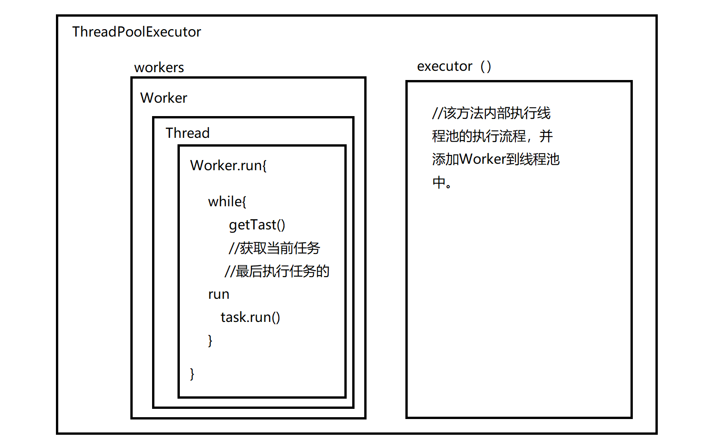

# 1.并发编程之多线程基础

## 1.1 多线程编程

> - 进程：进程是系统进行资源分配的基本单位，有独立的内存空间。
> - 线程：线程是CPU调度和分派的基本单位，线程依附于进程存在，每个线程会共享父进程的资源。
> - 协程：协程是一种用户态的轻量级线程，协程的调度完全由用户控制，协程间切换只需要保存任务的上下文，没有内核的开销。
>
> 常用的Windows、Linux等操作系统都采用抢占式多任务，如何调度线程完全由操作系统决定，程序不能决定什么时候执行，以及执行多长时间。
>
> Java语言内置了多进程支持，一个Java程序实际上是一个JVM进程，JVM进程用一个主线程来执行main()方法，在main()方法内部，又可以启动多个线程。

## 1.2 线程上下文切换

由于中断处理，多任务处理，用户态切换等原因会导致CPU从一个线程切换到另一个线程，切换过程需要保存当前进程的状态并恢复另一个进程的状态。

上下文切换的代价是高昂的，因为在核心上切换线程会花费很多时间。上下文切换的延迟取决于不同的因素，大概在50到100纳秒之间。考虑到硬件平均在每个核心上每纳秒执行12条指令，那么一次上下文切换可能花费600到1200条指令的延迟时间。实际上，上下文切换占用了大量程序执行指令的时间。

如果存在跨核上下文切换（Cross-Core Context Switch），可能会导致CPU缓存失败（CPU从缓存访问数据的成本大约是3到40个时钟周期，从主存访问数据的成本大约是100到300个时钟周期），这种场景的切换成本会更加昂贵。

## 1.3 使用场景

多线程作用是提高程序效率。

多线程最多的场景：web服务器本身；各种专有服务器（如游戏服务器）。

tomcat启动时会创建多个connector，每个connector处理一个请求，tomcat最大并发量是数百个，因为创建了数百个线程，再多线程服务器无法承受。

多线程常见应用场景：

1. 后台任务，例如：定时向大量（100w以上）的用户发送邮件：

   for(100w){

   ​	//发邮件

   }

2. 异步处理，例如：统计结果，记录日志，发送短信等；

   add(){

   ​	==>创建一个新的线程去记录日志

   ​	==>直接返回

   }

3. 分布式计算、分片下载、断点续传

总结：任务量比较大，通过多线程可以调高效率时、需要异步处理时、占用系统资源，造成阻塞的工作时。都可以采用多线程提高效率。

## 1.4 线程创建方式

常见的Java线程的4种创建方式分别为：

1. 继承Thread类；
2. 实现Runnable接口；
3. 通过ExcutorService和Callable<class>实现有返回值的线程；
4. 基于线程池。

第一种：继承Thread

> Thread类实现了Runnable接口，并定义了操作线程的一些方法。创建一个类并继承Thread接口，然后实例化线程对象并调用start方法启动线程。start方法为一个native方法，通过在操作系统上启动一个新线程，并最终执行run方法来启动一个线程。

```java
//step1:通过继承Thread类创建NewThread线程
public class NewThread extends Thread {
    public void run(){
        System.out.println("create a thread by extends thread");
    }
}
//step2:实例化一个NewThread线程对象
NewThread newThread = new NewThread();
//step3:调用start方法启动NewThread线程
newThread.start();
```

## 1.5 用户线程与守护线程

> java分两种线程：用户线程和守护线程。
>
> 守护线程是指程序运行时在后台提供的一种通用服务的线程，比如垃圾回收GC，这种线程并不属于程序不可或缺的部分。
>
> 当Java程序启动后会开启一个JVM进程，JVM进程中有两类线程，用户线程和守护线程，当用户线程执行结束JVM进程也就结束了，不管守护线程是否执行完毕。
>
> 比如GC，GC作为守护进程在JVM进程中一直存在，当用户线程运行完毕后，剩下GC等守护进程，JVM也会退出。
>
> **要设置线程为守护线程，需要在start()前调用setDaemon(true)**

```java
public static void main(String [] args){
    Thread t1 = new Thread(()->{
        for(int i=0; i<100; i++){
            try{
                Thread.sleep(200);
                System.out.println("t1输出："+ i);
            }catch(InterruptedException e){
                e.printStack();
            }
        }
    });
    t1.setDaemon(true);
    t1.start();
    Thread t2 = new Thread(()->{
        for(int i=0; i<100; i++){
            try{
                Thread.sleep(50);
                System.out.println("t2输出："+ i);
            }catch(InterruptedException e){
                e.printStack();
            }
        }
    });
    t2.start()
}
```

线程t1被设置为守护线程，线程t2会先于t1执行完毕，当t2执行完毕，无论t1是否执行完毕，jvm都会退出。

## 1.6 线程的优先级

线程的切换是由线程调度器控制的，程序员无法通过代码干涉，但是可以通过提高线程的优先级来最大程度的改善线程获取时间片的几率。

线程的优先级被划分为10级，值分别i为1-10，其中1最低，10最高。线程提供了三个常量来表示最低、最高和默认优先级：

- Thread.MIN_PRIORITY	1
- Thread.MAX_PRIORITY    10
- Thread.NORM_PRIORITY   5

**线程对象通过setPriority()来设置线程优先级。**其值默认是5


1.7 线程常用API

| **常用线程api方法**            |                                                              |
| ------------------------------ | ------------------------------------------------------------ |
| start()                        | 启动线程                                                     |
| getID()                        | 获取当前线程ID Thread-编号 该编号从0开始                     |
| getName()                      | 获取当前线程的名称                                           |
| Stop()                         | 停止线程（已废弃）                                           |
| getPriority()/setPriority()    | 返回线程的优先级                                             |
| boolean isAlive()              | 测试线程是否处于活动状态                                     |
| isDaemon() / setDaemon()       | 测试线程是否为守护线程                                       |
| isInterrupted()                | 测试线程是否已经中断,没有调用interrupt()返回false，否则返回true |
| interrupt()                    | 线程中断，代替stop()                                         |
| Thread.currentThread()         | 获取当前线程对象                                             |
| Thread.stage.getState()        | 获取线程的状态,对应线程的生命周期                            |
| **常用线程构造函数**           |                                                              |
| Thread()                       | 分配一个新的Thread对象                                       |
| Thread(String name)            | 分配一个新的Thread对象，具有指定的name正如其名               |
| Thread(Runnable r)             | 分配一个新的Thread对象                                       |
| Thread(Runnable r,String name) | 分配一个新的Thread对象                                       |

## 1.8线程状态

线程状态（生命周期）：

- NEW               new Thread()，尚未执行；
- RUNNABLE     start()就绪后抢夺时间片，正在执行run()
- BLOCKED      程序加锁，等待获取锁的线程的状态
- WAITING       调用wait()线程的状态，调用notify()唤醒
- TIMED_WAITING    调用sleep()方法状态
- TERMINATED     run()执行完毕，进入销毁状态


## 1.9 线程常用API2

### 1.9.1 sleep()方法

让线程休眠一段时间，让其他线程执行任务，但不会释放锁，如果有synchronized同步代码块，其他线程并不能访问这个共享数据。

### 1.9.2 yield()方法

让出本次线程占有cpu时间片，参与下一次竞争，只会给相同或更高优先级的线程以运行机会。


sleep和yield方法的区别

1. sleep()方法给其他线程运行机会时不考虑线程的优先级，因此会给低优先级的线程以运行机会；
2. yield()方法只会给相同优先级或更高优先级的线程以运行机会；
3. 线程执行sleep()方法后转入阻塞（blocked）状态，而执行yield()方法后会转入就绪（ready）状态；
4. sleep()方法声明会抛出InterruptedException，而yield()方法没有声明任何异常；
5. sleep()方法比yield()方法具有更好的移植性(跟操作系统cpu调度相关)；

### 1.9.3 join()方法

> Thread的join方法：线程等待
>
> 线程调用了join方法，那么就要一直运行到该线程运行结束，才会运行其他线程，这样可以控制线程执行顺序。
>
> A{	
>
> ​	B.join()；//让b线程先执行
>
> ​	--> 等待b线程执行完毕再接着执行
>
> }

面试题：现在又t1、t2、t3三个线程，你怎么保证t2再t1执行完后再执行，t3在t2执行完后再执行。

### 1.9.4 中断线程

#### 1.interrupted()和i是Interrupted()

中断线程就是其他线程给该线程发出一个信号，该线程收到信号后结束执行run()方法。

其他线程对目标线程调用interrupt()方法，目标线程需反复检查自身状态，如果isInterrupt则结束执行。

```java
public class Main{
    public static void main(String[] args){
        Thread t = new Thread(()->{
            int n = 0;
            while(!isInterrupt()){
                n++;
                System.out.println(n);
            }
        });
        t.start();
        Thread.sleep(1);
        t.interrupt();	//中断t线程
        //t.join()会让main线程处于等待状态，如果此时对main线程调用interrupt()，join()方法就会立刻抛出InterruptedException。
        //因此，目标线程只要捕获到join抛出的InterruptedException就说明有其他线程对其调用了interrupt()方法，通常情况下该线程就应该立刻结束。
        t.join();	//等待t线程结束
        System.out.print("end");
    }
}
```

t.interrupt()只是向t线程发出一个“中断请求”信号，t线程能否立刻响应，要看具体代码。t线程内部不断检查中断情况，所以能偶立即中断。

> join()抛出InterruptedException处理

```java 
public class Main{
    public static void main(String[] args){
        Thread t = new MyThread();
        t.start();
        Thread.sleep(1000);
        t.interrupt();	//中断
        t.join();		//等待t线程结束
        System.out.println("end");
    }
}
class MyThread extends Thread{
    public void run(){
        Thread hello = new HelloThread();
        hello.start();
        try{
            hello.join();
        }catch(InterruptException e){
            System.out.println("interrupted!");
        }
        hello.interrupt();//中断线程
    }
}
class HelloThread extends Thread{
    public void run(){
        int n =0;
        while(!isInterrupted()){
            n++;
            System.out.println(n);
            try{
                Thread.sleep(100);
            }catch(InterruptException e){
                break;
            }
        }
    }
}
```

#### 2.标志位：Thread.running

> 在线程外部中，通过将标志位running置位false，就可以让线程结束。

# 2.并发编程之线程安全

## 2.1 什么是线程安全？

2.1.1

## 2.2 JMM内存模型

> Java内存模型（即Java Mamory Model，简称JMM）。
>
> ​	JMM本身是一种抽象的概念，并不真实存在，他描述的是一组规则或规范，通过这组规范定义了程序中各种变量（包括实例字段，静态字段和构成数组对象的元素）的访问方式。由于JVM运行程序的实体是线程，而每个线程创建时JVM都会为其创建一个工作内存（有些地方称为栈空间），用于存储线程私有的数据，而Java内存模型中规定所有变量都存储在主内存，主内存是共享内存区域，所有线程都可以访问。
>
> ​	线程对变量的操作（读取赋值等）必须在工作内存中进行，首先要将变量从主内存中拷贝到自己的工作内存空间，然后对变量进行操作，操作完成后再将变量写回主内存，不能直接操作主内存中的变量，工作内存中存储着主内存中的变量副本拷贝，工作内存是每个线程私有数据区域，因此不同线程间无法访问对方的工作内存，线程间的通信必须通过主存来完成。


JMM内存模型线程数据操作细节


1. lock（锁定）：作用于主内存的变量，把一个变量标记为一条线程独占状态；
2. unlock（解锁）：作用于主内存的变量，把一个处于锁定状态的变量释放出来，释放后的变量才可以被其他线程锁定；
3. read（读取）：作用于主内存的变量，把一个变量从主内存传输到线程工作内存中，以便随后的load动作使用；
4. load（载入）：作用于工作内存的变量，他把read操作从主内存中得到的变量放入工作内存的变量副本中；
5. use（使用）：作用于工作内存的变量，把工作内存中的一个变量值传递给执行引擎；
6. assign（赋值）：作用于工作内存的变量，他把一个从执行引擎接收到的值赋给工作内存的变量；
7. store（存储）：作用于工作内存的变量，把工作内存中的一个变量的值传送到主内存中，以便随后的write的操作；
8. write（写入）：作用于工作内存的变量，把store操作从工作内存中的一个变量的值传送到主内存的变量中。

## 2.3 Java并发编程三大特性 

> 由于JMM内存模型，以及Java语言的设计，所以在并发编程当中我们可能会经常遇到下面几种问题。
>
> 这几种问题，我们称为并发编程的三大特性。

### 2.3.1 原子性

> 原子性：即一个操作或多个操作，要么全部执行并且在执行过程中不被打断，要么全部不执行。（提供了互斥访问，再同一时刻只有一个线程进行访问）
>
> 可以通过锁的方式解决。
>
> - Atomic包
> - CAS算法
> - Synchronized
> - Lock

```java
public class Main{
    public static void main(String[] args){
        var add = new AddThread();
        var dec = new DecThread();
        add.start();
        dec.start();
        add.join();
        dec.join();
        System.out.println(Counter.count);
    }
}

class Counter{
    public static int count = 0;
}

class AddThread extends Thread{
    public void run(){
        for(int i=0; i<10000; i++){
            Counter.count += 1;
        }
    }
}

class DecThread extends Thread{
    public void run(){
        for(int i=0; i<10000; i++){
            Counter.count -= 1;
        }
    }
}
```

上例执行结果逻辑上应该改是0，实际上不是0，这是由于不是原子操作造成的。

> n = n + 1;
>
> 实际上对应了3条指令：
>
> - ILOAD
> - IADD
> - ISTORE
>
> 假设n值为100，两个线程执行n+1，则结果可能不是102，原因如下：
>
> ```ascii
> ┌───────┐    ┌───────┐
> │Thread1│    │Thread2│
> └───┬───┘    └───┬───┘
>     │            │
>     │ILOAD (100) │
>     │            │ILOAD (100)
>     │            │IADD
>     │            │ISTORE (101)
>     │IADD        │
>     │ISTORE (101)│
>     ▼            ▼
> ```
>
> 如果线程1在执行`ILOAD`后被操作系统中断，此刻如果线程2被调度执行，它执行`ILOAD`后获取的值仍然是`100`，最终结果被两个线程的`ISTORE`写入后变成了`101`，而不是期待的`102`。
>
> 这说明多线程模型下，要保证逻辑正确，对共享变量进行读写时，必须保证一组指令以原子方式执行：即某一个线程执行时，其他线程必须等待：
>
> ```ascii
> ┌───────┐     ┌───────┐
> │Thread1│     │Thread2│
> └───┬───┘     └───┬───┘
>     │             │
>     │-- lock --   │
>     │ILOAD (100)  │
>     │IADD         │
>     │ISTORE (101) │
>     │-- unlock -- │
>     │             │-- lock --
>     │             │ILOAD (101)
>     │             │IADD
>     │             │ISTORE (102)
>     │             │-- unlock --
>     ▼             ▼
> ```
>
> 通过加锁和解锁的操作，就能保证3条指令总是在一个线程执行期间，不会有其他线程会进入此指令区间。即使在执行期线程被操作系统中断执行，其他线程也会因为无法获得锁导致无法进入此指令区间。只有执行线程将锁释放后，其他线程才有机会获得锁并执行。这种加锁和解锁之间的代码块我们称之为临界区（Critical Section），任何时候临界区最多只有一个线程能执行。

### 2.3.2 可见性

> 当多个线程访问同一个变量时，一个线程修改了这个变量的值，其他线程能够立即看到修改的值。
>
> 若两个线程在不同的cpu，那么线程1改变了`i`的值还没刷新到主存,线程2又使用了`i`，那么这个`i`值肯定还是之前的，线程1对变量的修改线程2没看到，这就是可见性问题。
>
> - Synchronized
> - Volatile（不能保证原子性 ）

### 2.3.3 有序性

> 程序执行的顺序按照代码的先后顺序执行。
>
> 一般来说JVM为了提高程序运行效率，可能会对输入代码进行优化，它不保证程序中各个语句的执行先后顺序同代码中定义顺序一致，但是会保证程序最终执行结果和代码顺序执行的结果是一致的。如下：
>
> int a = 10;	//语句1
>
> a = a+3;		//语句2
>
> int r = 2;		//语句3
>
> r = a*a;		//语句4
>
> 则因为JVM指令重排序（happen-before），他还可能执行顺序为：2-1-3-4，1-3-2-4
>
> 但绝对不可能2-1-4-3，因为这个打破了依赖关系。
>
> 显然重排序对单线程运行是不会有任何问题，而多线程就不一定了，所以我们在多线程时就得考虑这个问题了。

## 2.4 volatile关键字

> volatile关键字的作用是修饰变量，变量在多个线程之间可见，并且能保证所修饰变量的有序性。
>
> 1. 保证变量的可见性：当一个被volatile关键字修饰的变量被一个线程修改的时候，其他线程可以立刻得到修改之后的结果。当一个线程被volatile关键字修饰的变量写入数据的时候，虚拟机会强制它的值刷新到主内存中。**当一个线程用到被volatile关键字修饰的值的时候，虚拟机会强制要求它从主内存中读取**。
> 2. 屏蔽指令重排序：指令重排序是编译器和处理器为了高效对程序进行优化的手段，它只能保证程序执行的结果是正确的，但是无法保证程序的操作顺序与代码顺序一致。这在单线程中不会构成问题，但是在多线程中就会出现问题。非常经典的例子是在单例方法中同时对字段加入volatile，就是为了防止指令重排序。

## 2.5 synchronized

> synchronized关键字可以保证在同一时刻，只有一个线程可以执行某个方法或代码块，同时synchronized可以保证一个线程的变化可见（可见性），即可以代替volatile关键字。
>
> 可以保证原子性。

使用对象作为锁，《深入理解Java虚拟机》中描述对象头中有一个锁状态字段。

### 2.5.1 使用方法

1. 普通同步方法（实例方法），锁是当前实例对象，进入同步代码前要获取当前实例的锁。
2. 静态同步方法，锁是当前类的class，进入同步代码前要获取当前类对象的锁。
3. 同步方法块，锁是括号里面的对象，对给定对象加锁，进入同步代码块前要获得给定对象的锁。

### 2.5.2 synchronized基本原理

> sychronized是JVM底层帮助实现的，JVM是通过进入、退出对象监视器（Monitor）来实现对方法、同步代码块的同步的。
>
> ​	具体实现是在编译之后在同步方法调用前加入一个monitor.enter指令，在退出方法和异常处插入monitor.exit的指令。
>
> ​	其本质就是对一个对象监视器（Monitor）进行获取，而这个获取过程具有排他性从而达到了同一时刻只能一个线程访问的目的。
>
> ​	而对于没有获取到锁的线程将会阻塞到方法入口处，直到获取锁的线程monitor.exit之后才能尝试继续获取锁

```java 
static class A{
    public  static Object o1 = new Object();
    public static void main(String[] args){
        new A().fun1();
        A.fun2();
    }
    public synchronized void fun1(){
        //当前对象this作为锁对象
        //同步代码块
    }
    public synchronized static void fun2(){
        //A.Class对象作为锁对象
        //同步代码块
    }
    
    //fun3和fun4用同一个锁对象才不能被同时调用
    void fun3(){
        sychronized(o1){
            //do something
        }
    }
    
    void fun4(){
        sychronized(o1){
            //do something
        }
    }
}
```

2.5.3 线程死锁

```java
public class Main{
    public static void main(String[] args){
        Object o1 = new Object();//锁1
        Object o2 = new Object();//锁2
        new Thread(()->{
            synchronized(o1){
                try{
                    Thread.sleep(1000);
                    synchronized(o2){
                        System.out.print("线程1执行")
                    }
                }catch(InterruptedException e){
                    e.printStackTrace();
                }
            }
        }).start();
        new Thread(()->{
            synchronized(o2){
                try{
                    Thread.sleep(1000);
                    synchronized(o1){
                        System.out.print("线程2执行")
                    }
                }catch(InterruptedException e){
                    e.printStackTrace();
                }
            }
        }).start();
    }
}
```


## 2.6 Lock锁

> 在jdk1.5之后，并发包中新增了Lock接口（以及相关实现类）用来实现锁的功能，Lock接口提供了与synchronized关键字类似的同步功能，但需要使用时手动获取和释放锁。
>
> 引入了一个高级的处理并发的`java.util.concurrent`包，它提供了大量更高级的并发功能，能大大简化多线程程序的编写。
>
> 我们知道Java语言直接提供了`synchronized`关键字用于加锁，但这种锁一是很重，二是获取时必须一直等待，没有额外的尝试机制。
>
> `java.util.concurrent.locks`包提供的`ReentrantLock`(可重入锁)用于替代`synchronized`加锁。

```java
//范式
Lock lock = new ReentrantLock();
lock.lock();
try{
    //doSomething...
}finally{
    lock.unlock();
}
```

lock可以代替synchronized，来给代码块加锁。

示例：

```java
//synchorized
public class Counter{
    private int count;
    public void add(int n){
        synchorized(this){
            count += n;
        }
    }
}

//Lock
public class Counter{
    private final Lock lock = new ReentrantLock();
    private int count;
    
    public void add(int n){
        lock.lock();
        try{
            count += n;
        }finally{
            lock.unlock();
        }
    }
}
```

### 2.6.1 ReentrantLock尝试获取锁lock.tryLock()

因为`synchronized`是Java语言层面提供的语法，所以我们不需要考虑异常，而`ReentrantLock`是Java代码实现的锁，我们就必须先获取锁，然后在`finally`中正确释放锁。

顾名思义，`ReentrantLock`是可重入锁，它和`synchronized`一样，一个线程可以多次获取同一个锁。

和`synchronized`不同的是，`ReentrantLock`可以尝试获取锁：

```java
if(lock.tryLock(1,TimeUnit.SECONDS)){
    try{
        ...
    }finally{
        lock.unlock;
    }
}
```

上述代码在尝试获取锁的时候，最多等待1秒。如果1秒后仍未获取到锁，`tryLock()`返回`false`，程序就可以做一些额外处理，而不是无限等待下去。

所以，使用`ReentrantLock`比直接使用`synchronized`更安全，线程在`tryLock()`失败的时候不会导致死锁。

### 2.6.2 读写锁

ReentrantLock和synchonrized只允许一个线程进入临界代码区域，但是有时候这样效率过低。

**当读数据时候可以有多个线程同时获取读锁，当有写操作时只能一个线程获取锁。**

|      | 读     | 写     |
| ---- | ------ | ------ |
| 读   | 允许   | 不允许 |
| 写   | 不允许 | 不允许 |

使用`ReadWriteLock`可以解决这个问题，它保证：

- 只允许一个线程写入（其他线程既不能写入也不能读取）；
- 没有写入时，多个线程允许同时读（提高性能）。

用`ReadWriteLock`实现这个功能十分容易。我们需要创建一个`ReadWriteLock`实例，然后分别获取读锁和写锁：

```java
public class Counter{
    private final ReadWriteLock rwlock = new ReentrantReadWriteLock();
    private final Lock rlock = rwlock.readLock();
    private final Lock wlock = rwlock.writeLock();
    private int[] counts = new int[10];
    
    //写操作
    public void inc(int index){
        wlock.lock();	//加写锁
        try{
            counts[index] += 1;
        }finally{
            wlock.unlock();	//释放写锁
        }
    }
    //读操作
    public int[] get(){
        rlock.lock();	//加读锁
        try{
            return Arrays.copyOf(counts,counts.length);
        }finally{
            rlock.unlock();//释放读锁
        }
    }
}
```

把读写操作分别用读锁和写锁来加锁，在读取时，多个线程可以同时获得读锁，这样就大大提高了并发读的执行效率。

使用`ReadWriteLock`时，适用条件是同一个数据，有大量线程读取，但仅有少数线程修改。

例如，一个论坛的帖子，回复可以看做写入操作，它是不频繁的，但是，浏览可以看做读取操作，是非常频繁的，这种情况就可以使用`ReadWriteLock`。

### 2.6.3 Lock与synchronized区别

1. Lock是一个接口，而synchronied时Java的一个关键字，synchronized时内置的语言实现；

   synchronized关键字可以直接修饰方法，也可以修饰代码块，而lock只能修饰代码块。

2. synchronized在发生异常时，会自动释放线程占有的锁，一次不会导致死锁现象发生；而lock在发生异常时，如果没有主动通过unLock()去释放锁，则很可能会造成死锁现象，一次使用Lock时需要在finally块中释放锁。

3. Lock可以让等待的线程响应中断，而synchronized却不行，使用synchronized时，等待线程会一直等待下去，不能够响应中断。

4. 通过Lock可以知道有没有成功获取锁，而synchronized却无法办到。（提供tryLock）

5. Lock可以提高多个线程进行读操作的效率（提供读写锁）；

从性能上说，如果竞争资源不激烈，两者的性能时差不多的，而当竞争资源非常激烈时（既有大量线程同时竞争），此时Lock的性能要远远由于synchronized。所以说，在具体使用时要根据情况选择。


# 3.线程间的协作（wait/notify）

### 3.1 什么时线程间通信

多个线程在处理同一个资源，并且任务不同时，需要线程通信来帮助解决线程之间对同一个变量的使用或操作；

于时Java提出了等待唤醒机制：wait()/notify()或notifyAll()

wait()、notify()、notifyAll()是三个定义在object类中的方法，可以用来控制线程的状态，这三个方法最终调用的是jvm级的native方法（有jvm的C代码实现）。随着jvm运行平台的不同可能有些差异。

如果对象调用了wait()方法就会使持有该对象的线程把该对象的控制权交出去，然后处于等待状态。

如果对象调用了notify方法就会通知某个正在等待这个对象的控制权的线程可以继续运行（唤醒哪个有一定的随机性），notifyAll会唤醒所有等待该对象控制权的线程。

**wait方法必须在synchronized方法或者代码块中调用。**

队列示例：

```java
class TaskQueue {
    Queue<String> queue = new LinkedList<>();

    public synchronized void addTask(String s) {
        this.queue.add(s);
    }
}
```

下面的方式会造成死锁：因为getTask线程没有交出this对象控制权

```java
class TaskQueue {
    Queue<String> queue = new LinkedList<>();

    public synchronized void addTask(String s) {
        this.queue.add(s);
    }

    public synchronized String getTask() {
        while (queue.isEmpty()) {
        }
        return queue.remove();
    }
}
```

正确的处理方法

```java
class TaskQueue {
    Queue<String> queue = new LinkedList<>();

    public synchronized void addTask(String s) {
        this.queue.add(s);
    }

    public synchronized String getTask() {
        while (queue.isEmpty()) {
            // 释放this锁:
            this.wait();
            // 重新获取this锁
        }
        return queue.remove();
    }
}
```


### 3.2 面试题：多个线程交替打印奇数和偶数

```java
public class Main{
    
    public static void main(String []args){
        NumMode numMode = new NumMode();
        new Thread(new PrintOdd(numMode)).start();
        new Thread(new PrintEven(numMode)).start();
    }
    
    static class NumMode{
        public int num;
    }
    
    static class PrintOdd implements Runable {
        private NumMode numMode;
        public PrintOdd(NumMode numMode){
            this.NumMode = numMode;
        }
        @override
        public void run(){
            while(true){
                synchronized(numMode){
                   if(numMode.num < 100){
                        if(numMode.num % 2 != 0){
                            System.out.println("奇数===>"+numMode.num);
                            numMode.num++;
                            numMode.notify();
                        }else{
                            //偶数，奇数线程等待
                            try{
                                numMode.wait();
                            }catch(InterruptedException e){
                                e.printStackTrace();
                            }
                        }
                	}else{
                       break;
                   }
                }
            }
        }
    }
    
    static class PrintEven implements Runable{
        private NumMode numMode;
        public PrintEven(NumMode numMode){
            this.NumMode = numMode;
        }
        @override
        public void run(){
            while(true){
                synchronized(numMode){
                   if(numMode.num < 100){
                        if(numMode.num % 2 == 0){
                            System.out.println("偶数===>"+numMode.num);
                            numMode.num++;
                            numMode.notify();
                        }else{
                            //奇数，偶数线程等待
                            try{
                                numMode.wait();
                            }catch(InterruptedException e){
                                e.printStackTrace();
                            }
                        }
                	}else{
                       break;
                   }
                }
            }
        }
    }
}
```

### 3,3 面试题：使用多线程实现生产消费者模式

生产消费模式概念

> 生产者消费者模式是并发，多线程编程中经典的设计模式，生产者和消费者通过分离的执行工作解耦，简化了开发模式，生产者和消费者可以以不同的速度生产和消费数据。
>
> 生产者消费者模式的好处：
>
> 1. 它简化了开发，你可以独立的或并发的编写消费者和生产者，它仅仅只需知道共享对象是谁；
> 2. 生产者不需要知道谁是消费者或者有多少消费者，对消费者来说也是一样；
> 3. 生产者和消费者可以以不同的速度执行；
> 4. 分离的消费者和生产者在功能上能写出更简洁，可读，易维护的代码。
>
> 生产的数据放入的中间容器（Map，List，Queue等）中供消费者取用。

经典题目：生产消费者面试提（wait/notify实现）

- 生产线加工生产汽车；
- 4s店存放生产的汽车，最多存放4量汽车，如果达到4量就停止生产；
- 消费者在4s店购买汽车，如果4s店没有库存，则消费者需等待购买；

```java
public class Main{
    private static int CAR_NAME = 1;
    
    public static void main(String[]args){
        Car4s car4s = new Car4s();
        new Thread(new Provider(car4s)).start;
        new Thread(new Customer(car4s)).start;
    }
    //消费者
    static class Customer implements Runnable{
        private Car4s car4s;
        public Customer(Car4s car4s){
            this.car4s = car4s;
        }
        @override
        public void run(){
            while(true){
                synchronized(car4s){
                    if(car4s.getCarQueue().size() > 0){
                        //消费
                        Car car = car4s.getCarQueue().poll(car);
                        System.out.println("消费汽车===>"car.getName());
                        //无库存开始唤醒生产者
                        car4s.notifyAll();
                    }else{
                        //停止消费
                        try{
                            car4s.wait();
                        }catch(InterruptedException e){
                            e.printStackTrace();
                        }
                    }
                }
            }
        }
    }
    //生产者
    static class Provider implements Runnable{
        private Car4s car4s;
        public Provider(Car4s car4s){
            this.car4s = car4s;
        }
        @override
        public void run(){
            while(true){
                synchronized(car4s){
                    if(car4s.getCarQueue().size() < 4){
                        //生产
                        Car car = new Car();
                        car.setName(CAR_NAME+"");
                        car4s.getCarQueue().push(car);
                        CAR_NAME++;
                        System.out.println("生产汽车===>"car.getName());
                        //有库存开始唤醒消费者
                        car4s.notifyAll();
                    }else{
                        //停止生产
                        try{
                            car4s.wait();
                        }catch(InterruptedException e){
                            e.printStackTrace();
                        }
                    }
                }
            }
        }
    }
    
    //4s店
    static class Car4s{
        private Queue<Car> carQueue = new LinkedList<>();
        //getter/setter
    }
    //车
    static class Car{
        private String name;
        //getter/setter
    }
}
```


# 4.线程池API

## 4.1 概述

Java语言内置了多线程支持，启动一个新线程非常方便，但是，创建线程需要操作系统资源（线程资源，栈空间等），频繁创建和销毁大量线程需要消耗大量时间。

把很多小任务让一组线程来执行，而不是一个任务对应一个新线程。这种能接受大量小人物并进行分发处理的就是线程池。

任务，就是实现Runnable接口的类`new Thread(new Runnable())`。

> Java中的线程池是运用场景最多的并发框架，几乎所有需要异步或并发执行任务的程序都可以使用线程池。
>
> 在并发过程中，合理使用线程池能够带来3个好处：
>
> 1. 降低资源消耗。通过重复利用已创建的线程降低线程创建和销毁造成的消耗。
> 2. 提高响应速度。当任务到达时，任务可以不需要等待线程创建就能立即执行。
> 3. 提高线程的可管理性。线程是稀缺资源，如果无限地创建，不仅会消耗系统资源，还会降低系统的稳定性，使用线程池可以进行统一分配，调优和监控。

Java标准库提供了Excutor接口，通常使用此子接口ExcutorService来创建接口，Java提供了几个ExcutorService接口的实现类：

- FixedThreadPool：线程数固定的线程池；
- CachedThreadPool：线程数根据任务动态调整的线程池；
- SingleThreadExecutor：仅单线程执行的线程池。

```java
ExecutorService es = new ThreadPoolExecutor();
es.execute(任务);
es.shutdown();
```

## 4.2 线程池执行规则

【阿里巴巴开发手册】：【强制】线程池不允许使用Executors去创建，而是通过ThreadPoolExcutor的方式，这样的处理方式让写的同学更加明确线程池的运行规则，规避资源耗尽的风险。说明：Executors返回的线程池对象的弊端如下：

1. FixedThreadPool和SingleThreadPool：允许的请求队列长度为Integer.MAX_VALUE,可能会堆积大量的请求，从而导致OOM。
2. CachedThreadPool和ScheduledThreadPool:允许的创建线程数量为Integer.MAX_VALUE,可能会创建大量的线程，从而导致OOM。


#### 4.2.1 线程池创建

```java
ExecutorService es = new ThreadPoolExcutor(int corePoolSize, int maximumPoolSize, long keepAliveTime, TimeUnit unit, BlockingQueue workQueue, RejectedExecutionHandler handler);
es.execute(Runnable); //添加任务到线程池
```

参数说明：

1. corePoolSize：线程池芜湖线程的最少数量；

2. maximumPoolSize：线程池维护线程的最大数量；

3. keepAliveTime：线程池维护线程所允许的空闲时间；

4. unit：线程池维护线程所允许的空闲时间单位；

   - java.util.concurrent.TimeUnit中的几个静态变量
     - NANOSECONDS	  //纳秒
     - MINCROSECONDS  //微妙
     - MILLISECONDS       //毫秒
     - SECONDS                 //秒

5. workQueue：线程池所使用的缓冲队列（任务队列）；

   常用队列：

   - java.util.concurrent.ArrayBlockingQueue

6. handler：线程池对拒绝任务的处理策略。

   这些策略在ThreadPoolExecutor线程池核心类中以内部类方式定义存在。

   - ThreadPoolExecutor.AbortPolicy() **“默认”**：抛弃任务并抛出java.util.concurrent.RejectedExecutionException异常
   - ThreadPoolExecutor.CallerRunsPolicy()：重试添加当前任务，他会自动重复调用execute()方法；（不抛弃任务，调用线程池的线程，帮忙执行任务，比如说main线程帮忙执行）
   - ThreadPoolExecutor.DiscardOldestPolicy()：抛弃旧任务队列中创建较早的任务
   - ThreadPoolExecutor.DiscartPolicy()：直接抛弃当前任务，不抛出异常。

#### 4.2.2 线程池工作流程：

1. 当有任务到来时，首先判断当前线程线程数是否小于corePoolSize，如果小于这个数量则创建新线程处理，无论是否有空线程，都要创建新线程来处理该任务；如果等于这个数量并且任务队列未满，则将任务放入缓冲队列中（workQueue）；
2. 当队列满后，新任务到来后，判断线程数是否小于corePoolSize，然后判断队列是否满，如果都不满足则判断当前线程数量是否小于maximumPoolSize，如果小于则创建新线程处理新任务。
3. 如果新任务到来后前述所有条件都不满足，则执行线程池的拒绝策略；

因此参数在线程池处理的优先级为：corePoolSize > workQueue > maximumPoolSize ,如果三这个都满了则使用handle处理被拒绝的任务；

**当线程池中的线程数量大于corePoolSize时，如果某线程空闲时间超过keepAliveTime，线程将被终止。这样，线程池可以动态的调整池中的线程数量。**


#### 4.2.3 线程池的三种队列

BlockingQueue接口表示一个阻塞队列，无法装入新任务时会阻塞装入任务线程，当队列中没有任务时，会阻塞执行线程。

1. SynchronousQueue

   synchronousQueue类实现了BlockingQueue（阻塞队列），BlockingQueue无法装入新任务时会阻塞装入任务线程，当队列中没有任务时，会阻塞执行线程。

   SynchronousQueue是一个内部只包含一个元素的队列，插入元素到队列的线程被阻塞，知道另一个线程从队列中获取了队列中存储的元素。同样，如果线程尝试获取元素并且当前不存在任何元素，则该线程将被阻塞，知道线程将元素插入队列。

   [拓展](https://www.jianshu.com/p/d5e2e3513ba3)

2. LinkedBlockingQueue

   这是一个底层用链表实现的队列，这样队列的大小就没有限制，当线程数量达到corePoolSize，则所有任务都放入到该队列中等待（因此maximumPoolSizes就相当于无效了），这样每个线程完全独立于其他线程，生产者和消费者使用独立的锁来控制数据同步，即在高并发情况下可以并行操作队列中的数据。

3. ArrayBlockingQueue

   是一个底层使用数组实现的队列，即表示一个有界的缓冲队列，使用时可以指定缓冲队列大小，当正在执行的线程数等于corePoolSize时，多余的元素缓存在ArrayBlockingQueue队列中等待有空线程时继续执行，当ArrayBlockingQueue已满时，加入ArrayBlockingQueue失败，会开启新的线程去执行，当线程数已经达到最大的maximumPoolSize时，再有新元素尝试加入ArrayBlockingQueue时会报错。

## 4.3 Executors线程池工具类

Executors时线程池的工具类，提供了四种快捷创建线程池的方法：

1. newCachedThreadPool

   创建一个可缓存线程池，如果线程池长度超过处理需要，可灵活回收空闲线程，若无可回收，则新建线程。

   源码：Executors类中

   orePoolSize为0，maximumPoolSize设置为int最大值单任务缓冲队列执行；

   ```java
   public static ExecutorService newCachedThreadPool(){
       return new ThreadPoolExecutor(0,Integer.MAX_VALUE,60L,TimeUnit.SECONDS,new SynchronousQueue<Runnable>());
   }
   ```

2. newFixedThreadPool

   创建一个定长线程池，可控制线程最大并发数，超出的线程会在队列中等待。

   源码：orePoolSize和maximumPoolSize设置为nThreads使用无界队列执行；

   ```java
   public static ExecutorService newFixedThreadPool(int nThreads){
       return new ThreadPoolExecutor(nThreads,nThreads,0L,TimeUnit.MILLISECONDS,new LinkedBlockingQueue<Runnable>());
   }
   ```

   

3. newSingleThreadExecutor

   创建一个单线程化的线程池，它只会用唯一的工作线程来执行任务，保证所有任务按照指定顺序（FIFO，LIFO，优先级）执行。

   源码：corePoolSize和maximumPoolSize设置为1使用无界队列执行；

   ```java
   public static ExecutorService newSingleThreadExecutor(){
       return new FinalIzableDelegatedExecutorService(new ThreadPoolExecutor(1,1,0L,TimeUnit.MILLISECONDS,new LinkedBlockingQueue<Runnable>()));
   }
   ```

   

4. newScheduledThreadPool

   创建一个定长线程池，支持定时及周期性任务执行。


```java
public class Main{
    public static void main(String []args){
        
    }
    //newCacheThreadPool()
    public static void pool1(){
        ExecutorService es = Executors.newCachedThreadPool();
        //会创建出10个线程分别执行任务
        for(int i=0; i<10; i++){
            es.execute(()->{
                for(int j=0; j<10; j++){
                    try{
                        Thread.sleep(100);
                    }catch(InterruptedException e){
                        e.printStrackTrace();
                    }
                    System.out.println(Thread.currentThread().getName()+":"+j);
                }
            })
        }
        es.shutdown();
    }
    //newFixedThreadPool()
    public static void pool2(int nThreads){
        //创建线程池
        ExecutorService es = Executors.newFixedThreadPool(nThreads);
        //会创建出nThreads线程，分别执行任务
        for(int i=0; i<10; i++){
            es.execute(()->{
                try{
                    Thread.sleep(400);
                }catch(InterruptedException e){
                    e.printStackTrace();
                }
                for(int j=0; j<10; j++){
                    System.out.println(Thread.currentThread().getName()+":"+j);
                }
            })
        }
    }
    //newSingleThreadExecutor()
    public static void pool3(){
        ExecutorService es = Executors.newSingleThreadExecutor();
        //会创建出1个线程，分别执行任务
        for(int i=0; i<10; i++){
            es.execute(()->{
                try{
                    Thread.sleep(400);
                }catch(InterruptedException e){
                    e.printStackTrace();
                }
                for(int j=0; j<10; j++){
                    System.out.println(Thread.currentThread().getName()+":"+j);
                }
            })
        }
    }
    //newScheduledThreadPool可调度线程池
    public static void pool4(){
        ScheduledExecutorService newScheduledThreadPool = Executors.newScheduledThreadPool(corePoolSize:5);
        //延时执行的线程池
        /**
         * args：任务、时间、时间单位
         */
        newScheduledThreadPool.schedule(new Runnable(){
            public void run(){
                System.out.println("i:"+i);
            }
        },delay:2,TimeUnit.SECONDS);
        
        //周期性执行：延时5秒后执行，然后每隔4s执行一次；
        /**
         * args: 任务，延时时间，间隔时间，时间单位
         */
        newScheduledThreadPool.scheduleAtFixedRate(new Runnable(){
            public void run(){
                System.out.println("i:"+i);
            }
        },5,4,TimeUnit.SECONDS);
    }
}
```


4.4 线程池的工作流程

#### 4.4.1 线程池引入

线程的调度

单核单线程：CPU只有一个工作内核，可以同时执行一个线程。

JVM的线程调度机制：

​	抢占式线程调度机制

​	协调式的线程调度机制

多线程要注意的问题：

1. 线程安全问题；

2. 线程的性能：

   创建线程和维护线程都需要消耗系统资源；

   线程间的上下文切换也要消耗时间

   windows平台cmd下`wmic` -> `cpu get *` 

   以4核8线程cpu为例，执行任务时创建8个线程来执行任务，这样不会有较大的资源消耗。

JDK1.5 java.util.concurrent 的线程池框架，对线程利用率好处：

- 通过创建固定数量的线程来执行大量的任务；
- 这样可以很好的复用线程，减少线程的创建核维护的时间消耗。


#### 4.4.2 线程池体系

java.util.concurrent包下

顶层接口：Executor （内部仅一个execute方法）

​	子接口：ExecutorService

​		实现类：ThreadPoolExecutor（核心线程池实现类）

java.util.concurrent.Executor 线程池顶级接口定义了新线程池的最基本方法

​	java.util.concurrent.ExecutorService 继承了顶级接口，定义了线程池最常用的方法

​		java.util.concurrent.ThreadPoolExecutor 线程池核心实现类

​			java.util.concurrent.ScheduledThreadPoolExecutor 在线程池实现类基础上加入延时处理等

java.util.concurrent.Executors  线程池工具类，用于快速创建线程池

```java
//线程池各个参数的作用：
/**
 * corePoolSize:核心工作线程数量，线程池创建几个固定的线程来执行任务
 * maximumPoolSize:最大工作线程数量，当任务队列满时，会创建（最大线程-核心线程）个临时线程来帮我们处理任务
 * keepAliveTime:保持时间，临时线程执行完任务后，会主动去任务队列中获取任务，如果经过keepAliveTime时间没有获取到，临时销毁。核心线程默认不超时。
 * unit:时间单位。
 * threadFactory:线程工厂。
 * handler:包和策略，定义在ExecutorService中
 */
public ExecutorService ThreadPoolExecutor(int corePoolSize，
										  int maximumPoolSize, 
                                          long keepAliveTime, 
                                          timeUnit unit, 
                                          BlockingQueue<Runnable> workQueue,
                                          ThreadFactory threadFactory,
                                          RejectExecutionHandler handler);
//当任务执行完毕，核心线程默认是不超时的，默认不被销毁，但是可以通过方法设置超时
executor.allowCoreThreadTimeOut(true);
//任务执行完毕后关闭线程池
executor.shutdown();
//立即关闭线程池,返回值是剩余的任务列表List<Runnable>
executor.shutdownNow();
```

**线程池执行流程：**

流程1：判断核心线程数量

流程2：判断任务能否加入到任务队列

流程3：判断最大线程数

流程4：根据线程池的拒绝策略处理任务

**线程池关闭：**

线程池中包含：核心线程、临时线程

- 当任务执行完毕，核心线程默认是不超时的，默认不被销毁，但是可以通过方法设置超时
  `executor.allowCoreThreadTimeOut(true);`
- 任务执行完毕后关闭线程池
  `executor.shutdown();`
- 立即关闭线程池,返回值是剩余的任务列表List<Runnable>
  `executor.shutdownNow();`

#### 4.4.3 从源码角度深入理解线程池工作原理



在java.util.concurrent.ThreadPoolExecutor类中：

```java
	//workers，表示当前的线程池，线程池中实际线程是由内部类Worker表示的
	private final HashSet<Worker> workers = new HashSet<Worker>();

	//常用构造函数
	public ThreadPoolExecutor(int corePoolSize,
                              int maximumPoolSize,
                              long keepAliveTime,
                              TimeUnit unit,
                              BlockingQueue<Runnable> workQueue) {
        this(corePoolSize, maximumPoolSize, keepAliveTime, unit, workQueue,
             Executors.defaultThreadFactory(), defaultHandler);
    }
	//调用this构造函数，对参数做判断后赋值处理
	public ThreadPoolExecutor(int corePoolSize,
                              int maximumPoolSize,
                              long keepAliveTime,
                              TimeUnit unit,
                              BlockingQueue<Runnable> workQueue,
                              ThreadFactory threadFactory,
                              RejectedExecutionHandler handler) {
        if (corePoolSize < 0 ||
            maximumPoolSize <= 0 ||
            maximumPoolSize < corePoolSize ||
            keepAliveTime < 0)
            throw new IllegalArgumentException();
        if (workQueue == null || threadFactory == null || handler == null)
            throw new NullPointerException();
        this.acc = System.getSecurityManager() == null ?
                null :
                AccessController.getContext();
        this.corePoolSize = corePoolSize;
        this.maximumPoolSize = maximumPoolSize;
        this.workQueue = workQueue;
        this.keepAliveTime = unit.toNanos(keepAliveTime);
        this.threadFactory = threadFactory;
        this.handler = handler;
    }

	//表示线程池内部线程的Worker内部类（部分定义）
	private final class Worker
        extends AbstractQueuedSynchronizer
        implements Runnable
    {
    	//该类实现了Runnable接口表示一个任务，而这里实现的思路是：在Worker内部通过ThreadFactory创建一个线程作为成员变量，这个线程就是实际线程池中的运行线程
    	final Thread thread;
        /** Initial task to run.  Possibly null. */
        Runnable firstTask;
        /** Per-thread task counter */
        volatile long completedTasks;

        /**
         * Creates with given first task and thread from ThreadFactory.
         * @param firstTask the first task (null if none)
         */
        Worker(Runnable firstTask) {
            setState(-1); // inhibit interrupts until runWorker
            this.firstTask = firstTask;
            //这里是将Work作为任务交给线程执行，Worker也表示一个任务，这个任务包装了实际运行的任务，在Worker的run()方法中会调用实际任务的run()方法
            this.thread = getThreadFactory().newThread(this);
        }
         /** Delegates main run loop to outer runWorker  */
        public void run() {
        	//run()方法的逻辑实际在runWorker()中
            runWorker(this);
        }
        
        final void runWorker(Worker w) {
            Thread wt = Thread.currentThread();
            Runnable task = w.firstTask;
            w.firstTask = null;
            w.unlock(); // allow interrupts
            boolean completedAbruptly = true;
            try {
            	//如果当前任务不为空，且能从任务队列中获取任务则进入循环
                while (task != null || (task = getTask()) != null) {
                    w.lock();
                    // If pool is stopping, ensure thread is interrupted;
                    // if not, ensure thread is not interrupted.  This
                    // requires a recheck in second case to deal with
                    // shutdownNow race while clearing interrupt
                    if ((runStateAtLeast(ctl.get(), STOP) ||
                         (Thread.interrupted() &&
                          runStateAtLeast(ctl.get(), STOP))) &&
                        !wt.isInterrupted())
                        wt.interrupt();
                    try {
                        beforeExecute(wt, task);
                        Throwable thrown = null;
                        try {
                        	//执行实际任务的run()方法
                            task.run();
                        } catch (RuntimeException x) {
                            thrown = x; throw x;
                        } catch (Error x) {
                            thrown = x; throw x;
                        } catch (Throwable x) {
                            thrown = x; throw new Error(x);
                        } finally {
                            afterExecute(task, thrown);
                        }
                    } finally {
                    	//将任务置位null
                        task = null;
                        w.completedTasks++;
                        w.unlock();
                    }
                }
                completedAbruptly = false;
            } finally {
                processWorkerExit(w, completedAbruptly);
            }
    	}
    }    
```

//执行新任务流程：java.util.concurrent.ThreadPoolExecutor

```java
//部分定义
public class ThreadPoolExecutor extends AbstractExecutorService{
    //execute的实际实现逻辑
    public void execute(Runnable command){
        if(comment == null)
            throw new NullPointException();
        //线程池的执行流程（几个参数的作用）
        int c = ctl.get();	//通过这个值可以判断线程池工作状态，以及由多少线程在工作
        //判断工作线程数是否小于核心线程数
        if(workerCountOf(c) < corePoolSize){
            //如果小于核心线程数，则addwoker创建一个Worker
            //addWorker第二个参数的值为true时，表示添加核心线程，如果为false则表示添加临时线程
            if(addWorker(command, core:true))
                return;
            c = ctl.get();
        }
        //核心线程数达到，判断队列是否可入，offer可以返回添加任务到队列的结果bool类型
        if(isRunning(c) && workQueue.offer(command)){
            //线程池状态检查
            int recheck = ctl.get();
            if(!isRunning(recheck) && remove(command))
                reject(command);
            else if (workerCountOf(recheck) == 0)
                addWorker(firstTask:null, core:false);
        }
        //如果插入队列失败，继续判断是否满足最大线程数，这个判断逻辑在addWorker中
        else if(!addWorker(command,false))
            //添加Worker失败则调用拒绝策略
            reject(command);
    }
    
    //addWorker(Runnable firstTask, boolean core)
    private boolean addWorker(Runnable firstTask, boolean core) {
        retry:
        //死循环判断线程池的工作状态
        for (;;) {
            int c = ctl.get();
            int rs = runStateOf(c);

            // Check if queue empty only if necessary.
            if (rs >= SHUTDOWN &&
                ! (rs == SHUTDOWN &&
                   firstTask == null &&
                   ! workQueue.isEmpty()))
                return false;

            for (;;) {
                //取出当前工作线程的数量
                int wc = workerCountOf(c);
                if (wc >= CAPACITY ||
                    wc >= (core ? corePoolSize : maximumPoolSize)) //该方法传递进来的第二个参数，如果为true表示核心线程，false表示临时线程
                    return false;
                if (compareAndIncrementWorkerCount(c))
                    break retry;
                c = ctl.get();  // Re-read ctl
                if (runStateOf(c) != rs)
                    continue retry;
                // else CAS failed due to workerCount change; retry inner loop
            }
        }

        boolean workerStarted = false;
        boolean workerAdded = false;
        Worker w = null;
        //准备创建Worker
        try {
            //new了一个Worker并把任务传递进去
            w = new Worker(firstTask);
            //worker中的线程工厂创建出线程
            final Thread t = w.thread;
            if (t != null) {
                //状态判断
                final ReentrantLock mainLock = this.mainLock;
                mainLock.lock();
                try {
                    // Recheck while holding lock.
                    // Back out on ThreadFactory failure or if
                    // shut down before lock acquired.
                    int rs = runStateOf(ctl.get());

                    if (rs < SHUTDOWN ||
                        (rs == SHUTDOWN && firstTask == null)) {
                        if (t.isAlive()) // precheck that t is startable
                            throw new IllegalThreadStateException();
                        //添加worker进入线程池，是一个Set集合
                        workers.add(w);
                        int s = workers.size();
                        if (s > largestPoolSize)
                            largestPoolSize = s;
                        //代表添加成功的标志，设置为true
                        workerAdded = true;
                    }
                } finally {
                    mainLock.unlock();
                }
                if (workerAdded) {
                    //如果Worker添加到线程池成功，则启动Workder中的线程
                    t.start();
                    workerStarted = true;
                }
            }
        } finally {
            if (! workerStarted)
                addWorkerFailed(w);
        }
        return workerStarted;
    }
}
```