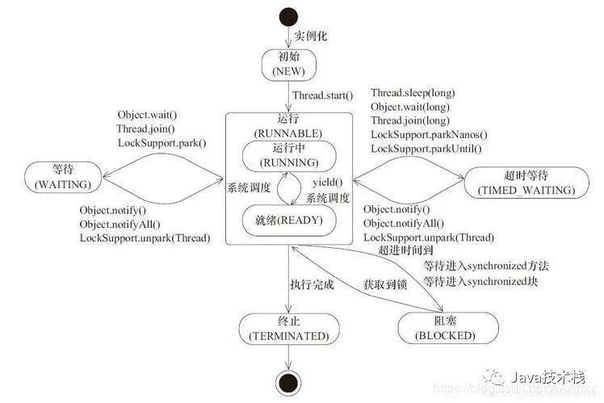
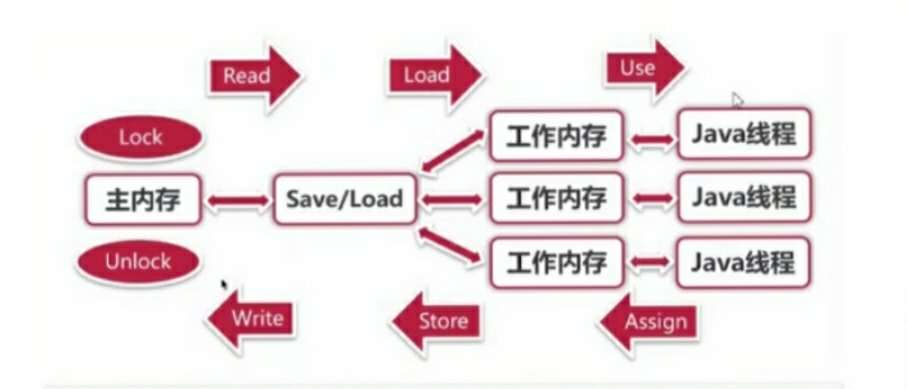

# 1.并发编程之多线程基础

## 1.1 多线程编程

> - 进程：进程是系统进行资源分配的基本单位，有独立的内存空间。
> - 线程：线程是CPU调度和分派的基本单位，线程依附于进程存在，每个线程会共享父进程的资源。
> - 协程：协程是一种用户态的轻量级线程，协程的调度完全由用户控制，协程间切换只需要保存任务的上下文，没有内核的开销。
>
> 常用的Windows、Linux等操作系统都采用抢占式多任务，如何调度线程完全由操作系统决定，程序不能决定什么时候执行，以及执行多长时间。
>
> Java语言内置了多进程支持，一个Java程序实际上是以个JVM进程，JVM进程用一个主线程来执行main()方法，在main()方法内部，又可以启动多个线程。

## 1.2 线程上下文切换

由于中断处理，多任务处理，用户态切换等原因会导致CPU从一个线程切换到另一个线程，切换过程需要保存当前进程的状态并恢复另一个进程的状态。

上下文切换的代价是高昂的，以为在核心上交换线程会花费很多时间。上下文切换的延迟取决于不同的因素，大概在50到100纳秒之间。考虑到硬件平均在每个核心上每纳秒执行12条指令，那么一次上下文切换可能花费600到1200条指令的延迟时间。实际上，上下文切换占用了大量程序执行指令的时间。

如果存在跨核上下文切换（Cross-Core Context Switch），可能会导致CPU缓存失败（CPU从缓存访问数据的成本大约是3到40个时钟周期，从主存访问数据的成本大约是100到300个时钟周期），这种场景的切换成本会更加昂贵。

## 1.3 使用场景

多线程作用是提高程序效率。

多线程最多的场景：web服务器本身；各种专有服务器（如游戏服务器）。

tomcat启动时会创建多个connector，每个connector处理一个请求，tomcat最大并发量是数百个，因为创建了数百个线程，再多线程服务器无法承受。

多线程常见应用场景：

1. 后台任务，例如：定时向大量（100w以上）的用户发送邮件：

   for(100w){

   ​	//发邮件

   }

2. 异步处理，例如：统计结果，记录日志，发送短信等；

   add(){

   ​	==>创建一个新的线程去记录日志

   ​	==>直接返回

   }

3. 分布式计算、分片下载、断点续传

总结：任务量比较大，通过多线程可以调高效率时、需要异步处理时、占用系统资源，造成阻塞的工作时。都可以采用多线程提高效率。

## 1.4 线程创建方式

常见的Java线程的4种创建方式分别为：

1. 继承Thread类；
2. 实现Runnable接口；
3. 通过ExcutorService和Callable<class>实现有返回值的线程；
4. 基于线程池。

第一种：继承Thread

> Thread类实现了Runnable接口，并定义了操作线程的一些方法。创建一个类并继承Thread接口，然后实例化线程对象并调用start方法启动线程。start方法为一个native方法，通过在操作系统上启动一个新线程，并最终执行run方法来启动一个线程。

```java
//step1:通过继承Thread类创建NewThread线程
public class NewThread extends Thread {
    public void run(){
        System.out.println("create a thread by extends thread");
    }
}
//step2:实例化一个NewThread线程对象
NewThread newThread = new NewThread();
//step3:调用start方法启动NewThread线程
newThread.start();
```

## 1.5 用户线程与守护线程

> java分两种线程：用户线程和守护线程。
>
> 守护线程是指程序运行时在后台提供的一种通用服务的线程，比如垃圾回收GC，这种线程并不属于程序不可或缺的部分。
>
> 当Java程序启动后会开启一个JVM进程，JVM进程中有两类线程，用户线程和守护线程，当用户线程执行结束JVM进程也就结束了，不管守护线程是否执行完毕。
>
> 比如GC，GC作为守护进程在JVM进程中一直存在，当用户线程运行完毕后，剩下GC等守护进程，JVM也会退出。
>
> **要设置线程为守护线程，需要在start()前调用setDaemon(true)**

```java
public static void main(String [] args){
    Thread t1 = new Thread(()->{
        for(int i=0; i<100; i++){
            try{
                Thread.sleep(200);
                System.out.println("t1输出："+ i);
            }catch(InterruptedException e){
                e.printStack();
            }
        }
    });
    t1.setDaemon(true);
    t1.start();
    Thread t2 = new Thread(()->{
        for(int i=0; i<100; i++){
            try{
                Thread.sleep(50);
                System.out.println("t2输出："+ i);
            }catch(InterruptedException e){
                e.printStack();
            }
        }
    });
    t2.start()
}
```

线程t1被设置为守护线程，线程t2会先于t1执行完毕，当t2执行完毕，无论t1是否执行完毕，jvm都会退出。

## 1.6 线程的优先级

线程的切换是由线程调度器控制的，程序员无法通过代码干涉，但是可以通过提高线程的优先级来最大程度的改善线程获取时间片的几率。

线程的优先级被划分为10级，值分别i为1-10，其中1最低，10最高。线程提供了三个常量来表示最低、最高和默认优先级：

- Thread.MIN_PRIORITY	1
- Thread.MAX_PRIORITY    10
- Thread.NORM_PRIORITY   5

**线程对象通过setPriority()来设置线程优先级。**其值默认是5


1.7 线程常用API

| **常用线程api方法**            |                                                              |
| ------------------------------ | ------------------------------------------------------------ |
| start()                        | 启动线程                                                     |
| getID()                        | 获取当前线程ID Thread-编号 该编号从0开始                     |
| getName()                      | 获取当前线程的名称                                           |
| Stop()                         | 停止线程（已废弃）                                           |
| getPriority()                  | 返回线程的优先级                                             |
| boolean isAlive()              | 测试线程是否处于活动状态                                     |
| isDaemon()                     | 测试线程是否为守护线程                                       |
| isInterrupted()                | 测试线程是否已经中断,没有调用interrupt()返回false，否则返回true |
| interrupt()                    | 线程中断，代替stop()                                         |
| Thread.currentThread()         | 获取当前线程对象                                             |
| Thread.stage.getState()        | 获取线程的状态,对应线程的生命周期                            |
| **常用线程构造函数**           |                                                              |
| Thread()                       | 分配一个新的Thread对象                                       |
| Thread(String name)            | 分配一个新的Thread对象，具有指定的name正如其名               |
| Thread(Runnable r)             | 分配一个新的Thread对象                                       |
| Thread(Runnable r,String name) | 分配一个新的Thread对象                                       |

## 1.8线程状态

线程状态（生命周期）：

- NEW               new Thread()，尚未执行；
- RUNNABLE     start()就绪后抢夺时间片，正在执行run()
- BLOCKED      程序加锁，等待获取锁的线程的状态
- WAITING       调用wait()线程的状态，调用notify()唤醒
- TIMED_WAITING    调用sleep()方法状态
- TERMINATED     run()执行完毕，进入销毁状态



## 1.9 线程常用API2

### 1.9.1 sleep()方法


### 1.9.2 yield()方法


### 1.9.3 join()方法

> Thread的join方法：线程等待
>
> 线程调用了join方法，那么就要一直运行到该线程运行结束，才会运行其他线程，这样可以控制线程执行顺序。
>
> A{	
>
> ​	B.join()；//让b线程先执行
>
> ​	--> 等待b线程执行完毕再接着执行
>
> }

面试题：现在又t1、t2、t3三个线程，你怎么保证t2再t1执行完后再执行，t3在t2执行完后再执行。

### 1.9.4 中断线程

#### 1.interrupted()和i是Interrupted()

中断线程就是其他线程给该线程发出一个信号，该线程收到信号后结束执行run()方法。

其他线程对目标线程调用interrupt()方法，目标线程需反复检查自身状态，如果isInterrupt则结束执行。

```java
public class Main{
    public static void main(String[] args){
        Thread t = new Thread(()->{
            int n = 0;
            while(!isInterrupt()){
                n++;
                System.out.println(n);
            }
        });
        t.start();
        Thread.sleep(1);
        t.interrupt();	//中断t线程
        //t.join()会让main线程处于等待状态，如果此时对main线程调用interrupt()，join()方法就会立刻抛出InterruptedException。
        //因此，目标线程只要捕获到join抛出的InterruptedException就说明有其他线程对其调用了interrupt()方法，通常情况下该线程就应该立刻结束。
        t.join();	//等待t线程结束
        System.out.print("end");
    }
}
```

t.interrupt()只是向t线程发出一个“中断请求”信号，t线程能否立刻响应，要看具体代码。t线程内部不断检查中断情况，所以能偶立即中断。

> join()抛出InterruptedException处理

```java 
public class Main{
    public static void main(String[] args){
        Thread t = new MyThread();
        t.start();
        Thread.sleep(1000);
        t.interrupt();	//中断
        t.join();		//等待t线程结束
        System.out.println("end");
    }
}
class MyThread extends Thread{
    public void run(){
        Thread hello = new HelloThread();
        hello.start();
        try{
            hello.join();
        }catch(InterruptException e){
            System.out.println("interrupted!");
        }
        hello.interrupt();//中断线程
    }
}
class HelloThread extends Thread{
    public void run(){
        int n =0;
        while(!isInterrupted()){
            n++;
            System.out.println(n);
            try{
                Thread.sleep(100);
            }catch(InterruptException e){
                break;
            }
        }
    }
}
```

#### 2.标志位：Thread.running

> 在线程外部中，通过将标志位running置位false，就可以让线程结束。

# 2.并发编程之线程安全

## 2.1 什么是线程安全？

2.1.1

## 2.2 JMM内存模型

> Java内存模型（即Java Mamory Model，简称JMM）。
>
> ​	JMM本身是一种抽象的概念，并不真实存在，他描述的是一组规则或规范，通过这组规范定义了程序中各种变量（包括实例字段，静态字段和构成数组对象的元素）的访问方式。由于JVM运行程序的实体是线程，而每个线程创建时JVM都会为其创建一个工作内存（有些地方称为栈空间），用于存储线程私有的数据，而Java内存模型中规定所有变量都存储在主内存，主内存是共享内存区域，所有线程都可以访问。
>
> ​	线程对变量的操作（读取赋值等）必须在工作内存中进行，首先要将变量从主内存中拷贝到自己的工作内存空间，然后对变量进行操作，操作完成后再将变量写回主内存，不能直接操作主内存中的变量，工作内存中存储着主内存中的变量副本拷贝，工作内存是每个线程私有数据区域，因此不同线程间无法访问对方的工作内存，线程间的通信必须通过主存来完成。


JMM内存模型线程数据操作细节



1. lock（锁定）：作用于主内存的变量，把一个变量标记为一条线程独占状态；
2. unlock（解锁）：作用于主内存的变量，把一个处于锁定状态的变量释放出来，释放后的变量才可以被其他线程锁定；
3. read（读取）：作用于主内存的变量，把一个变量从主内存传输到线程工作内存中，以便随后的load动作使用；
4. load（载入）：作用于工作内存的变量，他把read操作从主内存中得到的变量放入工作内存的变量副本中；
5. use（使用）：作用于工作内存的变量，把工作内存中的一个变量值传递给执行引擎；
6. assign（赋值）：作用于工作内存的变量，他把一个从执行引擎接收到的值赋给工作内存的变量；
7. store（存储）：作用于工作内存的变量，把工作内存中的一个变量的值传送到主内存中，以便随后的write的操作；
8. write（写入）：作用于工作内存的变量，把store操作从工作内存中的一个变量的值传送到主内存的变量中。

## 2.3 Java并发编程三大特性 

> 由于JMM内存模型，以及Java语言的设计，所以再并发编程当中我们可能会经常遇到下面几种问题。
>
> 这几种问题，我们称为并发编程的三大特性。

### 2.3.1 原子性

> 原子性：即一个操作或多个操作，要么全部执行并且再执行过程中不被打断，要么全部不执行。（提供了互斥访问，再同一时刻只有一个线程进行访问）
>
> 可以通过锁的方式解决。
>
> - Atomic包
> - CAS算法
> - Synchronized
> - Lock

```java
public class Main{
    public static void main(String[] args){
        var add = new AddThread();
        var dec = new DecThread();
        add.start();
        dec.start();
        add.join();
        dec.join();
        System.out.println(Counter.count);
    }
}

class Counter{
    public static int count = 0;
}

class AddThread extends Thread{
    public void run(){
        for(int i=0; i<10000; i++){
            Counter.count += 1;
        }
    }
}

class DecThread extends Thread{
    public void run(){
        for(int i=0; i<10000; i++){
            Counter.count += 1;
        }
    }
}
```

上例执行结果逻辑上应该改是0，实际上不是0，这是由于不是原子操作造成的。

> n = n + 1;
>
> 实际上对应了3条指令：
>
> - ILOAD
> - IADD
> - ISTORE
>
> 假设n值为100，两个线程执行n+1，则结果可能不是102，原因如下：
>
> ```ascii
> ┌───────┐    ┌───────┐
> │Thread1│    │Thread2│
> └───┬───┘    └───┬───┘
>     │            │
>     │ILOAD (100) │
>     │            │ILOAD (100)
>     │            │IADD
>     │            │ISTORE (101)
>     │IADD        │
>     │ISTORE (101)│
>     ▼            ▼
> ```
>
> 如果线程1在执行`ILOAD`后被操作系统中断，此刻如果线程2被调度执行，它执行`ILOAD`后获取的值仍然是`100`，最终结果被两个线程的`ISTORE`写入后变成了`101`，而不是期待的`102`。
>
> 这说明多线程模型下，要保证逻辑正确，对共享变量进行读写时，必须保证一组指令以原子方式执行：即某一个线程执行时，其他线程必须等待：
>
> ```ascii
> ┌───────┐     ┌───────┐
> │Thread1│     │Thread2│
> └───┬───┘     └───┬───┘
>     │             │
>     │-- lock --   │
>     │ILOAD (100)  │
>     │IADD         │
>     │ISTORE (101) │
>     │-- unlock -- │
>     │             │-- lock --
>     │             │ILOAD (101)
>     │             │IADD
>     │             │ISTORE (102)
>     │             │-- unlock --
>     ▼             ▼
> ```
>
> 通过加锁和解锁的操作，就能保证3条指令总是在一个线程执行期间，不会有其他线程会进入此指令区间。即使在执行期线程被操作系统中断执行，其他线程也会因为无法获得锁导致无法进入此指令区间。只有执行线程将锁释放后，其他线程才有机会获得锁并执行。这种加锁和解锁之间的代码块我们称之为临界区（Critical Section），任何时候临界区最多只有一个线程能执行。

### 2.3.2 可见性

> 当多个线程访问同一个变量时，一个线程修改了这个变量的值，其他线程能够立即看到修改的值。
>
> 若两个线程再不同的cpu，那么线程1改变了`i`的值还没刷新到主存,线程2又使用了`i`，那么这个`i`值肯定还是之前的，线程1对变量的修改线程2没看到，这就是可见性问题。
>
> - Synchronized
> - Volatile（不能保证原子性 ）

### 2.3.3 有序性

> 程序执行的顺序按照代码的先后顺序执行。
>
> 一般来说JVM为了提高程序运行效率，可能会对输入代码进行优化，它不保证程序中各个语句的执行先后顺序同代码中定义顺序一致，但是会保证程序最终执行结果和代码顺序执行的结果是一致的。如下：
>
> int a = 10;	//语句1
>
> a = a+3;		//语句2
>
> int r = 2;		//语句3
>
> r = a*a;		//语句4
>
> 则因为JVM指令重排序（happen-before），他还可能执行顺序为：2-1-3-4，1-3-2-4
>
> 但绝对不可能2-1-4-3，因为这个打破了依赖关系。
>
> 显然重排序对单线程运行是不会有任何问题，而多线程就不一定了，所以我们在多线程时就得考虑这个问题了。

## 2.4 volatile关键字

> volatile关键字的作用是修饰变量，变量在多个线程之间可见，并且能保证所修饰变量的有序性。
>
> 1. 保证变量的可见性：当一个被volatile关键字修饰的变量被一个线程修改的时候，其他线程可以立刻得到修改之后的结果。当一个线程被volatile关键字修饰的变量写入数据的时候，虚拟机会强制它的值刷新到主内存中。当一个线程用到被volatile关键字修饰的值的时候，虚拟机会强制要求它从主内存中读取。
> 2. 屏蔽指令重排序：指令重排序是编译器和处理器为了搞笑对程序进行优化的手段，它只能保证程序执行的结果是正确的，但是无法保证程序的操作顺序与代码顺序一致。这在单线程中不会构成问题，但是在多线程中就会出现问题。非常经典的例子是在单例方法中同时对字段加入volatile，就是为了防止指令重排序。

## 2.5 synchronized

> synchronized关键字可以保证在同一时刻，只有一个线程可以执行某个方法或代码块，同时synchronized可以保证一个线程的变化可见（可见性），即可以代替volatile关键字。
>
> 可以保证原子性。

使用对象作为锁，对象头中有一个锁状态字段。

### 2.5.1 使用方法

1. 普通同步方法（实例方法），锁是当前实例对象，进入同步代码前要获取当前实例的锁。
2. 静态同步方法，锁是当前类的class，进入同步代码前要获取当前类对象的锁。
3. 同步方法块，锁是括号里面的对象，对给定对象枷锁，进入同步代码块前要获得给定对象的锁。

### 2.5.2 synchronized基本原理

> sychronized是JVM底层帮助实现的，JVM是通过进入、退出对象监视器（Monitor）来实现对方法、同步块的同步的。
>
> ​	具体实现是在编译之后再同步方法调用前加入一个monitor.enter指令，在退出方法和异常处插入monitor.exit的指令。
>
> ​	其本质就是对一个对象监视器（Monitor）进行获取，而这个获取过程具有排他性从而达到了同一时刻只能一个线程访问的目的。
>
> ​	而对于没有获取到锁的线程将会阻塞到方法入口处，直到获取锁的线程monitor.exit之后才能尝试继续获取锁

```java 
static class A{
    public  static Object o1 = new Object();
    public static void main(String[] args){
        new A().fun1();
        A.fun2();
    }
    public synchronized void fun1(){
        //当前对象this作为锁对象
        //同步代码块
    }
    public synchronized static void fun2(){
        //A.Class对象作为锁对象
        //同步代码块
    }
    
    //fun3和fun4用同一个锁对象才不能被同时调用
    void fun3(){
        sychronized(o1){
            //do something
        }
    }
    
    void fun4(){
        sychronized(o1){
            //do something
        }
    }
}
```

2.5.3 线程死锁

```java
public class Main{
    public static void main(String[] args){
        Object o1 = new Object();//锁1
        Object o2 = new Object();//锁2
        new Thread(()->{
            synchronized(o1){
                try{
                    Thread.sleep(1000);
                    synchronized(o2){
                        System.out.print("线程1执行")
                    }
                }catch(InterruptedException e){
                    e.printStackTrace();
                }
            }
        }).start();
        new Thread(()->{
            synchronized(o2){
                try{
                    Thread.sleep(1000);
                    synchronized(o1){
                        System.out.print("线程2执行")
                    }
                }catch(InterruptedException e){
                    e.printStackTrace();
                }
            }
        }).start();
    }
}
```

