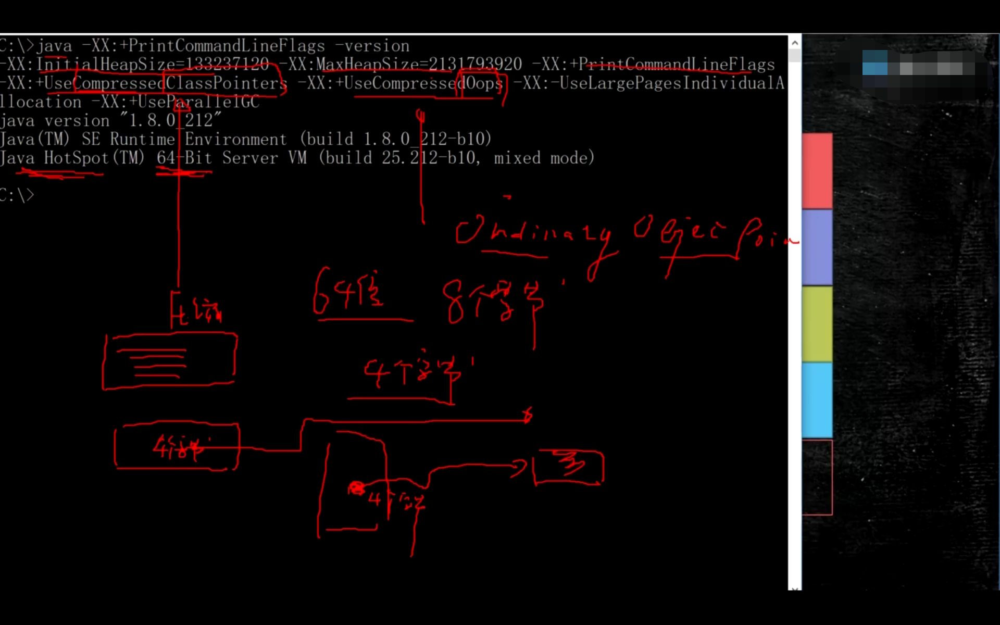
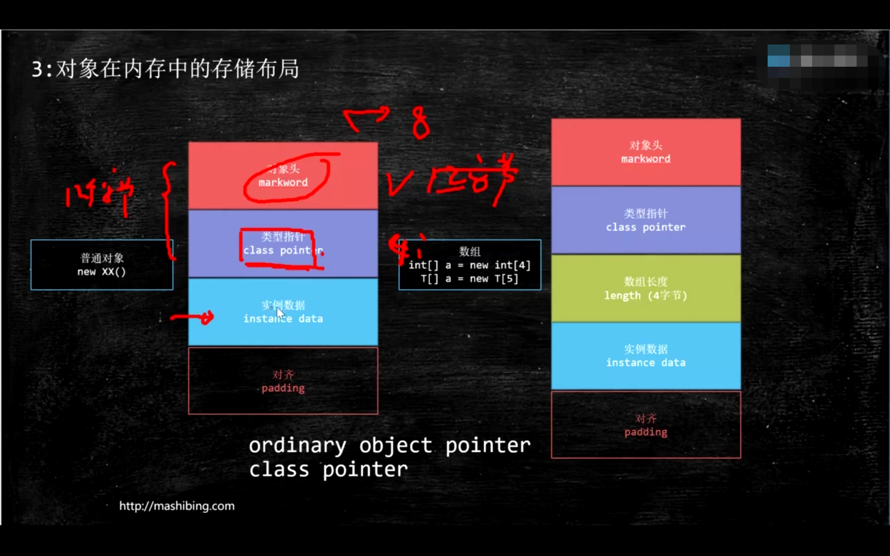

# CAS

## 概念：比较并交换

**CAS(E,N,V)**

CAS（Compare and Swap，Compare and exchange）指比较并交换。CAS算法CAS(E,N,V)包含3个参数，E表示要更新的变量，N表示预期的值，V表示新值。在且仅在E等于N时，才会将变量设置为V，如果N和E不同，则说明已经有其他线程做了更新，当前线程什么都不做。最后，CAS返回当前V的真实值。

不加锁情况下使用CAS保证多线程一致性过程：

> 正常的多线程操作一个数据时，会加锁，操作数据时只让一个线程进行。
>
> 使用CAS时：
>
> 1. 当前线程读取数据，存入E;
> 2. 计算出新值V；
> 3. 再次读取变量值，存入N；
> 4. 如果E和N相等则更新变量为V，如果E和V不等则进行下一次CAS。

## ABA问题

ABA问题是CAS中，读取变量后，变量经过其他线程修改，又变回到原来的值，而不做处理CAS不知道它中间经过其他线程的修改。（举例：和女朋友分手，女朋友又经历了其他的男人，最后要和你符合，而你却不知道中间的经历。）

解决：给值加一个版本号，当任何线程对该值做改动时更新版本号，CAS在做比较时不仅要做值比较，还要做版本号比较。

在jdk中AtmicStampedReference中有ABA问题解决。


## CAS底层实现

AtomicInteger.class：

```java
public final int incrementAndGet(){
    for(;;){
        int current = get();
        int next = current + 1;
        if(compareAndSet(current, next))
            return next;
    }
}
public final boolean compareAndSet(int expect, int update){
    return unsafe.compareAndSwapInt(this, valueOffset, expect, update);
}
```


### 源码层

**源码层：jdk下sunn.misc.Unsafe.class**

```java
public final native boolean compareAndSwapObject(...);
public final native boolean compareAndSwapInt(...);
public final native boolean compareAndSwapLong(...);
```


### JVM层

native方法要到JVM（Hotspot）中执行

运用：

```java
package com.zzy.thread;
import sun.misc.Unsafe;
import java.lang.reflect.Field;

public class TestUnsafe{
    int i = 0;
    private static TestUnsafe t = new TestUnsafe();
    public static void main(String[] args){
        Field unsafeField = Unsafe.class.getDeclareFields()[0];
        unsafeField.setAccessible(true);
        Unsafe unsafe = (Unsafe)unsafeField.get(null);
        Field f = TestUnsafe.class.getDeclaredField("i");
        long offset = unsafe.objectFieldOffset(f);
        System.out.println(offset);
        
        boolean success = unsafe.compareAndSwapInt(t,offset,0,1);
        System.out.println(success);
        System.out.println(t.i);
    }
}
```


**在jdk1.8u hotspot下/src/share/vm/prims/unsafe.cpp的c++代码**

```c++
cmpxchg = compare and exechange
UNSAFE_ENTRY(jboolean, unsafe_CompareAndSwapInt(JNIENV *env, jobject unsafe, jobject obj,jloang offset, jint e, jint x))
    UnsafeWrapper("unsafe_CompareAndSwapInt");
	oop p = JNIHandles::resolve(obj);
	jint* addr = (jint*) index_oop_from_field_long(p, offset);
	return (jint)(Atomic::cmpxchg(x, addr, e)) == e;   //追踪到cmpchg方法
UNSAFE_END
```


**cmpxchg方法跟踪源码到：jdk8u:atomic_linux_x86.inline.hpp**

```c++
//is_MP = Multi Processor
 inline jint Atomic::cmpxchg(jint exchange_value, volatile jint* dest, jint compare_value){
 	int mp = os::is_MP();
 	//汇编实现，CAS在底层对应一个cmpxchg汇编指令
 	//LOCK_IF_MP表示如果有多核，指令前会加一个lock汇编指令
 	_asm_ volatile(LOCK_IF_MP(%4) "cmpxchgl %1,(%3)"
 				   : "=a" (exchange_value)
 				   : "r" (exchange_value),"a" (compare_value), "r" (dest), "r" (mp)
 				   : "cc", "memory");
 	return exchange_value;
 }
```


**jdk8u:os.hpp is_MP()**

```c++
static inline bool is_MP() {
    //...
    return (_processor_count != 1) || AssumeMP;
}
```


**jdk8u:atomic_linux_x86.inline.hpp**

```c++
#define LOCK_IF_MP(mp) "cmp $0," #mp "; je 1f; lock; 1:"
```


### 汇编层

**最终实现**

cmpxchg = cas修改变量值

`lock cmpxchg`指令

cmpxchg指令不能保证原子性，当CAS读取数据修改后，开始忘变量写时，值还是有可能被修改

lock指令体现原子性，当执行cmpxchg指令时，其他cpu不允许对变量值做修改；


### 硬件层

lock指令在执行后面指令的时候锁定一个北桥信号

（不采用锁总线的方式）


# 1.Java中的锁

**目前理解：Java锁是对线程同步的策略思想，不指具体的抽象类或对象，而对象头中的锁指一个标志，是Java锁的实现一部分。而不是指Java锁。**

> 锁从乐观和悲观的角度可分为乐观锁和悲观锁，从获取资源的公平性角度可分为公平锁和非公平锁，从是否共享资源角度可非为共享锁混合独占锁，从锁的状态的角度可分为偏向锁、轻量级锁和重量级锁。同时，在jvm中还巧妙设计了自旋锁以更快地使用CPU资源，

## 1.1 自旋锁

自旋锁不如说自旋等待锁，线程不放弃cpu执行时间，自旋等待锁。

> Java的线程是映射到操作系统的原生线程之上的，如果要阻塞或唤醒一个线程，都需要操作系统来帮忙完成，这就需要从用户态转换到核心态中，因此状态装换需要耗费很多的处理器时间，对于代码简单的同步块（如被synchronized修饰的getter()和setter()方法），状态转换消耗的时间有可能比用户代码执行的时间还要长。
>
> 虚拟机的开发团队注意到在许多应用上，共享数据的锁定状态只会持续很短的一段时间，为了这段时间取挂起和恢复现场并不值得。如果物理机器有一个以上的处理器，能让两个或以上的线程同时并行执行，我们就可以让后面请求锁的那个线程“稍等一下“，但不放弃处理器的执行时间，看看持有锁的线程是否很快就会释放锁。为了让线程等待，我们只需让线程执行一个忙循环（自旋），这项技术就是所谓的自旋锁。
>
> 自旋等待不能代替阻塞。自旋等待本身虽然避免了线程切换的开销，但它是要占用处理器时间的，因此，如果锁被占用的时间很短，自旋等待的效果就会非常好，反之，如果锁被占用的时间很长，那么自旋的线程只会拜拜浪费处理器资源。因此，自旋等待的时间必须要有一定的限度，如果自旋超过了限定次数（默认是10次，可以使用-XX:PreBlockSpin来更改）没有成功获得锁，就应当使用传统的方式去挂起线程了。
>
> 自旋锁在JDK1.4.2中引入，使用-XX:+UseSpinning来开启。JDK6中已经变为默认开启，并且引入了自适应的自旋锁。自适应意味着自旋的时间不在固定了，而是由前一次在同一个锁上的自旋时间及锁的拥有者的状态来决定。
>
> 自旋是在轻量级锁中使用的，在重量级锁中，线程不使用自旋。
>
> **如果在同一个锁对象上，自旋等待刚刚成功获得过锁，并且持有锁的线程正在运行中，那么虚拟机就会认为这次自旋也是很有可能再次成功，进而它将允许自旋等待持续相对更长的时间，比如100次循环。另外，如果对于某个锁，自旋很少成功获得过，那在以后要获取这个锁时将可能省略掉自旋过程，以避免浪费处理器资源。**

## 1.2 乐观锁

乐观处理数据，读不上锁，写上锁。

> 在每次读取数据时都认为别人不会修改该数据，所以不会上锁，但在更新时会判断在此期间别人有没有更新该数据，通常采用在写时先读出当前版本号然后枷锁的方法。具体过程为：比较当前版本号与上一次的版本号，如果版本号一致，则更新，如果版本号不一致，则重复进行读、比较、写操作。（CAS）
>
> Java中的乐观锁，大部分是通过CAS（Campare and swap）操作实现的，CAS是一种原子更新操作，在对数据操作之前首先会比较当前值跟传入的值是否一样，如果一样则更新，否则不执行更新操作，直接返回失败状态。

## 1.3 悲观锁

悲观锁，读写加锁

> 悲观锁，采用悲观思想处理数据，在每次读取数据时都认为别人会修改数据，所以每次在读写数据时都会加上锁，这样被人想读写这个数据时就会阻塞、等待知道拿到锁。
>
> Java中悲观锁大部分基于AQS（Abstract Queued Synchronized，抽象的队列同步器）架构实现。AQS定义了一套多线程访问共享资源的同步框架，许多同步类的实现都依赖于它，例如长用的Synchronized、ReentrantLock、Semaphore、CountDownLatch等。该框架下的锁会先尝试以CAS乐观锁去获取锁，如果获取不到，则会转为悲观锁（如RetreenLock）。

## 1.4 可重入锁

> 可重入锁也叫做递归锁，指在同一线程中，在外层函数获取到该锁之后，内层的递归函数仍然可以继续获取该所。在Java环境下，ReentrantLock和synchronized都是可重入锁。

## 1.5 公平锁和非公平锁

> - 公平锁（Fair Lock）指在分配锁前检查是否有线程在排队等待获取该锁，优先将锁分配给排队时间最长的线程。
> - 非公平锁（Nonfair Lock）指在分配锁时不考虑线程排队等待的情况直接获取锁，在获取步到锁时再排到队尾等待。

# 2.sychronized实现详解


## 2.1 Java源码层

```java
synchronized(o)
```

## 2.2 字节码层

Java源码编译为字节码，在用synchronized修饰的代码段中，编译为字节码后，会在代码片段前后加入：

monitorenter和monitorexit

## 2.3 JVM层（Hotspot）

使用工具做实验：**JOL = Java Object Layout**

在maven中引入

```xml
<dependencies>
	<dependency>
    	<groupId>org.openjdk.jol</groupId>
        <artifactId>jol-core</artifactId>
        <version>0.9</version>
    </dependency>
</dependencies>
```


使用openjdk类库输出对象头信息做实验

```java
package com.zzy.insidesync;

import org.openjdk.jol.info.ClassLayout;

public class T01_Sync1 {
  

    public static void main(String[] args) {
        Object o = new Object();

        System.out.println(ClassLayout.parseInstance(o).toPrintable());
    }
}
```

结果：

```java
com.zzy.insidesync.T01_Sync1$Lock object internals:
 OFFSET  SIZE   TYPE DESCRIPTION                               VALUE
      0     4   (object header)  05 00 00 00 (00000101 00000000 00000000 00000000) (5)
      4     4   (object header)  00 00 00 00 (00000000 00000000 00000000 00000000) (0)
      8     4   (object header)  49 ce 00 20 (01001001 11001110 00000000 00100000) (536923721)
     12     4        (loss due to the next object alignment)
Instance size: 16 bytes
Space losses: 0 bytes internal + 4 bytes external = 4 bytes total
```

使用锁机制实验：

**锁定对象o，锁的信息记录在对象o中，不能说锁定了代码块**

```java
package com.zzy.insidesync;

import org.openjdk.jol.info.ClassLayout;

public class T01_Sync1 {
  

    public static void main(String[] args) {
        Object o = new Object();
        
        synchronized(o){
            System.out.println(ClassLayout.parseInstance(o).toPrintable());
        }
    }
}
```

结果：

```java
com.zzy.insidesync.T02_Sync2$Lock object internals:
 OFFSET  SIZE   TYPE DESCRIPTION                               VALUE
      0     4   (object header)  05 90 2e 1e (00000101 10010000 00101110 00011110) (506368005)
      4     4   (object header)  1b 02 00 00 (00011011 00000010 00000000 00000000) (539)
      8     4   (object header)  49 ce 00 20 (01001001 11001110 00000000 00100000) (536923721)
     12     4        (loss due to the next object alignment)
Instance size: 16 bytes
Space losses: 0 bytes internal + 4 bytes external = 4 bytes tota
```

可以看到，markword部分上锁前和后发生了变化，**锁信息记录在markword中**。

对象布局输出解释：

OFFSET表示从某个位置开始，SIZE表示大小（字节byte）

输出信息表示：

第一行：从第0位置开始，大小为4byte，表示对象头，后面是四个字节值

第二行：从第4个字节开始，大小4个字节，表示对象头，后面是四个字节值；

第三行：从第8个字节开始，大小4个字节，表示对象头，后面是四个字节值；

第四行：从第12个字节开始，大小4个字节，表示对其；

共16个字节

### 2.3.1 对象在内存中的布局

对象在内存中的布局有三部分组成：

- 对象头
  - markword：存储锁信息，有关synchronized的信息
  - class pointer（类指针）：指向该对象所属类的指针，Java中会对每个类加载一个Class对象到内存；
- 实例数据（instance data）：对象的成员变量数据；
- 对齐（padding）：对象大小必须是8的倍数，由于jvm读取内存中对象是按照总线宽度读取的，如果是8倍数的话读取效率高；



使用命令行`java -XX:+PrintCommandLineFlags -version`打印存储配置参数：

- -XX:InitialHeapSize 表示起始堆大小
- -XX:MaxHeapSize 表示最大堆大小
- -XX:PrintCommandLineFlags 
- XX:UseCompressedClassPointers 开启类指针压缩，64位虚拟机，指针长度为64为即8byte，开启指针压缩，后压缩为4byte；
- -XX:UseCompressedOops 开启普通对象指针压缩，如String对象指针默认也是压缩为4byte




**面试题：**

> Object o = new Object()在内存中占多少个字节？ -顺丰
>
> 有对象布局可知，markword占8byte，默认开启类指针压缩，则classpointer大小为4byte，实例数据为0，对齐为4byte所以为16byte；o默认开启普通对象指针压缩占4byte
>
> 如果一个对象包含一个int和一个String类型成员变量，则大小为？
>
> 对象头有12byte，int占4byte，String默认开启指针压缩，占4byte，共20byte，补齐4byte共24byte。


## 2.4 锁升级（上锁过程）

在最早的JDK版本JDK1.0、1.2时synchronized都是重量级锁。

后来jdk对synchronized进行一系列优化，锁有一个升级过程。这个升级过程被markword清晰记录。


**升级过程：**

new（无锁态）-> 偏向锁 -> 轻量级锁（也叫无锁，自旋锁，自适应自旋）->重量级锁

用**markword中最低的三位**代表锁状态，其中1位是偏向锁位，两位是普通锁位。

1. `Object o = new Object();`

   锁 = 0 01（无锁态）

   `o.hashCode()` -> 001 + hashcode

   00000001 10101101 00110100 00110110

   01011001 00000000 00000000 00000000

   little endian big endian

   00000000 00000000 00000000 01011001 00110110 00110100 10101101 00000000

2. 当有线程第一次给对象加锁，则升级位偏向锁，markword记录当前线程指针（具体是在markword前54位记录当前线程指针JaveThread*），锁 = 101（偏向锁）。

   则当该锁只有这一个线程执行时，效率就大大提升。

   > 默认synchronized(o)

   > 00 -> 轻量级锁

   > 默认情况偏向锁有个时延，默认是4秒
   >
   > why?因为JVM虚拟机自己有一些默认启动的线程，里面有好多sync代码，这些sync代码启动时候就知道肯定会有竞争，如果使用偏向锁，就会造成偏向锁不断的进行锁撤销和锁升级的操作，效率较低。
   >
   > -XX:BiasedLockingStartupDelay=0
   >
   > 如果设定上述参数：new Object() -> 101偏向锁 -> 线程ID为0 -> Anonymous BiasedLock
   >
   > 打开偏向锁，new出来的对象，默认就是一个可偏向匿名对象101，**JDK8默认无锁**
   >
   > 偏向锁不可重偏向，批量偏向，批量撤销

   

3. 当锁发生任意竞争，即有多个线程来竞争锁，则升级为轻量级锁。

   **首先撤销偏向锁，修改锁标志位，markword后两位为00，每个线程都有一个线程栈，线程栈生成Lock Record对象，线程竞争通过CAS的方式将该线程栈的Lock Record对象指针记录在markword的前62位，那个线程记录成功，则该线程获取锁成功。**此时Lock Record将对象的markword备份了一份。

   

4. 由于CAS会占用CPU资源所以当线程竞争更加激烈时会将锁升级为重量级锁，**重量级锁需要到操作系统申请，重量级锁有一个数据结构，当多个线程竞争时，没有得到锁的线程会进入锁的阻塞队列，进入阻塞状态，这样就不用CAS自旋占用CPU资源**。

   升级过程：向操作系统申请资源，linux mutex，CPU从3级-0级系统调用，线程挂起，进入等待队列，等待操作系统调度，然后再映射回用户空间。

   此时markword中记录的指针就指向了这个互斥量（重量级锁）。

   升级条件为

   JDK1.6前：

   竞争加剧，线程自旋超过10次，-XX:PreBlockSpin,或自旋线程数超过CPU核数一半。

   JDK1.6后：

   1. CAS自适应自旋（Adapative Self Spinning）,JVM自己控制；
   2. 当占用cpu核数超过1/2时；

   用户态和内核态

   应用程序一般跑在内核态中，如果要做一些核心操作如向硬件写入数据，或者操作硬件，则要经过内核态。获取锁就要经过内核态，锁在内核态中是一些互斥的数据结构muter，此时markword记录的指针指向这个互斥量。

   轻量级锁是运行在用户态的，不需要经过内核态，效率高。但是会占用cpu资源。


## 2.5 锁消除 Lock eliminate

```java
public void add(String str1,String str2){
    StringBUffer sb = new StringBuffer();
    sb.append(str1).append(str2)
}
```

> StringBuffer是线程安全的，因为他的关键方法都被synchronized修饰过的，但是上述代码，sb这个引用只在add这个方法使用，不可能被其他线程引用（因为是局部变量，栈私有），因此sb是不可能共享的资源，JVM会自动消除StringBuffer对象内部的锁。

## 2.6 锁粗化 lock coarsening

```java
public String test(String str){
    int i = 0;
    StringBuffer sb = new StringBuffer();
    while(i < 100){
        sb.append(str);
        i++;
    }
    return sb.toString();
}
```

> StringBuffer是线程安全的，while调用sb的append方法100次（没有粗化就要100次加锁解锁过程），JVM会检测到这样的一连串操作都对同一个对象加锁，此时JVM就会将加锁的范围粗化到这一连串的操作外部，这里加到while外，使得一连串操作只需要加一次锁即可。


## 2.7 锁降级（不重要）

[JVM锁降级](https://www.zhihu.com/question/63859501)

锁降级发生在GC阶段，再GC阶段降级只有GC线程访问，所以降级没有多大意义。


## 2.8 超线程

一个ALU+两组Registers + PC

[参考资料](http://openjdk.java.net/groups/hotspot/docs/HotSpotGlossary.html)