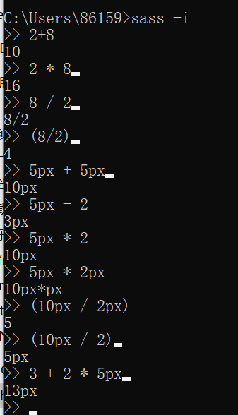

# SASS基础

## 1、安装sass（windows）

1. 系统环境已经安装了ruby；
2. 命令行中：`gem install sass`;
   - `sass -v
   - ​	//返回sass的版本

## 2、命令行编译sass为CSS

在项目保存路径打开命令行；

mac下命令：`mkdir 目录名 && cd $_`;//创建目录并进入该目录

sass的后缀名为`scss`

编译命令：

`sass 要编译的文件路径:输出的文件路径`

使用sass自动监听文件变化自动编译工具：

`sass --watch  要监听的sass目录:要编译输出的css目录` 这种方式监听编译的css名称与sass文件的名称是一样的。

## 3、编译输出的四种格式style

- nested，嵌套
- compact，紧凑
- expanded，扩展
- compressed，压缩

命令：在使用sass编译输出时候添加参数，--style参数

如紧凑格式：`sass --watch sass:css --style compact`

## 4、sass的两种语法

缩进式语法的sass文件后缀名为sass，老版本；

- 多行注释 `/*...`，单行注释：只需要 //,后面每行缩进即可
- `import base ` //导入东西不需要加引号；
- 定义mixin`=alert`等号加缩进，内容无需加分号；
- 引入mixin使用一个+

新的sass css的sass文件后缀名为scss，新版本。

- 注释`/*...*/`,单行注释：每一行都要 //
- `import "base"`  //导入东西要加引号
- 定义mixin指令要使用`@mixin alert {}`内容加分号；
- 引入mixin要使用@include指令；

## 5、scss的基础语法

### 1.定义并使用变量

```scss
//sass中定义的变量前要加上一个$符号
//变量名可以使用减号或者下划线，也可以交替使用，但是一般统一；
//变量的值可以是数字、字符串（要加引号）、颜色等；
$primary-color: #1269b5;
//定义好变量后可以在该文件任何地方使用该变量
//变量也可以是多个值
$primary-border: 1px solid $primary-color;
//引用变量
div.box {
    background-color: $primary-color;
}
h1.page-header {
    border: $primary-border;
}
```

### 2.嵌套-Nesting

```css
.nav {
    height: 100px;
}
.nav ul {
    margin: 0;
}
.nav ul li {
    float: left;
    list-style: none;
    padding: 5px;
}
```

改用嵌套语法：

```scss
.nav {
    height: 100px;
    ul {
        margin: 0;
        li {
            float: left;
            list-style: none;
            padding: 5px;
        }
    }
}
```

### 3.嵌套时使用父选择器

sass对嵌套的编译时将内部嵌套的样式和外部样式名拼接加上一个空格编译成一个css选择器；

但是有时候使用伪类或者交集选择器时候不要空格，这是可以使用&符号，&表示父选择器的名字；

```scss
.nav {
    height: 100px;
    ul {
        margin: 0;
        li {
            float: left;
            list-style: none;
            padding: 5px;
        }
        a {
            display: block;
            color: #000;
            padding: 5px;
            &:hover {	//编译结果：.nav ul li a:hover
                background-color: #0d2f7e;
                color: #fff;
            }
        }
    }
    & &-test{	//编译结果：.nav .nav-test
        font-size: 15px;
    }
}
```

### 4.将嵌套应用到属性中

```scss
//使用属性嵌套前
body{
    font-family: Helvetice, Arial, sans-serif;
    font-size: 15px;
    font-weight: normal;
}
.nav{
    border: 1px solid #000;
    border-left: 0;
    border-right: 0;
}
//属性嵌套后
body{
    font{
        family: Helvetice, Arial, sans-serif;
    	size: 15px;
    	weight: normal;
    }
}
.nav{
    border: 1px solid #000 {
    	border-left: 0;
   		border-right: 0;
    }
}
```

### 5.混合-mixin

> 可以把其想象成一个用名字定义好的样式，可以在任何地方重复的使用它,类似于js中的function，每一个mixin都有自己的名字，使用这个名字可以调用它，编译mixin时候可以添加参数，让mixin使用起来更灵活。

定义方式：

`@mixin 名字(参数1， 参数2 ...){...}`

```scss
@mixin alert {//无参mixin
    color: #8a6d3b;
    background-color: #fcf8e3;
    a {
        color: #664c2b;
    }
}
.alert-waring{
    @include alert;	//引用mixin
}

//编译后结果
.alert-warning {
    color: #8a6d3b;
    background-color: #fcf8e3;
}
.alert-warning a{
    color: #664c2b;
}
```

### 6.mixin中使用参数

```scss
@mixin alert($text-color, $background) {//参数定义规则和变量一样
    color: $text-color;
    background-color: $background;
    a {
        color: darken($text-color,10%);//颜色加深10%
    }
}
.alert-waring{
    @include alert(#8a6d3b, #fcf8e3);	//引用mixin
}
.alert-info {
    @include alert($background:#d9edf7, $text-color:#31708f); 
}

//编译后结果
.alert-warning {
    color: #8a6d3b;
    background-color: #fcf8e3;
}
.alert-warning a{
    color: #66512c;
}
```

### 7.扩展-@extend

> 就是让一个选择器去继承另一个选择器所有样式；

```scss
.alert {
    padding: 15px;
}

.alert a {
    font-weight: bold;
}

.alert-info {
    @extend .alert;	//不仅可以继承alert选择器，和alert相关的都会被继承
    background: #d9edf7;
}
//编译结果
.alert, .alert-info {
    padding: 15px;
}
.alert a, .alert-info a {
    font-weight: bold;
}
.alert-info {
    background-color: #d9edf7;
}
```

### 8.@import

把其他css包含进来，sass中编写小的css文件（称作Partials），sass通过@import将他们包含到一个文件中。

每一个Partial就是一个css文件，文件由下划线开头，sass不糊单独编译这种文件。

_base.scss

style.css中

```scss
@import "base";
```

### 9.数据类型-data type

sass中包含三种注释：单行注释、多行注释、强制注释；

- 多行注释会在编译输出的css中保留，在压缩的css中会去掉；

- 单行注释不会出现在便宜后端css中；

- 强制注释,会保留在css中。

  ```scss
  /*!
   *
   */
  ```

  

**Data Type**

css的值和scss变量的值可以有几个不同的类型：数字、字符串、颜色、列表等；

不同类型有不同的操作：可以使用+来连接两个字符串，用数字类型去做一些运算，sass中有一些函数用来专门处理这些类型；

使用`sass -i`在命令行来运行sass代码

type-of(5)  //number

type-of(5px) //number

type-of(hello) //string

type-of("hello")  //string

type-of(1px solid #000) //list,多个值，用空格或者逗号隔开；

type-of(#000)  //color

type-of(red)  //color

type-of(rgb(0,0,0))  //color

type-of(hsl(0,100%,0))  //color


**Number**

在css中高度的值宽度的值都可以是数字类型，这些值会带一些单位如px、em、%等，在sass中可以使用+-*/%进行一些数学运算，来处理这些数字类型的值，在得到结果中会包含单位。         

sass的交互模式：`sass -i`

    

除法在css中使用有特殊含义如：

`font: 16px/1.8 serif`

因此在使用出发时候使用括号。

px*px不是css中的有效单位因此在使用时候注意。

**数字函数**

sass提供了一些函数用于方便的数字类型：

```shell
abs(10) //10
abs(10px)  //10px
abs(-10px)  //10px
round(3.5)	//四舍五入函数 4
round(3.2)	//3
ceil(3.2)	//4 进位
floor(3.6)  //3 退一位
percentage(650px /1000px)	//65%得到一个百分数
min(1,2,3)	//1
max(1,2,3)	//3
```


**String-字符串**

带引号和不带引号的字符串的区别在于：带引号的字符串中可以包含空格和一些特殊的符号，常见的用在字符串类型的操作符就是+，可以拼接两个字符串。

```shell
”zhao“ + zeyu  //"zhaozeyu"
zhao + "zeyu"  //"zhaozeyu"
"zhaozeyu" + 666	//"zhaozeyu666"
zhao - zeyu		//"zhao-zeyu"
zhao / zeyu		//"zhao/zeyu"
zhao * zeyu		//会报错
```

**处理字符串的函数**

```shell
$variable:"Zhaozeyu"	//定义一个变量
to-upper-case($variable)	//"ZHAOZEYU"
to-lower-case($variable)	//"zhaozeyu"
str-length($variable)	//得到字符串的长度 8
str-index($variable, "ze")	//得到字串开始位置5
str-insert($variable, ".scss", 9) /插入字符串 "zhaozeyu.scss"
```


**颜色**

在css中表示颜色的方式有很多种，普通字符（如red）、16进制表示（如#000000），rgb表示（rgb(255,0,0)）,hsl表示（hsl（0，100%，50%）h色相，s饱和度，l明度），sass支持所有颜色的表示方法，可以使用运算操作符去处理这些颜色的值，sass还提供了一些非常有用的函数；

**rgb和rgba方式**

rgb(红，绿，蓝)	//值的范围为0-255，也可以使用百分比表示

rgba(红，绿，蓝，透明度)	//透明度的值范围为0-1


**HSL方式**

H：色相（0-360度）、S：饱和度（0-100%）、L明度（0-100%）

hsl(0,100%,50%)	//使用hsl函数表示红色

hsla(0,100%,50%,0.5)	//最后一个值设置透明度


**ajust-hue函数**

ajust-hue()可以调整hsl中h的值

```scss
$base-color: #ff0000;
$base-color-hsl: hsl(0,100%,50%);
body{
    background-color: ajust-hue($base-color,132deg);//deg单位可加可不加，也可以调整$base-color
}
```


**lighten和darken函数**

lighten可以调整颜色的明度，让颜色更亮；

darken可以调整颜色的明度，让颜色更暗；

```scss
$base-color: hsl(222,100%,50%);
$light-color: lighten($base-color,30%);
$dark-color: darken($base-color,20%);
.alert {
	border: 1px solid $base-color;
    background-color: $light-color;
    color: $dark-color;
}
```

**saturate函数和desaturate函数**

saturate可以增加颜色的饱和度，desaturate相反

```scss
$base-color: hsl(221, 50%, 50%);
$saturate-color: saturate($base-color, 50%);
$desaturate-color: desaturate($base-color,30%);
```


transparentize和opacify函数

用于调整颜色的透明度：transparentize用于减小颜色透明度，opacify用于提高颜色的透明度；

```scss
$base-color: hsla(222,100%,50%,0.5);
$fade-in-color: opacify($base-color, 0.3);  //0.8
$fade-out-color: transparentize($base-color, 0.3) //0.2
```


**list-列表**

list表示列表数据，在sass中表示css的一串值，列表中的值可以使用空格或者逗号分隔开。

如：

`border: 1px solid #000`

`font-family:Courier, "Lucida Console", monospace`

列表中可以包含其他列表，如：

`padding: 5px 10px,5px 0` //padding中包含两个列表，两个列表使用逗号分隔开.

或者使用括号分割开：`padding: (5px 10px) (5px 0)`

**列表的函数**

```scss
length(5px 10px) //2,获取列表的长度
length（5px 10px 5px 0） //4
nth(5px 10px, 1)	//5px,得到指定索引的列表项，索引从1开始
index(1px solid red,solid)	//2,获取指定列表项的索引值
append(5px 10px, 5px)	//5px 10px 5px,向指定列表插入新列表项，第三个参数是定列表的分割符可以是space，comma（逗号），auto
join(5px 10px, 5px, 0) //(5px 10px 5px 0)组合两个列表，也有第三个分割符参数
```


**map-名值对列表**

`$map:(key1:value1, key2:value2, key3:value3)`

**map函数**

```shell
$colors:(light: #ffffff, dark:#000000)	//定义map变量
length($colors)	//2
map-get($colors, light)	//#ffffff,根据key获取值
map-keys($colors)	//("light","dark"),获取key列表
map-values($colors)	//(#ffffff,#000000),获取值的列表
map-has-key($colors, light)	//true,判断key是否存在
map-merge($colors, (light-gray: #e5e5e5)) //合并连个map
$colors: map-merge($colors, (light-gray: #e5e5e5))
map-remove($colors,light,dark)	//移除map中的项目
```


**布尔类型-boolean**

其值可以是true/false,在sass中使用比较运算符会得到一个boolean值。

```shell
5px > 3px	//true
5px > 10px	//false
//支持使用 and or not
(5px > 3px) and (5px > 10px) //false
```


### 10.指令

在使用复杂的mixin或者函数时候我们需要一些控制的指令，去做一些判断或者循环。

- @for
- @each
- @while
- @if

**@if/@else if/@else**

`@if 条件 {...}`

```scss
$use-prefixes: false;
$theme:"dark";
body {
    @if $theme == dark {
        background-color: black;
    } @else if $theme == light {
        background-color: white;
    } @else {
        background-color: grey;
    }
}
.rounded {
    @if $use-prefixes {
        -webkit-border-radius: 5px;
        -moz-border-radius: 5px;
        -ms-border-radius: 5px;
        -o-border-radius: 5px;
    }
    border-radius: 5px;
}
```


**@for**

`@for $var from <开始值> through <结束值> {...}`

```scss
$columns: 4;
@for $i from 1 through $columns {	//through包含$columns即循环四次，而to不包含，只循环3次
    .col-#{$i} {
        width: 100% / $columns * $i;
    }
}
.col-1 {
    width: 25%;
}
.col-2 {
    width: 50%;
}
.col-3 {
    width: 75%;
}
.col-4 {
    width: 100%;
}
```


**@each**

`@each $var in $list{...}`

```scss
$icons: success error warning;

@each $icon in $icons {
    .icon-#{$icon} {
        background-image: url(../images/icons/#{$icon}.png)
    }
}
```


**@while**

`@while 条件 {...}`

```scss
$i: 6;
@while $i > 0 {
    .item-#{$i} {
        width: 5px * $i;
    }
    $i: $i - 2;
}
```


**自定义函数-@function**

`@function 名称 （参数1，参数2）{...}`

```scss
$colors: (light: #ffffff, dark: #000000);

@function color($key) {
    @return map-get($colors, $key);
}
body {
    background-color: color(light);
}
```


**错误与警告@warn和@error**

```scss
$colors: (light: #ffffff, dark: #000000);

@function color(key) {
    @if not map-has-key($colors, $key) {
        //@warn警告在命令行输出
        //@error 编译会报错
        @warn "在 $colors 里面没找到#{$key} 这个key";
    }
    @return map-get($colors, $key);
}
body {
    background-color: color(gray);
}
```

