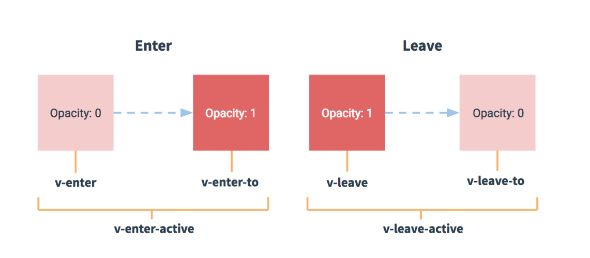

# VUE入门基础2

## 1、vue中动画

为什么使用动画：动画能够提高用户体验，帮助用户更好的理解页面中的功能：

Vue在插入、更新或者移除DOM时，提供多种不同方式的应用过度效果。包括一下工具：

- 在CSS过度和动画中自动应用class；
- 可以配合使用第三方CSS动画库，如Animate.css;
- 在过渡钩子函数中使用js直接操作DOM；
- 可以配合使用第三方js动画库，如Velocity.js。

### 单元素/组件的过度

Vue提供了transition的封装组件，在下列情形中，可以给任何元素和组件添加进入/离开过度：

- 条件渲染（使用`v-if/v-else`）
- 条件展示（使用`v-show`）
- 动态组件
- 组件根节点

### 过渡类名



在进入和离开的过度中，会有6个class切换：

1. `v-enter`：定义进入过渡的开始状态。在元素被插入之前生效，在元素被插入之后的下一帧移除。
2. `v-enter-active`：定义进入过渡生效时的状态。在整个进入过渡的阶段中应用，在元素被插入之前生效，在过渡/动画完成之后移除。这个类可以被用来定义进入过渡的过程时间，延迟和曲线函数。
3. `v-enter-to`：**2.1.8版及以上** 定义进入过渡的结束状态。在元素被插入之后下一帧生效 (与此同时 `v-enter` 被移除)，在过渡/动画完成之后移除。
4. `v-leave`：  定义离开过渡的开始状态。在离开过渡被触发时立刻生效，下一帧被移除。
5. `v-leave-active`：定义离开过渡生效时的状态。在整个离开过渡的阶段中应用，在离开过渡被触发时立刻生效，在过渡/动画完成之后移除。这个类可以被用来定义离开过渡的过程时间，延迟和曲线函数。
6. `v-leave-to`：**2.1.8版及以上** 定义离开过渡的结束状态。在离开过渡被触发之后下一帧生效 (与此同时 `v-leave` 被删除)，在过渡/动画完成之后移除。

对于这些在过渡中切换的类名来说，如果你使用一个没有名字的 `<transition>`，则 `v-` 是这些类名的默认前缀。如果你使用了 `<transition name="my-transition">`，那么 `v-enter` 会替换为 `my-transition-enter`。

`v-enter-active` 和 `v-leave-active` 可以控制进入/离开过渡的不同的缓和曲线，在下面章节会有个示例说明。

```html
<head>
    <script src="./lib/vue-.js"></script>
    <style>
        /*v-enter【这是一个时间点】是进入之前，元素的起始状态，此时还没有开始进入*/
        /*v-leave-to【这是一个时间点】是动画离开之后，离开的终止状态，此时，元素动画已经结束了*/
    	.v-enter,
        .v-leave-to {
            opacity: 0;
            transform: translateX(150px);
        }
        /* v-enter-active 【入场动画的时间段】 */
    	/* v-leave-active 【离场动画的时间段】 */
        .v-enter-active,
        .v-leave-active {
            transition: all 0.8s ease;
        }
        
        .my-enter,
        .my-leave-to {
            opacity: 0;
            transform: translateY(70px);
        }
        
        .my-enter-active,
        .my-leave-active{
            transition: all 0.8s ease;
        }
        
    </style>
</head>
<body>
    <div id="app">
        <input type="button" value="toggle" @click="flag=!flag">
        <!-- 需求： 点击按钮，让 h3 显示，再点击，让 h3 隐藏 -->
    	<!-- 1. 使用 transition 元素，把 需要被动画控制的元素，包裹起来 -->
    	<!-- transition 元素，是 Vue 官方提供的 -->
        <transition>
        	<h3 v-if="flag">这是一个H3</h3>
        </transition>
        
        <hr>
        
        <!--改变前缀-->
        <input type=button value="toggle2" @click="flag2=!flag2">
        <transition name="my">
        	<h6 v-if="flag2">这是一个H6</h6>
        </transition>
    </div>
    <script>
    	var vm = new Vue({
            el: '#app',
            data: {
                flag: false,
                flag2: false
            },
            methods: {}
        });
    </script>
</body>
```

### 使用第三方CSS动画库

1. 导入动画类库

   `<link rel="stylesheet" type="text/css" href="./lib/animate.css">`

2. 定义transition及属性：

   ```html
   <transition
               enter-active-class="bounceIn"
               leave-active-class="bounceOut"
               :duration="{enter: 200, leave: 400}" >
       <h3 v-if="flag" class="animated">
          这是要给H3
       </h3>
   </transition>
   ```

3. 案例：

   ```html
   <head>
     <meta charset="UTF-8">
     <meta name="viewport" content="width=device-width, initial-scale=1.0">
     <meta http-equiv="X-UA-Compatible" content="ie=edge">
     <title>Document</title>
     <script src="./lib/vue-2.4.0.js"></script>
     <link rel="stylesheet" href="./lib/animate.css">
     <!-- 入场 bounceIn    离场 bounceOut -->
   </head>
   
   <body>
     <div id="app">
       <input type="button" value="toggle" @click="flag=!flag">
       <!-- 需求： 点击按钮，让 h3 显示，再点击，让 h3 隐藏 -->
       <!-- <transition enter-active-class="animated bounceIn" leave-active-class="animated bounceOut">
         <h3 v-if="flag">这是一个H3</h3>
       </transition> -->
   
       <!-- 使用 :duration="毫秒值" 来统一设置 入场 和 离场 时候的动画时长 -->
       <!-- <transition enter-active-class="bounceIn" leave-active-class="bounceOut" :duration="200">
         <h3 v-if="flag" class="animated">这是一个H3</h3>
       </transition> -->
   
       <!-- 使用  :duration="{ enter: 200, leave: 400 }"  来分别设置 入场的时长 和 离场的时长  -->
       <transition 
       enter-active-class="bounceIn" 
       leave-active-class="bounceOut" 
       :duration="{ enter: 200, leave: 400 }">
         <h3 v-if="flag" class="animated">这是一个H3</h3>
       </transition> 
     </div>
   
     <script>
       // 创建 Vue 实例，得到 ViewModel
       var vm = new Vue({
         el: '#app',
         data: {
           flag: false
         },
         methods: {}
       });
     </script>
   </body>
   ```

   ### 使用钩子函数模拟小球半场动画

   动画中的钩子函数

   ```html
   <transition
     v-on:before-enter="beforeEnter"
     v-on:enter="enter"
     v-on:after-enter="afterEnter"
     v-on:enter-cancelled="enterCancelled"
   
     v-on:before-leave="beforeLeave"
     v-on:leave="leave"
     v-on:after-leave="afterLeave"
     v-on:leave-cancelled="leaveCancelled"
   >
     <!-- ... -->
   </transition>
   // ...
   methods: {
     // --------
     // 进入中
     // --------
   
     beforeEnter: function (el) {
       // ...
     },
     // 当与 CSS 结合使用时
     // 回调函数 done 是可选的
     enter: function (el, done) {
       // ...
       done()
     },
     afterEnter: function (el) {
       // ...
     },
     enterCancelled: function (el) {
       // ...
     },
   
     // --------
     // 离开时
     // --------
   
     beforeLeave: function (el) {
       // ...
     },
     // 当与 CSS 结合使用时
     // 回调函数 done 是可选的
     leave: function (el, done) {
       // ...
       done()
     },
     afterLeave: function (el) {
       // ...
     },
     // leaveCancelled 只用于 v-show 中
     leaveCancelled: function (el) {
       // ...
     }
   }
   ```

   小球半场动画案例：

   ```html
   <head>
       <script src="./lib/vue-.js"></script>
       <style>
           .ball{
               width: 15px;
               height:15px;
               border-radius: 50%;
               background-color: red;
           }
       </style>
   </head>
   <body>
       <div id="app">
           <input type="button" value="快到碗里来" @click="flag=!flag">
           <!--1.使用transition元素把小球包裹进来-->
           <transition
             @before-enter="beforeEnter"
             @enter="enter"
             @after-enter="afterEnter">
           	<div class="ball" v-show="flag"></div>
           </transition>
       </div>
       <script>
       	var vm = new Vue({
               el:'#app',
               data: {
                   flag: false
               },
               methods: {
                   //注意:动画钩子函数的第一个参数：el，表示要执行动画的那个DOM元素，是一个远摄关JS DOM对象
                   //可以认为，el是通过document.getElementById('')方式获取到的原生JS DOM对象
                   beforeEnter(el) {
                       //beforeEnter表示动画入场之前，此时，动画尚未开始，可以在beforeEnter中，设置元素开始动画之前的其实样式
                       //设置小球开始动画之前的起始位置
                       el.style.transform = "translate(0,0)"
                   },
                   enter(el, done){
                       // 这句话，没有实际的作用，但是，如果不写，出不来动画效果；
             		// 可以认为 el.offsetWidth 会强制动画刷新
                       el.offsetWidth
                       // enter 表示动画 开始之后的样式，这里，可以设置小球完成动画之后的，结束状态
                       el.style.transform = "translate(150px, 450px)"
                       el.style.transform = 'all 1s ease'
                       // 这里的 done， 起始就是 afterEnter 这个函数，也就是说：done 是 afterEnter 函数的引用
                       done()
                   },
                   afterEnter(el){
                       // 动画完成之后，会调用 afterEnter
             			// console.log('ok')
                       // Vue 把一个完整的动画，使用钩子函数，拆分为了两部分：
             			// 我们使用 flag 标识符，来表示动画的切换；
                       // 这句话， 第一个功能，是控制小球的显示与隐藏
             			// 第二个功能： 直接跳过后半场动画，让 flag 标识符 直接变为 false
             			// 当第二次再点击 按钮的时候， flag  false  ->    true
                       this.flag = !this.flag
                   }
               }
        });
       </script>
    
   </body>
   ```
   
   ### 列表动画
   
   ```html
   <head>
     <script src="./lib/vue-2.4.0.js"></script>
     <style>
       li {
         border: 1px dashed #999;
         margin: 5px;
         line-height: 35px;
         padding-left: 5px;
         font-size: 12px;
         width: 100%;
       }
   
       li:hover {
         background-color: hotpink;
         transition: all 0.8s ease;
       }
   
       .v-enter,
       .v-leave-to {
         opacity: 0;
         transform: translateY(80px);
       }
   
       .v-enter-active,
       .v-leave-active {
         transition: all 0.6s ease;
       }
   
       /* 下面的 .v-move 和 .v-leave-active 配合使用，能够实现列表后续的元素，渐渐地漂上来的效果 */
       .v-move {
         transition: all 0.6s ease;
       }
       .v-leave-active{
         position: absolute;
       }
     </style>
   </head>
   
   <body>
     <div id="app">
   
       <div>
         <label>
           Id:
           <input type="text" v-model="id">
         </label>
   
         <label>
           Name:
           <input type="text" v-model="name">
         </label>
   
         <input type="button" value="添加" @click="add">
       </div>
   
       <!-- <ul> -->
         <!-- 在实现列表过渡的时候，如果需要过渡的元素，是通过 v-for 循环渲染出来的，不能使用 transition 包裹，需要使用 transitionGroup -->
         <!-- 如果要为 v-for 循环创建的元素设置动画，必须为每一个 元素 设置 :key 属性 -->
         <!-- 给 transition-group 添加 appear 属性，实现页面刚展示出来时候，入场时候的效果 -->
         <!-- 通过 为 transition-group 元素，设置 tag 属性，指定 transition-group 渲染为指定的元素，如果不指定 tag 属性，默认，渲染为 span 标签 -->
         <transition-group appear tag="ul">
           <li v-for="(item, i) in list" :key="item.id" @click="del(i)">
             {{item.id}} --- {{item.name}}
           </li>
         </transition-group>
       <!-- </ul> -->
   
     </div>
   
     <script>
       // 创建 Vue 实例，得到 ViewModel
       var vm = new Vue({
         el: '#app',
         data: {
           id: '',
           name: '',
           list: [
             { id: 1, name: '赵高' },
             { id: 2, name: '秦桧' },
             { id: 3, name: '严嵩' },
             { id: 4, name: '魏忠贤' }
           ]
         },
         methods: {
           add() {
             this.list.push({ id: this.id, name: this.name })
             this.id = this.name = ''
           },
           del(i) {
             this.list.splice(i, 1)
           }
         }
       });
     </script>
   </body>
   ```
   


## 2、组件

### 1.组件的创建方式

```html
<body>
    <div id="app">
        <!-- 如果要使用组件，直接，把组件的名称，以 HTML 标签的形式，引入到页面中，即可 -->
        <mycoml></mycoml>
    </div>
    
    <script>
    	// 1.1 使用 Vue.extend 来创建全局的Vue组件
    	// var com1 = Vue.extend({
    	//   template: '<h3>这是使用 Vue.extend 创建的组件</h3>' // 通过 template 属性，指定了组件要展示的HTML结构
    	// })
    	// 1.2 使用 Vue.component('组件的名称', 创建出来的组件模板对象)
    	// Vue.component('myCom1', com1)
    	// 如果使用 Vue.component 定义全局组件的时候，组件名称使用了 驼峰命名，则在引用组件的时候，需要把 大写的驼峰改为小写的字母，同时，两个单词之前，使用 - 链接；
    	// 如果不使用驼峰,则直接拿名称来使用即可;
    	// Vue.component('mycom1', com1)

    	// Vue.component 第一个参数:组件的名称,将来在引用组件的时候,就是一个 标签形式 来引入 它的
    	// 第二个参数: Vue.extend 创建的组件  ,其中 template 就是组件将来要展示的HTML内容
    	Vue.component('mycom1', Vue.extend({
      	template: '<h3>这是使用 Vue.extend 创建的组件</h3>'
    	}))


    	// 创建 Vue 实例，得到 ViewModel
    	var vm = new Vue({
      		el: '#app',
      		data: {},
      		methods: {}
    	});
    </script>
</body>
```

### 2.组件的创建方式2

```html
<body>
  <div id="app">
    <!-- 还是使用 标签形式,引入自己的组件 -->
    <mycom2></mycom2>
  </div>

  <script>
    // 注意:不论是哪种方式创建出来的组件,组件的 template 属性指向的模板内容,必须有且只能有唯一的一个根元素
    Vue.component('mycom2', {
      template: '<div><h3>这是直接使用 Vue.component 创建出来的组件</h3><span>123</span></div>'
    })

    // 创建 Vue 实例，得到 ViewModel
    var vm = new Vue({
      el: '#app',
      data: {},
      methods: {}
    });
  </script>
</body>
```

### 3.组件创建的方式3

```html
<body>
  <div id="app">
    <mycom3></mycom3>
    <!-- <login></login> -->
  </div>


  <div id="app2">
    <mycom3></mycom3>
    <login></login>
  </div>

  <!-- 在 被控制的 #app 外面,使用 template 元素,定义组件的HTML模板结构  -->
  <template id="tmpl">
    <div>
      <h1>这是通过 template 元素,在外部定义的组件结构,这个方式,有代码的只能提示和高亮</h1>
      <h4>好用,不错!</h4>
    </div>
  </template>

  <template id="tmpl2">
    <h1>这是私有的 login 组件</h1>
  </template>

  <script>
    Vue.component('mycom3', {
      template: '#tmpl'
    })

    // 创建 Vue 实例，得到 ViewModel
    var vm = new Vue({
      el: '#app',
      data: {},
      methods: {}
    });


    var vm2 = new Vue({
      el: '#app2',
      data: {},
      methods: {},
      filters: {},
      directives: {},
      components: { // 定义实例内部私有组件的
        login: {
          template: '#tmpl2'
        }
      },

      beforeCreate() { },
      created() { },
      beforeMount() { },
      mounted() { },
      beforeUpdate() { },
      updated() { },
      beforeDestroy() { },
      destroyed() { }
    })
  </script>
</body>
```

总结：

定义全局组件：`Vue.component(组件名称，{template:''})`

```html
<!--通过对象字面量创建一个组件模板-->
<body>
    <div id='app'>
        <login></login>
    </div>
    
    <script>
    	//通过对象字面量的形式，定义了一个组件模板
        var login = {
            template: '<h1>1234</h1>'
        }
        //注册成全局组件
        //Vue.component('mylogin', login)
        //注册成私有组件
        var vm = new Vue({
            el: '#app',
            data: {},
            methods: {},
            components: {
                login
            }
        });
    </script>
</body>
```


### 4.组件中的data和methods

```html
<body>
  <div id="app">
    <mycom1></mycom1>
  </div>

  <script>
    // 1. 组件可以有自己的 data 数据
    // 2. 组件的 data 和 实例的 data 有点不一样,实例中的 data 可以为一个对象,但是 组件中的 data 必须是一个方法
    // 3. 组件中的 data 除了必须为一个方法之外,这个方法内部,还必须返回一个对象才行;
    // 4. 组件中 的data 数据,使用方式,和实例中的 data 使用方式完全一样!!!
    Vue.component('mycom1', {
      template: '<h1>这是全局组件 --- {{msg}}</h1>',
      data: function () {
        return {
          msg: '这是组件的中data定义的数据'
        }
      }
    })

    // 创建 Vue 实例，得到 ViewModel
    var vm = new Vue({
      el: '#app',
      data: {},
      methods: {}
    });
  </script>
</body>
```

### 5.组件的data必须是一个函数

组件的函数必须返回一个对象

```html
<body>
  <div id="app">
    <counter></counter>
    <hr>
    <counter></counter>
    <hr>
    <counter></counter>
  </div>


  <template id="tmpl">
    <div>
      <input type="button" value="+1" @click="increment">
      <h3>{{count}}</h3>
    </div>
  </template>

  <script>
    var dataObj = { count: 0 }

    // 这是一个计数器的组件, 身上有个按钮,每当点击按钮,让 data 中的 count 值 +1
    Vue.component('counter', {
      template: '#tmpl',
      data: function () {
        // return dataObj
        return { count: 0 }
      },
      methods: {
        increment() {
          this.count++
        }
      }
    })

    // 创建 Vue 实例，得到 ViewModel
    var vm = new Vue({
      el: '#app',
      data: {},
      methods: {}
    });
  </script>
</body>
```

### 6.组件的切换

场景需求：在登陆和注册首页，点击不同的按钮组件切换

#### 1.方式一（不推荐）

```html
<body>
  <div id="app">
    <a href="" @click.prevent="flag=true">登录</a>
    <a href="" @click.prevent="flag=false">注册</a>

    <login v-if="flag"></login>
    <register v-else="flag"></register>

  </div>

  <script>
    Vue.component('login', {
      template: '<h3>登录组件</h3>'
    })

    Vue.component('register', {
      template: '<h3>注册组件</h3>'
    })

    // 创建 Vue 实例，得到 ViewModel
    var vm = new Vue({
      el: '#app',
      data: {
        flag: false
      },
      methods: {}
    });
  </script>
</body>
```

#### 2.方式二

```html
<body>
  <div id="app">
    <a href="" @click.prevent="comName='login'">登录</a>
    <a href="" @click.prevent="comName='register'">注册</a>
    <!-- Vue提供了 component ,来展示对应名称的组件 -->
    <!-- component 是一个占位符, :is 属性,可以用来指定要展示的组件的名称 -->
    <component :is="comName"></component>
    <!-- 总结:当前学习了几个 Vue 提供的标签了??? -->
    <!-- component,  template,  transition,  transitionGroup  -->
  </div>
  <script>
    // 组件名称是 字符串
    Vue.component('login', {
      template: '<h3>登录组件</h3>'
    })

    Vue.component('register', {
      template: '<h3>注册组件</h3>'
    })

    // 创建 Vue 实例，得到 ViewModel
    var vm = new Vue({
      el: '#app',
      data: {
        comName: 'login' // 当前 component 中的 :is 绑定的组件的名称
      },
      methods: {}
    });
  </script>
</body>
```

#### 3.切换动画效果

```html
<head>
  <script src="./lib/vue-2.4.0.js"></script>
  <style>
    .v-enter,
    .v-leave-to {
      opacity: 0;
      transform: translateX(150px);
    }

    .v-enter-active,
    .v-leave-active {
      transition: all 0.5s ease;
    }
  </style>
</head>

<body>
  <div id="app">
    <a href="" @click.prevent="comName='login'">登录</a>
    <a href="" @click.prevent="comName='register'">注册</a>

    <!-- 通过 mode 属性,设置组件切换时候的 模式 -->
    <transition mode="out-in">
      <component :is="comName"></component>
    </transition>

  </div>

  <script>
    // 组件名称是 字符串
    Vue.component('login', {
      template: '<h3>登录组件</h3>'
    })

    Vue.component('register', {
      template: '<h3>注册组件</h3>'
    })

    // 创建 Vue 实例，得到 ViewModel
    var vm = new Vue({
      el: '#app',
      data: {
        comName: 'login' // 当前 component 中的 :is 绑定的组件的名称
      },
      methods: {}
    });
  </script>
</body>
```

## 7、父组件向子组件传值

在子组件中通过v-bind指令，通过属性绑定的形式，把需要传递给子组件的数据，以属性绑定的形式传递到子组件内部，内部使用prop属性来使用。

案例：

```html
<body>
    <div id='app'>
        <!--父组件，可以在引入用子组件的时候，通过属性绑定（v-bind）的形式,把需要传递给子组件的数据，以属性绑定的形式，传递到子组件内部，供子组件使用。-->
        <com1 v-bind:parentmsg="msg"></com1>
    </div>
    
    <script>
    	var vm = new Vue({
            el: 'app',
            data: {
                msg: '来自父元素的数据！'
            },
            methods: {},
            //子组件中，默认无法访问到组件中的data和methods
            components: {
                //注意：子组件中的data数据，不不是通过父组件传递过来的，而是自己私有的，比如：自钻进通过Ajax，请求回来的数据，都可以放到data上。
                data(){
                    //data上的数据都是可读可写的
                    return {
                        title: '123',
                        content: 'qqq'
                    }
                },
                template: '<h1 @click="change">这是子组件----{{parentmsg}}----</h1>',
                //注意：组件中的所有props中的数据，都是通过父组件传递给子组件的
                //props中的数据，都是只读的，无法重新赋值
                //把父组件传递过来的parentmsg属性，现在props数组中，定义一下，这样，才能使用这个数据。
                props: ['parentmsg'],
                directives: {},
                filters: {},
                components: {},
                methods: {
                    change(){
                        this.parentmsg = '被修改了'
                    }
                }
            }
        });
    </script>
</body>
```

## 8、父组件把方法传递给子组件

> 父组件向子组件 传递 方法，使用的是 事件绑定机制； v-on, 当我们自定义了 一个 事件属性之后，那么，子组件就能够，通过某些方式，来调用 传递进去的 这个 方法了 .
>
> 这里是将父组件的函数对象引用传递进子组件，在子组件中，通过this.$emit()调用。

案例：

```html
<body>
    <div id="app">
        <com2 @func="show"></com2>
    </div>
    
    <template id="tmpl">
    	<div>
            <h1>这是 子组件</h1>
            <input type="button" value="这是自钻进中的按钮-点击触发父组件传递过来的func方法" @click="myclick">
        </div>
    </template>
    
    <script>
    	var com2 = {
            template: '#tmpl',
            data(){
                return {
                    sonmsg: {name: '小头儿子'， age: 6}
                }
            },
            methods: {
                myclick() {
                    //当点击子组件的按钮，拿到父组件传递来的func函数，并通过$emit()触发函数；
                    //$emit()第一个是传递来的绑定函数引用名，后面可跟任意个参数。
                    this.$emit('func', this.sonmsg)
                }
            }
        }
        var vm = new Vue({
            el: '#app',
            data: {
                datamsgFromSon: null
            },
            methods: {
                show(data){
                    this.datamsgFromSon = data
                }
            },
            components: {
                com2
                //com2: com2
            }
        });
    </script>
</body>
```

## 9、子组件向父组件传值

> 原理：父组件将方法的引用，传递到子组件内部，子组件在内部调用父组件传递过来的方法，同时把要发送给父组件的数据，在调用方法的时候当作参数传递进去。

父组件将方法的引用传递给子组件，其中，getMsg是父组件中的methods中定义的方法名称，func是子组件调用传递过来方法时候的方法名称。

`<son @func="getMsg"></son>`

子组件内部通过`this.$emit('方法名',要传递的数据)`方式，来调用父组件中的方法，同时把数据传递给父组件使用。

```html
<div id="app">
    <!-- 引用父组件 -->
    <son @func="getMsg"></son>

    <!-- 组件模板定义 -->
    <script type="x-template" id="son">
      <div>
        <input type="button" value="向父组件传值" @click="sendMsg" />
      </div>
    </script>
  </div>

  <script>
    // 子组件的定义方式
    Vue.component('son', {
      template: '#son', // 组件模板Id
      methods: {
        sendMsg() { // 按钮的点击事件
          this.$emit('func', 'OK'); // 调用父组件传递过来的方法，同时把数据传递出去
        }
      }
    });

    // 创建 Vue 实例，得到 ViewModel
    var vm = new Vue({
      el: '#app',
      data: {},
      methods: {
        getMsg(val){ // 子组件中，通过 this.$emit() 实际调用的方法，在此进行定义
          alert(val);
        }
      }
    });
  </script>
```


## 10、评论列表案例

> 分析：发表评论的业务逻辑：
>
> 1. 评论数据存放到localStorage中，localStorage.setItem('cmts', '')
>
> 2. 先组织出一个最新的评论数据对象；
>
> 3. 想办法，吧第二部中得到的评论对象，保存到localStorage中：
>
>    3.1. localStorage只支持寸法字符串数据，要先调用JSON.stringify();
>
>    3.2. 在保存最新的评论之前，先获取到localStorage中的json，转换为一个数组，然后把最新的评论push到这个数组中；
>
>    3.3. 如果获取到的localStorage中的评论字符串为空，或不存在，则可以返回一个‘[]’，让Json.parse()去转换；
>
>    3.4. 把最新的评论列表数组，再次调用stringify将其转换为数组字符串，调用localStorage.setItem().

```html
<head>
    <script src='./vue-.js'></script>
    <link rel="stylesheet" href="./bootstrap.css">
</head>
<body>
    <div id="app">
        <cmt-box @func='loadComments'></cmt-box>
        
        <ul class='list-group'>
            <li class='list-group-item' v-for="item in list" :key="item.id">
                <span class="badge">评论人：{{item.user}}</span>{{item.content}}
            </li>
        </ul>
    </div>
    
    <template id="tmp1">
    	<div>
            <div class="form-group">
                <label>评论人：</label>
                <input type="text" class="form-control" v-model="user">
            </div>
            
            <div class="form-group">
                <label>评论内容：</label>
                <textarea class="form-control" v-model="content"></textarea>
            </div>
            
            <div class="form-group">
                <input type="button" value="发表评论" class="btn btn-primary" @click="postComment">
            </div>
        </div>
    </template>
    
    <script>
    	var commentBox = {
            data() {
                return {
                    user: '',
                    content: ''
                }
            },
            template: '#tmp1',
            methods: {
                postComment(){
                    var comment = { id : Data.now(), user: this.user, content: this.content};
                    var list = JSON.parse(localStorage.getItem('cmts') || '[]');
                    list.unshift(comment);
                    localStorage.setItem('cmts', JSON.stringify(list));
                    this.user = this.content = '';
                    this.$emit('func');
                }
            }
        }
        
        var vm = new Vue({
            el: '#app',
            data: {
                list:[
                    {id: Data.now(),user:'李白',content:'天生我才必有用'},
                    {id: Data.now(), user:'江小白'，content:'劝君更尽一杯酒'},
                    {id:Data.now(), user:'小马',content:'我姓马'}
                ]
            },
            beforeCreate(){},
            create(){
                this.loadComments()
            },
            methods: {
                loadComments(){
                    var list = JSON.parse(localStorage.getItem('cmts'))
                    this.list = lisst
                }
            },
            components:{
                'cmt-box':commentBox
            }
            
        });
    </script>
</body>
```

## 11、通过this.$refs获取DOM元素和组件

> vm实例中存在一个ref属性值，该属性引用这页面中的DOM节点。
>
> 在vm实例中通过vm实例的this.$ref可以获取指定ref属性的节点或vue组件。
>
> 使用ref可以获取组件的data并且可以在父组件中调用子组件的方法。

```html
<body>
    <div id="app">
        <input type="button" value="获取元素" @click="getElement" ref="mybtn">
        
        <h3 id="myh3" ref="myh3">哈哈哈，今天天气太好了！！！</h3>
        
        <hr>
        
        <login ref="mylogin"></login>
    </div>
    <script>
    	var login = {
            template: '<h1>登录组件</h1>',
            data(){
                return {
                    msg: 'son msg'
                }
            },
            methods: {
                show() {
                    console.log('调用了子组件的方法')
                }
            }
        }
        
        var vm = new Vue({
            el: '#app',
            data: {},
            methods: {
                getElement(){
                    //使用DOM获取元素节点的方法
                    console.log(document.getElementById('myh3').innerText)
                    //vue提供的ref方式获取
                    //获取元素节点
                    concole.log(this.$refs.myh3.innerText)
                    //获取组件
                    //获取组件的data
                    console.log(this.$refs.mylogin.msg)
                    //调用组件的方法
                    this.$refs.mylogin.show()
                }
            },
            components: {
                login
            }
        });
    </script>
</body>
```

## 12、路由

> 什么是路由：
>
> 1. 后端路由：对于一个普通的网站，所有的超链接都是一个URL地址，所有的RUL地址都对应服务器上对应的资源；
> 2. 前端路由：对于单页面应用程序来说，主要通过URL中的hash（#号）来实现不同页面之间的切换，同时，hash有一个特点，HTTP中不会包含hash的内容；所以单页面程序中的页面跳转主要通过hash实现。
> 3. 在单页面应用程序中，这种通过hash改变切换页面的方式，称作前端路由。

资料：[路由中的#](https://www.cnblogs.com/joyho/articles/4430148.html)

### 1.在vue中使用vue-router

> 安装vue-router：到官网查看

1. 导入vue-router包

   ```html
   <script src=."/vue.js"></script>
   <script src="./vue-router.js"></script>
   ```

2. 创建组件

   ```javascript
   var login = {
       template: '<h1>登录组件</h1>'
   }
   
   var register = {
       template: '<h1>注册组件</h1>'
   }
   ```

   

3. 创建vue-router对象

   ```js
   var routerobj = new VueRouter({
   	routes: [
           //默认展示login组件，这里的重定向和后端概念不同
           {path:'/', redirect:'/login'},
           {path:'/login', component:login}，
           {path:'/register', component: register}
       ]
   });
   ```

   > 当导入vue-router包之后，在window全局对象中，就有了一个路由的构造函数，叫做VueRouter，在new路由对象的时候，客户为构造函数传递一个配置对象。
   >
   > route属相表示路由匹配规则的意思，routes可以匹配多个规则。
   >
   > 每个路由规则都是一个对象，这个规则对象身上，有两个必须的属性：
   >
   > 1. path：表示监听那个路由的链接地址；
   >
   > 2. component：表示如果路由是前面匹配到的path，则展示componnet属性对应的那个组件
   >
   >    注意：component的属性值，必须是一个组件的模板对象，不能是组件的引用名称。

4. 将路由规则对象，注册到vm实例上，用来监听URL地址的变化，然后展示对应的组件

   ```javascript
   varvm = new Vue({
   	el: '#app',
   	data: {},
       methods: {},
       router: routerObj  	//注册路由对象
   });
   ```

5. 在页面中使用

   > 使用router-view组件显示监听到的组件
   >
   > - router-view是vue-router提供的元素，专门用来当做占位符，将来路由匹配到的组件，就会展示到这个router-view中去
   >
   > 使用router-link组件来导航
   >
   > - 使用tag属性指定router-link渲染为指定的标签，默认为a
   >
   > 使用transition组件动画展示切换效果

   ```html
   <body>
       <div id-="app">
           <!--使用tag指定router-link组件渲染为span标签-->
           <router-link to="/login" tag="span">登录</router-link>
           <router-link to="/register">注册</router-link>
           <!--使用mode显示动画展示模式，先出后进-->
           <transition mode="out-in">
           	<router-view></router-view>
           </transition>
       </div>
   </body>
   ```

### 2.设置路由高亮

router-link组件被渲染后，默认有一些指定的类，如：

1. to，类型：string
2. tag，类型：string，默认值：a
3. active-class，类型：string，默认值：router-link-active

被激活的router-link默认被渲染为指定的标签，同时包含一些类和属性，被激活的router-link包含一个active-class默认值为router-link-active，可以修改这个默认值，同时使用这个类名给激活的router-link设置css样式。

```html
<head>
    <script src="./vue.js"></script>
    <script scr="./vue-router.js"></script>
    <style>
        .myRouter{
            background-color: greed;
            color: red;
            font: 800 italic 50px;
        }
        .v-enter,
        .v-leave-to {
            opacity: 0;
            transform: translateX(140px);
        }
        .v-enter-active,
        .v-leave-active {
            transition: all 0.5s ease;
        }
    </style>
</head>
<body>
    <div id="app">
        <router-link to="/login" tag="span">登录</router-link>
        <router-link to="/register" tag="span">注册</router-link>
        
        <transition mode="out-in">
            <router-view></router-view>
        </transition>
    </div>
    
    <script>
        var login = {
            template: '<h1>登录组件</h1>'
        };
        var regist = {
            template: '<h1>登录组件</h1>'
        };
        
    	var routerObj = new VueRouter({
            routes: [
                {path: '/', redirect: '/login'},
                {path: '/login', component:login},
                {path: '/register', component:register}
            ]
            linkActiveClass:'myRouter'
        });
        
        var vm = new Vue({
            el:'#app',
            data:{},
            methods:{},
            router: routerObj
        });
    </script>
</body>
```

### 3.在路由规则中定义参数（query方式）

像http请求一样路径后跟“？”添加参数，使用“&”添加多个参数。

vue-router会有一个match方法解析路径，并将参数解析出来，组件中使用：

`this.$route.query.参数名  //this可省`来获取路由规则传递的参数。

```html
<head>
    <script src="./vue.js"></script>
    <script src="./vue-router.js"></script>
</head>
<body>
    <div id="app">
        <!--如果在路由中，石红查询字符串，给路由传递参数，则路由规则path不用改变-->
        <router-link to="/login?id=10&name=zs">登录</router-link>
        <router-link to="/register">注册</router-link>
        
        <router-view></router-view>
    </div>
    <script>
    	var login = {
            //在组件中使用路由传递过来的参数
            template: '<h1>登录---{{ $route.query.id }} --- {{ $route.query.name}} </h1>',
            data(){
                return {
                    msg: '123'
                }
            }
            created(){	//组件的生命周期钩子
                console.log(this.$route)
                console.log(this.$route.query.id)
            }
        }
        
        var register = {
            template: '<h1>注册</h1>'
        }
        
        var routerObj = new VueRouter({
            routes: [
                {path: '/login', component: login},
                {path: 'register', component: register}
            ]
        })
        var vm = new Vue({
            el: 'app',
            data: {},
            methods: {},
            routerObj   //等效于router: routerObj
        });
    </script>
</body>
```

### 4.在路由规则中定义参数（params方式）

不使用？和&，在路由匹配规则属性中解析参数，使用：

`$route.params.参数名`

```html
<head>
    <script src="./vue.js"></script>
    <script src="./vue-router.js"></script>
</head>
<body>
    <div id="app">
        <router-link to="/login/10/zs"></router-link>
        <router-link to='/register'></router-link>
        
        <router-view></router-view>
    </div>
    
    <script>
    	var login = {
            template: '<h1> 登录---{{$route.params.id}}---{{$route.params.name}} </h1>'
        }
        var register = {
            template: '<h1>注册</h1>'
        }
        
        var routerObj = new VueRouter({
            routes: [
                {path: '/login/:id/:name', component:login},
                {path: '/register', component: register}
            ]
        })
        var vm = new Vue({
            el: '#app',
            data: {},
            methods: {},
            routeObj
        })
    </script>
</body>
```

### 5.使用children实现路由嵌套

在子组件中实现路由嵌套组件，在route对象中使用children属性。

```html
<head>
    <script src="./vue.js"></script>
    <script src="./vue-router.js"></script>
</head>
<body>
    <div id="app">
        <router-link to="/account">Account</router-link>
        <router-view></router-view>
    </div>
    
    <template id="tmp1">
    	<div>
            <h1>这是Account组件</h1>
            <router-link to="/account/login">登录</router-link>
            <router-link to="/account/register">注册</router-link>
            
            <router-view></router-view>
        </div>
    </template>
    <script>
    	var account = {
            template: 'tmp1'
        }
        
        var login = {
            template: '<h3>登录</h3>'
        }
        
        var register = {
            template: '<h3>注册</h3>'
        }
        
        var router = new VueRouter({
            routes: [
                {
                    path: '/account',
                    component: account,
                    //使用children属性，实现子路由，同时，子路由的path前面，永远不要带“/”,否则，永远以根路径开始请求，这样不方便我们用户去理解URL地址
                    children: {
                        {path: '/login', component: login},
                    	{path: '/register', component: register}
                    }
                }
            ]
        })
        var vm = new Vue({
            el: '#app',
            data: {},
            methods: {},
            router
        })
    </script>
</body>
```

### 6.命名视图实现经典布局

> 使用router-view的name属性指定，路由显示的组件；
>
> 在路由规则对象中component使用components对象代替，指定name匹配的component。

```html
<head>
    <script src="./vue.js"></script>
    <script scr="./vue-router.js"></script>
    
    <style>
        * {
            margin: 0;
            padding: 0;
        }
        .container {
            display: flex;
            height: 600px;
        }
        .left {
            background-color: lightgreen;
            flex: 2;
        }
        .main {
            background-color: lightpink;
            flex: 8;
        }
    </style>
</head>
<body>
    
    <div id ="app">
        <router-view></router-view>
        <div class="container">
            <router-view name="left"></router-view>
            <router-view name="main"></router-view>
        </div>
    </div>
    
    <script>
    	var header = {
            template: '<h1 class"header">Header头部区域</h1>'
        }
        var leftBox = {
            template: '<h1 class="left">Left侧边栏区域</h1>'
        }
        var mainBox = {
            template: '<h1 class="main">mainBox主题区域</h1>'
        }
        
        //创建路由对象
        var router = new VueRouter({
            routers: [
                {
                    //使用componets指定多个组件和router-view配合使用
                    path: '/', components: {
                        'default': header,
                        'left': leftBox,
                        'main': mainBox
                    }
                }
            ]
        })
        var vm = new Vue({
            el: '#app',
            data: {},
            methods: {},
            router
        })
    </script>
</body>
```

## 13、methods、watch、computed属性

> 三个文本框，firstname、lastname、fullname，当前两个其中任意一个发生改变，fullname做出改变，fullname=firstname+lastname。
>
> 分析：
>
> 1. 监听到文本框数据的改变，这样才能知道什么时候去拼接出一个fullname；
> 2. 如何监听到文本框的数据改变？？

### 1.名称案例methods事件绑定监听实现

使用键盘事件，监听到用户改变文本框的内容：

```html
<head>
    <script src="./vue.js"></script>
</head>
<body>
    <div id="#app">
        <input type="text" v-model="firstname" @keyup="getFullname"> + 
        <input type="text" v-model="lastname" @keyup="getFullname"> = 
        <input type="text" v-model="fullname">
    </div>
    
    <script>
    	var vm = new Vue({
            el: '#app',
            //js对象中键带“-”是加“''”，其他可以不加
            data: {
                firstname: '',
                lastname: '',
                fullname: ''
            },
            methods: {
                getFullname(){
                    this.fullname = this.firstname + '-'+ this.lastname;
                }
            }
        });
    </script>
</body>
```

### 2.使用watch监听数据改变来实现

watch属性可以监视data中指定数据的变化，然后触发watch中对应的function处理函数。

watch属性用于监听不是来自页面中数据，如监听路由的变化。

```html
<head>
    <script src="./vue.js"></script>
</head>
<body>
    
    <div id="app">
        <input type="text" v-model="firstname"> + 
        <input type="text" v-model="lastname"> = 
        <input type="text" v-model="fullname">
    </div>
    
    <script>
    	var vm = new Vue({
            el: '#app',
            data: {
                firstname: '',
                lastname: '',
                fullname: ''
            },
            watch: {
                //可加引号
                'firstname': function(newVal, oldVal){
                    //两个参数，newVal表示监视到的新数据，oldVal表示改变之前的数据
                   this.fullname = newVal + '-' + this.lastname;
                },
                //也可以不加引号，只接收一个参数
                lastname: function(newVal){
                    this.fullname = this.firstname + '-' + newVal
                }
            }
        })
    </script>
</body>
```

### 3.watch监听路由地址的改变

```html
<head>
    <script src="./vue.js"></script>
    <script src="./vue-router.js"></script>
</head>
<body>
    <div id="app">
        <router-link to="/login">登录</router-link>
        <router-link to="/register">注册</router-link>
        
        <router-view></router-view>
    </div>
    
    <script>
    	//创建组件
        var login = {
            template: '<h1>登录</h1>'
        }
        var register = {
            template: '<h1>注册</h1>'
        }
        //注册组件
        var router = new VueRouter({
            routes:[
                {path: '/', redirect: '/login'},
                {path: '/login', component: login},
                {path: '/register', component: register}
            ],
            linkActiveClass: 'myRouter' //激活相关的类
        })
        
        var vm = new Vue({
            el: '#app',
            data: {},
            methods: {},
            router,
            watch: {
                '$route.path': function(newVal, oldVal){
                    if(newVal === '/login'){
                        console.log('欢迎进入登录页面！')
                    }else if(oldVal === '/register'){
                        console.log('欢迎进入注册页面！')
                    }
                }
            }
        })
    </script>
</body>
```

### 4.使用computed实现名称案例

computed:

在computed中，可以定义一些属性，这些属性叫做计算属性，计算属性的本质就是一个方法，只不过，我们在使用计算属性的时候，是把他们的名称直接当做属性来使用的，并不会把计算属性当做方法去调用。

注意：

1. 计算属性在应用的时候，一定不要加上()去调用，直接把他当做普通的属性（data中的）去使用就好了；
2. 只要计算属性这个function内部，所用到的任何data中的数据发生了变化，就会立即重新计算这个计算属性的值；
3. 计算属性的求值结果会被缓存起来，方便下次直接使用，如果计算属性方法中，引用的任何数据都没有发生变化，则，不会重新对计算属性求值；

```html
<head>
    <script src="./vue.js"></script>
</head>
<body>
    <div id="app">
        <input type="text" v-model="firstname"> + 
        <input type="text" v-model="lastname"> = 
        <input type="text" v-model="fullname">
    </div>
    
    <script>
    	var vm = new Vue({
            el:'#app',
            data: {
                firstname: '',
                lastname: ''
            },
            methods: {},
            computed: {
                fullname: function(){
                    return this.firstname + '-' + this.lastname
                }
            }
        })
    </script>
</body>
```

### 5.watch、computed和methods之间的对比

1. computed属性的结果会被缓存，除非依赖的响应式属性变化才会重新计算，主要当做属性来用；
2. methods方法表示一个具体的操作，主要书写业务逻辑；
3. watch一个对象，键是需要观察的表达式，值是对应的回调函数。主要用来监听某些特定数据的变化，从而进行某些具体的业务逻辑操作；可以看做是computed和methods的结合体；