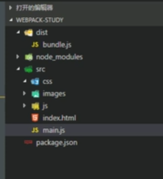
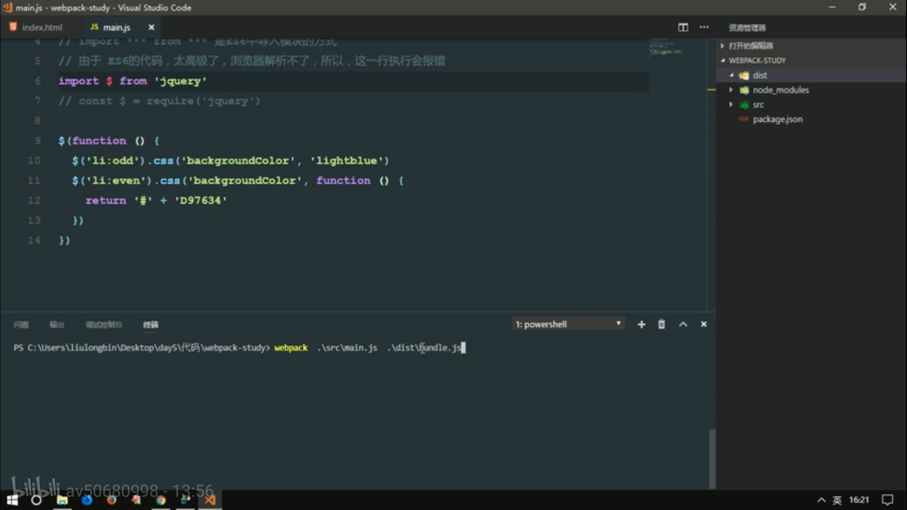

# Vue基础（Webpack）03

## 1.nrm使用

> 1. nrm
>
>    nrm(npm registry manager)是npm的镜像源管理工具，有时候国外资源太慢，使用这个就可以快速地在npm源间切换；
>
> 2. 安装nrm
>
>    在命令行执行命令，npm install -g nrm,全局安装nrm；
>
> 3. 使用
>
>    执行命令nrm ls查看可选的源
>
>    ```shell
>    nrm ls
>    
>    *npm ---- https://registry.npmjs.org/
>    
>    cnpm --- http://r.cnpmjs.org/
>    
>    taobao - http://registry.npm.taobao.org/
>    
>    eu ----- http://registry.npmjs.eu/
>    
>    au ----- http://registry.npmjs.org.au/
>    
>    sl ----- http://npm.strongloop.com/
>    
>    nj ----- https://registry.nodejitsu.com/
>    ```
>
>    其中带有*的是当前使用的源，上面的输出表明当前源是官方源。
>
> 4. 切换
>
>    如果要切换到taobao源，执行命令nrm use taobao；
>
> 5. 增加
>
>    可以增加定制的源，特别适用于添加企业内部的私有源
>
>    ```shell
>    nrm add <registry> <url> //其中reigstry为源名，url为源的路径。
>    ```
>
> 6. 删除
>
>    ```shell
>    nrm del <registry>
>    ```
>
> 7. 测试速度
>
>    可以测试响应源的响应时间
>
>    ```shell
>    nrm test npm
>    ```

## 2.网页中常引用的静态资源

- JS
  - .js  .jsx  .coffee  .ts(TypeScript 类C#语言)
- CSS
  - .css  .less  .sass  .scss
- Images
  - .jpg  .png  .gif  .bmp  .svg
- 字体文件（Fonts）
  - .svg  .ttf  .eot  .woff  .woff2
- 模板文件
  - .ejs  .jade  .vue(这是在webpack中定义组件的方式，推荐这么使用)

## 3.网页中引入静态资源多了以后的问题？？

1. 网页加载速度慢，因为要发起很多的二次请求；
2. 要处理错综复杂的依赖关系。

### 通常解决方式

1. 合并，压缩，精灵图，图片的Base64编码；
2. 使用requireJS，也可以使用webpack可以解决各个包之间的复杂依赖关系；

## 4、webpack

### 什么是webpack？？

webpack是前端的一个项目构建工具，它是基于Node.js开发出来的一个前端工具；

本质上，webpack是一个现代JavaScript应用程序的静态模块打包器（module bundler）。当webpack处理应用程序时，它会递归的构建一个依赖关系图（dependency graph），其中包含应用程序需要的每个模块，然后将所有这样的模块打包成一个或多个bundle。（引自webpack中文网）

### 如何解决静态资源过多问题？？

1. 使用Gulp，是基于task任务的；
2. 使用webpack，是基于整个项目进行构建的；
   - 借助于webpack这个前端自动化构建工具，可以完美实现资源的合并、打包、压缩等诸多功能；
   - [webpack官网](http://webpack.github.io/)
   - [webpack中文网](https://www.webpackjs.com/)

### webpack安装的两种方式

1. 运行`npm i webpack -g`全局安装webpack，这样就能在全局使用webpack的命令；
2. 在项目根目录中运行`npm i webpack --save-dev`安装到项目依赖中。

## 5、webpack简单使用

列表隔行变色案例：

### 1.创建工程目录

创建webpack-study,目录如下：



### 2.创建页面

```html
<head>
    <!--注意： 这里不推荐直接引入任何包和css文件-->
    <!--这里引入webpack处理后的js文件-->
</head>
<body>
    <ul>
        <li>这是第1个li</li>
        <li>这是第2个li</li>
        <li>这是第3个li</li>
        <li>这是第4个li</li>
        <li>这是第5个li</li>
        <li>这是第6个li</li>
        <li>这是第7个li</li>
        <li>这是第8个li</li>
        <li>这是第9个li</li>
        <li>这是第10个li</li>
    </ul>
</body>
```

### 3.创建main.js文件

```javascript
//文件使用es6语法
//main.js文件是我们项目的JS入口文件

//1.导入Jquery
import $ from 'jquery'
//nodejs的语法
const $ = require('jquery')

$(function(){
    $('li:odd').css('backgroundColor', 'yellow')
    $('li:even').css('backgroundColor', function(){
        return '#' + 'D97634'
    })
})
```

### 4.使用webpack处理

有使用了es6语法，浏览器无法解析，使用webpack进行处理：



> 在项目目录下运行webpack命令：
>
> webpack .\src\main.js .\dist\bundle.js  //webpack  入口  出口

将生成的js文件在页面中引入即可。

### 5.总结

> 1.webpack能够处理JS文件的互相依赖关系；
>
> 2.webpack能够处理JS的兼容问题，把高级的、浏览器不识别的语法转换为低级的，浏览器能够正常识别的语法。
>
> 3.运行项目使用`npm run dev`

## 6、webpack的基本配置概念

四个基本概念：

1. 入口（entry）；
2. 输出（output）；
3. loader；
4. 插件（plugins）。

### 1.入口（entry）

入口起点（entry point）指示webpack应该使用哪个模块，来作为构建其内部依赖图的开始。进入入口起点后，webpack会找出那些模块和库是入口起点依赖（直接或间接）的。

就是要让webpack'打包处理的文件路径。

在webpack.config.js文件中进行配置：使用nodejs语法

在entry属性中配置一个或多个入口起点，默认值为./src

```javascript
module.exports = {
    entry: './path/to/my/entry/file.js'
};
```

### 2.出口（output）

output属性告诉webpack在哪里输出它所创建的bundles，以及如何命名这些文件，默认值为./dist。

在webpack.config.js文件中配置output属性指定出口：

```javascript
const path = require('path');

module.exports = {
    entry: '',
    output: {
    	path: path.resolve(__dirname, 'dist'),
    	filename: 'my-first-webpack.bundle.js'
  	}
};
```

### 3.loader

loader让webpack能够去处理那些非js文件，如css，less等。loader可以将所有类型的文件处理为webpack可以处理的有效模块，前提是这些loader需要引入到环境中去。

在更高层面，在webpack的配置中loader有两个目标：

1. test属性：用于标识出应该对应的咯ader进行转换的某个或某些文件。
2. use属性：表示进行转换时使用哪个loader。

```javascript
const path = require('path');

const config = {
  output: {
    filename: 'my-first-webpack.bundle.js'
  },
  module: {
    rules: [
      { test: /\.txt$/, use: 'raw-loader' }
    ]
  }
};

module.exports = config;
```

### 4.插件（plugins）

插件的执行范围比loader更广，插件的范围包括，从打包优化和压缩，一直到重新定义环境中的变量。[插件接口](https://www.webpackjs.com/api/plugins)功能极其强大，可以用来处理各种各样的任务。

想要使用一个插件，你只需要 `require()` 它，然后把它添加到 `plugins` 数组中。多数插件可以通过选项(option)自定义。你也可以在一个配置文件中因为不同目的而多次使用同一个插件，这时需要通过使用 `new` 操作符来创建它的一个实例。

```javascript
const HtmlWebpackPlugin = require('html-webpack-plugin'); // 通过 npm 安装
const webpack = require('webpack'); // 用于访问内置插件

const config = {
  module: {
    rules: [
      { test: /\.txt$/, use: 'raw-loader' }
    ]
  },
  plugins: [
    new HtmlWebpackPlugin({template: './src/index.html'})
  ]
};

module.exports = config;
```


## 7、webpack-dev-server使用

每次保存文件后，不用手动执行命令对项目进行编译，webpack-dev-server监听文件改变，并执行编译命令，完成自动编译。

> 1. 安装工具：npm i webpack-dev-server -D把这个工具安装到项目的本地开发依赖。
>
> 2. 安装完毕后，这个工具用法和webpack命令的用法完全一样；
>
> 3. 由于是在项目中本地安装的，所以无法把它当做脚本命令在powershell终端中直接运行（只有全局安装才行）。可以在package.json中指定使用webpack-dev-server工具。
>
>    ```json
>    "scripts": {
>        "test": "echo \"Error: no test specified\" && exit 1",
>        "dev2": "webpack-dev-server --open --port 3000 --contentBase src --hot",
>        "dev": "webpack-dev-server"
>      }
>    ```
>
> 4. 注意： webpack-dev-server 这个工具，如果想要正常运行，要求，在本地项目中，必须安装 webpack（即全局已经安装了，本地也要再安装）
>
> 5. webpack-dev-server会将项目托管到本地服务器上8080端口，服务器托管的是项目的根目录；
>
> 6. webpack-dev-server 帮我们打包生成的 bundle.js 文件，并没有存放到 实际的 物理磁盘上；而是，直接托管到了 电脑的内存中，所以，我们在 项目根目录中，根本找不到 这个打包好的 bundle.js;
>
> 7. 我们可以认为， webpack-dev-server 把打包好的 文件，以一种虚拟的形式，托管到了 咱们项目的 根目录中，虽然我们看不到它，但是，可以认为， 和 dist  src   node_modules  平级，有一个看不见的文件，叫做 bundle.js

第二种打开方式

```javascript
//启动热更新的第二步:导入webpack
const webpack = require('webpack')

module.exports = {
    entry: '',
    output: {},
    devServer: {
        //  --open --port 3000 --contentBase src --hot
        open: true,		//自动打开浏览器
        port: 3000,		//设置自动启动时候的运行端口
        contentBase: 'src',		//指定托管的根目录
        hot: true	//启动热更新的第一步
    },      
    plugins: [	//配置插件节点
        new webpack.HotModuleReplacementPlugin()
    ]  
}
```

## 8、plugin使用案例：内存中加载页面插件

首先安装插件‘html-webpack-plugin’插件：npm i html-webpack-plugin；

//在webpack.config.js中

```javascript
//导入在内存中生成的HTML页面插件
//只要是插件，都一定要放到plugins节点中去
//这个插件的两个作用：
//1.自动在内存中根据指定页面生成一个内存的页面
//2.自动把打包好的bundle.js追加到页面中
const htmlWebpackPlugin = require('html-webpack-plugin')

module.exports = {
	entry: '',
	output: {},
    plugins: [
        new htmlWebpackPlugin({// 创建一个 在内存中 生成 HTML  页面的插件
            template: path.join(__dirname, './src/index.html'), // 指定 模板页面，将来会根据指定的页面路径，去生成内存中的 页面
            filename: 'index.html' // 指定生成的页面的名称
        })
    ],
}
```

## 9、loader的使用案例

注意： webpack, 默认只能打包处理 JS 类型的文件，无法处理 其它的非 JS 类型的文件；
 如果要处理 非JS类型的文件，我们需要手动安装一些 合适 第三方 loader 加载器；

1. 首先本地（项目）安装对应的loader:

`cnpm i style-loader css-loader -D`

```javascript
// 使用 import 语法，导入 CSS样式表
import './css/index.css'
import './css/index.less'
import './css/index.scss'
```

2. 打开 webpack.config.js 这个配置文件，在 里面，新增一个 配置节点，叫做 module, 它是一个对象；在 这个 module 对象身上，有个 rules 属性，这个 rules 属性是个 数组；这个数组中，存放了，所有第三方文件的 匹配和 处理规则；

   在webpack.config.js文件中

   ```javascript
   module.exports = {
       entry: '',
       output: {},
       module: {// 这个节点，用于配置 所有 第三方模块 加载器 
           rules: [ // 所有第三方模块的 匹配规则
         { test: /\.css$/, use: ['style-loader', 'css-loader'] }, //  配置处理 .css 文件的第三方loader 规则
         { test: /\.less$/, use: ['style-loader', 'css-loader', 'less-loader'] }, //配置处理 .less 文件的第三方 loader 规则
         { test: /\.scss$/, use: ['style-loader', 'css-loader', 'sass-loader'] }, // 配置处理 .scss 文件的 第三方 loader 规则
       ]
       }
   }
   ```

> 注意： webpack 处理第三方文件类型的过程：
>
> 1. 发现这个 要处理的文件不是JS文件，然后就去 配置文件中，查找有没有对应的第三方 loader 规则;
> 2. 如果能找到对应的规则， 就会调用 对应的 loader 处理 这种文件类型；
> 3.  在调用loader 的时候，是从后往前调用的；
> 4.  当最后的一个 loader 调用完毕，会把 处理的结果，直接交给 webpack 进行 打包合并，最终输出到  bundle.js 中去

## 10、webpack基本配置使用总结

1. 使用vscode打开文件夹，执行命令将工程使用npm的包管理工具管理起来：`npm init -y`;

2. 创建文件目录：src（index.html、main.js）、dist、webpack.config.js等；

3. 安装webpack-dev-server:`cnpm i webpack-dev-server -D`,并配置热更新、使用等,在package.json中：

   ```json
   "scripts": {
       "test": "echo \"Error: no test specified\" && exit 1",
       "dev2": "webpack-dev-server --open --port 3000 --contentBase src --hot",
       "dev": "webpack-dev-server"
     }
   ```

4. 安装本地webpack:`cnpm i webpack -D`;

5. 编写配置文件webpack.config.js,使用plugins和loader

   > 安装html-webpack-plugin插件：`cnpm i html-webpack-plugin `

   ```javascript
   const path = require(path);
   //使用htmlWebpackPlugin插件，在内存中生成页面，同时在页面中自动引入生成的bundle.js
   var htmlWebpackPlugin = require('html-webpack-plugin')
   module.exports = {
       //这里使用nodejs语法，项目根目录__dirname拼接文件路径
       entry: path.join(__dirname,'./src/main.js'),
       output: {//指定输出选项
          	path: path.join(__dirname, ''),//输出路径
           filename: 'bundle.js'	//指定输出文件的名称
       }
       //引入插件
       plugins: [
           new htmlWebpackPlugin({// 创建一个 在内存中 生成 HTML  页面的插件
               template: path.join(__dirname, './src/index.html'), // 指定 模板页面，将来会根据指定的页面路径，去生成内存中的 页面
               filename: 'index.html' // 指定生成的页面的名称
           })
       ],
   }
   ```

6. 运行项目：`npm run dev`

## 11、url-loader处理图片、字体文件路径

> 当样式表css中使用图片、字体文件等url路径时，默认webpack无法处理会报错；
>
> 安装loader：`cnpm i url-loader file-loader -D`:
>
> - 这里安装两个loader，url-loader内部依赖file-loader，在配置loader时候不用配置file-loader

在css中引入url路径后，在webpack,config.js中配置规则

```javascript
module.exports = {
  entry: path.join(__dirname, './src/main.js'), // 入口文件
  output: { // 指定输出选项
    path: path.join(__dirname, './dist'), // 输出路径
    filename: 'bundle.js' // 指定输出文件的名称
  },
  plugins: [ // 所有webpack  插件的配置节点
    new htmlWebpackPlugin({
      template: path.join(__dirname, './src/index.html'), // 指定模板文件路径
      filename: 'index.html' // 设置生成的内存页面的名称
    })
  ],
  module: { // 配置所有第三方loader 模块的
    rules: [ // 第三方模块的匹配规则
      { test: /\.css$/, use: ['style-loader', 'css-loader'] }, // 处理 CSS 文件的 loader
      { test: /\.less$/, use: ['style-loader', 'css-loader', 'less-loader'] }, // 处理 less 文件的 loader
      { test: /\.scss$/, use: ['style-loader', 'css-loader', 'sass-loader'] }, // 处理 scss 文件的 loader
      { test: /\.(jpg|png|gif|bmp|jpeg)$/, use: 'url-loader?limit=7631&name=[hash:8]-[name].[ext]' }, // 处理 图片路径的 loader
      // limit 给定的值，是图片的大小，单位是 byte， 如果我们引用的 图片，大于或等于给定的 limit值，则不会被转为base64格式的字符串， 如果 图片小于给定的 limit 值，则会被转为 base64的字符串
      { test: /\.(ttf|eot|svg|woff|woff2)$/, use: 'url-loader' }, // 处理 字体文件的 loader 
    ]
  },
}
```

这里`{ test: /\.(jpg|png|gif|bmp|jpeg)$/, use: 'url-loader?limit=7631&name=[hash:8]-[name].[ext]' }`中指定use传参和url的传参规则完全一致，name参数[name]表示原来的文件名，[ext]表示原来文件的后缀名，为了防止重名，引入[hash:8]产生一个8位的hash值。

比如当在项目路径下有两个目录，分别放入两张内容不同但是名称相同的图片，在css中分别引入，经过webpack打包后，会发现不能区分两张图片，由于webpack打包后可以认为相当于在根路径下引用图片，css中的图片路径都变成根路径，这是，图片就会被替换成最后一个加载的，因此在使用时要对文件重命名区分。

> 使用bootstrap的字体库：
>
> 1. 安装bootstrap：`cnpm i bootstrap -S`
>
> 2. 配置webpack-dev-server在根目录托管项目：在package.json中修改`--open --port 3000 --contentBase src --hot`-->`--open --port 3000 --hot`删去contentBase src
>
> 3. 可以使用传统方式在页面中引用
>
> 4. 在main.js中引用
>
>    ```javascript
>    // 项目的JS入口文件
>    console.log('ok')
>    
>    import './css/index.css'
>    import './css/index.scss'
>    // 注意： 如果要通过路径的形式，去引入 node_modules 中相关的文件，可以直接省略 路径前面的 node_modules 这一层目录，直接写 包的名称，然后后面跟上具体的文件路径
>    // 不写 node_modules 这一层目录 ，默认 就会去 node_modules 中查找
>    import 'bootstrap/dist/css/bootstrap.css'
>    ```
>
> 5. 在index页面中引用bootstrap字体库样式
>
>    ```html
>    <body>
>      <div class="box"></div>
>      <div class="box2"></div>
>    	<!--这里定义一个bootstrap的字体库类，来引用-->
>      <span class="glyphicon glyphicon-heart" aria-hidden="true"></span>
>    </body>
>    ```
>
> 6. 如上在webpack.config.js中加入loader规则来处理字体库。

## 12、webpack中babel的配置

> 在项目入口main.js中使用ES6的高级语法或者ES7语法，webpack不能处理会报错，这时候需要使用第三方loader（babel）进行处理，将高级语法的js文件处理成低级语法后再交给webpack处理打包成bundle.js。

1. 在webpack中可以运行如下两套命令，安装两套包，去安装babel相关的loader功能；

   - 第一套包：`cnpm i babel-core babel-loader babel-plugin-transform-runtime -D`（转换插件）;
   - 第二套包：`cnpm i babel-preset-env babel-preset-stage-0 -D`（相当于语法插件）

2. 打开webpack的配置文件，在 module 节点下的 rules 数组中，添加一个新的匹配规则；

   - `{test:/\.js$/, use: 'babel-loader', exclude:/node_modules/}`
   - 注意：在配置 babel 的 loader 规则的时候，必须把node_modules 目录，通过 exclude 选项排除掉，原因有二：
     - 如果不排除 node_modules，则 babel 会把node_modules 中所有的第三方JS文件，都打包编译，这样，会非常消耗cpu，同时，打包速度会非常慢；
     - 哪怕最终 babel 把所有的 node_modules 中的JS转换完毕了，但是，项目也无法正常运行！

3. 在项目的根目录中，新加你一个叫做 .babelrc 的 babel 配置文件，这个配置文件属于JSON格式，所以，在写 .babelrc 配置的时候，必须符合JSON语法规范。**不能写注释，字符串必须双引号**。

   - 在 .babelrc 写如下的配置： 可以吧preset翻译成【语法】的意思。

     ```json
     	{
              "presets": ["env", "stage-0"],
              "plugins": ["transform-runtime"]
         }
     ```

4. 了解： 目前，我们安装的 babel-preset-env , 是比较新的ES语法， 之前， 我们安装的是 babel-preset-es2015, 现在，出了一个跟新的语法插件，叫做 babel-preset-env ， 它包含了 所有的 和 es***相关的语法

## 13、Vue实例的render函数

### 1.在页面中使用render函数渲染组件

普通方式渲染组件：

```html
<head>
	<script src="./vue.js"></script>
</head>
<body>
    <div id="app">
        <p>333</p>
        <login></login>
    </div>
    <script>
    	var login = {
            template: '<h1>登录组件</h1>'
        }
        var vm = new Vue({
            el: '#app',
            data: {},
            methods: {},
            components: {
                login
            }
        });
    </script>
</body>
```

使用render渲染组件：

```html
<head>
    <script src="./vue.js"></script>
</head>
<body>
    <div id="app">
        <p>333<p>
    </div>
    <script>
    	var login = {
            template: '<h1>登录组件</h1>'
        }
        var vm = new Vue({
            el: '#app',
            data: {},
            methods: {},
            render: function (createElements) {//createElements十一个方法，调用它，能够把指定的组件模板，渲染为html结构
                return createElements(login)
                //注意：这里return的结果，会替换页面中的el指定的那个容器
            }
        });
    </script>
</body>
```

这两种方式区别在于render会整个替换vm指定的元素，就像插值表达式和v-text区别一样。

## 14、如何在webpack构建的项目中使用vue

> 在普通网页中使用vue：
>
> 1. 使用script标签，引入vue的包；
> 2. 在index页面中，创建一个id为app div的容器；
> 3. 通过 new Vue 得到一个 vm 的实例。

1. 安装vue包：`npm i vue -S`;

2. 在main.js中导入vue:

   ```javascript
   //注意：在webpack中，使用import Vue from 'vue'导入的Vue构造函数，功能不完整，只提供了runtime-only的方式，没有提供像网页中那样的使用方式；
   //import Vue from 'vue'  //等同于nodejs的 var Vue = require('vue')
   //分析 webpack包查找规则：
   //1.找项目根目录中有没有 node_modules 的文件夹；
   //2.在 node_modules 中根据包名， 找对应的vue文件夹；
   //3.在 vue 文件夹中，找一个叫做package.json的包配置文件；
   //4.在 package.json 文件中，查找一个 main 属性【main属性指定了这个包在被加载时候的入口文件】
   //默人main属性为：'/vue/vue-commont.js'
   
   //解决方式一：更改，package.json的main属性
   //解决方式二：更改main.js导入Vue的路径
   import Vue from '../node_modules/vue/dist/vue.js'
   
   //使用网页是使用vue的形式创建组件
   var login = {
       template: '<h1>登录组件</h1>'
   }
   
   var vm = new Vue({
       el: '#app',
       data: {
           msg: 'webpack vue'
       },
       components: {
           login
       }
   });
   ```

   解决方式三：追加webpack.config.js **resolve**

   ```js
   module.export = {
       entry: '',
       ouput: {},
       plugins: [],
       module: {},
       resolve: {
           alias: {// 修改 Vue 被导入时候的包的路径
               "vue$": "vue/dist/vue.js"
           }
       }
   }
   //这种方式由于修改了配置文件，所以需要重启项目npm run dev
   ```

3. 在index.html中使用vue

   ```html
   <body>
   	<div id="app">
           <p>{{msg}}</p>
           <login>s</login>
       </div>
   </body>
   ```


webpack使用runtime-only导入vue使用render渲染组件

**main.js**

```javascript
import Vue from 'vue'	//runtime-only形式导入vue
//导入vue组件文件
import login from './login.vue'

var vm = new Vue({
    el: '#app',
    data: {},
    methods: {},
    //render: function(createElements){
    //    return createElements(login)
    //}
    render: c => c(login)
})
```

在src下编写vue组件文件：login.vue

> 默认，webpack无法打包， .vue 文件，需要安装相关的loader：
>
>  `cnpm i vue-loader vue-template-compiler -D`
>
> 在配置文件中，新增loader配置项：
>
> - `{test:/\.vue$/, use: 'vue-loader'}`

```vue
<template>
	<div>
        <h1>这是登录组件，使用.vue文件定义出来的  --- {{msg}}</h1>
    </div>
</template>
<script>
//向外暴露对象 
export default {
    data() {
        //注意：组件中的data必须是function
        return {
            msg:"123"
        };
    },
    methods: {
        show(){
            console.log("调用了 login.vue中的show方法")
        }
    }
}
</script>
<style>
</style>
```

在页面中使用

```html
<body>
	<div id="app">
        
    </div>
</body>
```

> 总结：webpack中如何使用vue
>
> 1. 安装vue包： `cnpm i vue -S`;
> 2. 由于在webpack中，推荐使用 .vue 这个组件模板文件定义组件，所以，需要安装能够解析这种文件的loader：`cnpm i vue-loader vue-template-complier -D`;
> 3. 在 main.js中，导入vue模块， `import Vue from 'vue'`
> 4. 定义一个 .vue 结尾的组件，其中，组件由三部分组成：template 、script、style；
> 5. 使用 `import login from './login.vue'` 导入这个组件；
> 6. 创建 vm 的实例， `var vm = new Vue({el:'#app', render: c => c(login)})`;
> 7. 在页面中创建一个id为app的div元素，作为我们vm实例要控制的区域；


## 15、JS文件向外暴露成员的方法

1.Node中向外暴露成员的形式：

```javascript
//使用module.exports和exports来暴露成员
//使用 var 名称 = require(‘模块标识符’)
module.exports = {}
```

2.ES6中向外暴露成员

test.js

```javascript
//在 ES6 中，也通过规范的形式，规定了 ES6 中如何导入和到处模块
//ES6中导入模块，使用 “import 模块名称 from ‘模块标识符’“ 或 ”import '路径'“

//使用 export default 向外暴露对象
//export default info {
//    address: '北京'
//}
var info = {
    name: 'zs',
   	age: 20 
}
export default info

//使用export向外暴露成员
export var title = '笑哈哈'
export var content = '哈哈哈'
```

在其他js文件中引入：

```javascript
import m222, {title as title123, content} from './test.js'
console.log(m222)
console.log(title123 + ' --- ' + content)
```

> 说明：
>
> 1. export default向外暴露成员：
>    - 可以使用任意变量名接收；
>    - 在一个模块中，export default 只允许向外暴露一次；
>    - 可以同时使用 export default 和 export 向外暴露成员；
> 2. export 向外暴露成员：
>    - 使用 export向外暴露成员，只能使用 { } 的形式来接收，这种形式叫做【按需导入】；
>    - export 可以向外暴露多个成员， 同时， 如果某些成员，我们在 import 的时候，不需要，则可以不再 { } 中定义；
>    - 使用 export 导出的成员，必须严格按照导出时候的名称来使用 {} 按需接收；
>    - 使用 export 导出的成员，如果想换个名称接收，可以使用as来起别名；

## 16、结合webpack使用vue-router

首先创建一个新工程目录，执行`cnpm i`

在src下操作：

1. 创建一个index.html页面

   ```html
   <body>
       <div id="app">
           
       </div>
   </body>
   ```

2. 创建main.js文件

   ```javascript
   //导入vue库
   import Vue from 'vue'
   //1.导入 vue-router 包
   import VueRouter from 'vue-router'
   //2.手动安装VueRouter
   Vue.use(VueRouter)
   
   //导入 app 组件
   import app from './App.vue'
   //导入 自定义路由模块
   import router from './router.js'
   
   var vm = new Vue({
       el: '#app',
       render: c=> c(app),	//render 会把 el 指定的容器中，所有的内容都清空覆盖，所以 不要 把 路由的 router-view 和 router-link 直接写到 el 所控制的元素中
       router	//将路由对象挂载到 vm 上
   })
   ```

   > 注意： App 这个组件，是通过 VM 实例的 render 函数，渲染出来的， render 函数如果要渲染 组件， 渲染出来的组件，只能放到 el: '#app' 所指定的 元素中；
   >  Account 和 GoodsList 组件， 是通过 路由匹配监听到的，所以， 这两个组件，只能展示到 属于 路由的 <router-view></router-view> 中去；

3. 创建组件（包含组件嵌套）

   创建App.vue

   ```vue
   <template>
   	<div>
           <h1>这是App组件</h1>
           
           <router-link to="/account">Account</router-link>
           <router-link to="/goodslist">Goodslist</router-link>
           
           <router-view></router-view>
       </div>
   </template>
   
   <script></script>
   
   <style></style>
   ```

4. 创建main目录，在其中创建GoodsList.vue和Account.vue两个vue组件

   **GoodsList.vue**

   ```vue
   <template>
   	<div>
           <h1>这是 GoodsList 组件</h1>
       </div>
   </template>
   <script></script>
   <style></style>
   ```

   **Account.vue**

   ```vue
   <template>
     <div>
       <h1>这是 Account 组件</h1>
   
       <router-link to="/account/login">登录</router-link>
       <router-link to="/account/register">注册</router-link>
   
       <router-view></router-view>
     </div>
   </template>
   
   <script>
   </script>
   
   <style lang="scss" scoped>
   /* 普通的 style 标签只支持 普通的 样式，如果想要启用 scss 或 less ，需要为 style 元素，设置 lang 属性 */
   // 只要 咱们的 style 标签， 是在 .vue 组件中定义的，那么，推荐都为 style 开启 scoped 属性
   body {
     div {
       font-style: italic;
     }
   }
   </style>
   ```

   > 为组件加样式时使用 scope 属性，让样式只在当前组件起作用，如果要写 less 或者 sass 语法，则需要使用lang属性。

5. 创建subcom目录在里面创建两个Account组件的子组件

   **login.vue**

   ```vue
   <template>
     <div>
       <h3>这是Account的登录子组件</h3>
     </div>
   </template>
   
   <script>
   </script>
   
   <style scoped>
   div {
     color: red;
   }
   </style>
   ```

   **register.vue**

   ```vue
   <template>
     <div>
       <h3>这是Account的注册子组件</h3>
     </div>
   </template>
   
   <script>
   </script>
   
   <style>
   
   </style>
   ```

6. 编写路由规则文件 router.js

   ```javascript
   import VueRouter from 'vue-router'
   
   //导入Account组件
   import account from './main/Account.vue'
   import goodslist from './main/GoodsList.vue'
   
   //导入Account的两个子组件
   import login from './subcom/login.vue'
   import register from './subbom/register.vue'
   
   //3.创建路由对象
   var router = new VueRouter({
       routes: [
           // account  goodslist
           {
               path: '/account',
               component: account,
               children: [
                   {path: 'login', component: login},
                   {path: 'register', component: register}
               ]
           },
           {path: '/goodslist', component: goodslist}
       ]
   })
   
   //把路由对象暴露出去
   export default router
   ```

## 17、组件中样式scoped属性选择器的实现原理

vue在渲染时候，会对加入scoped的组件添加一个以‘data-’开头的属性，然后css则选择时候使用这个属性选中元素。

