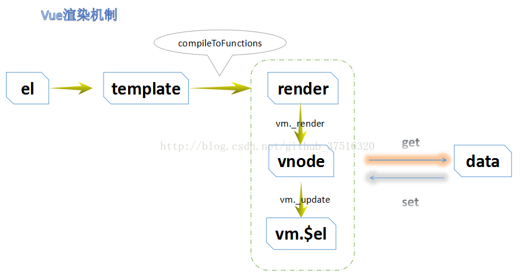
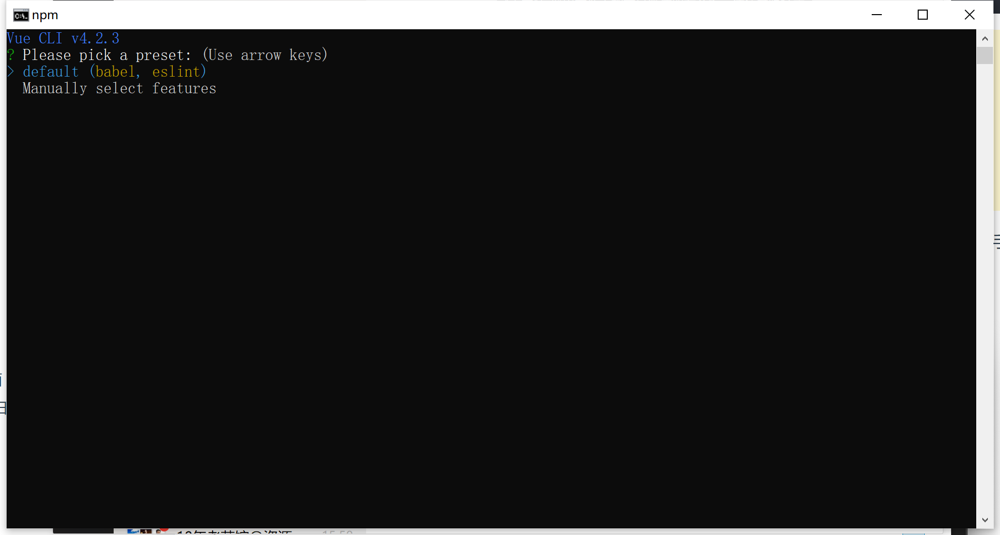
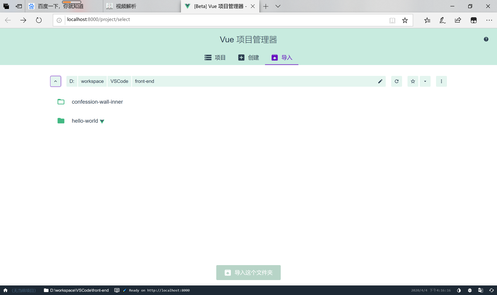
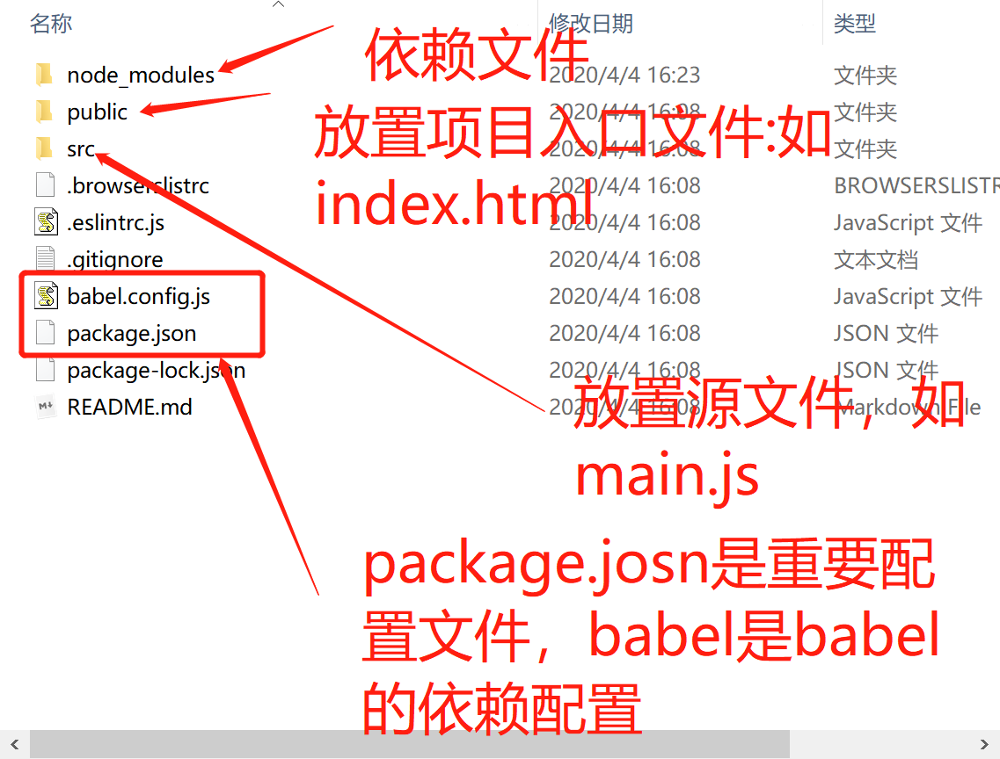

# 1.webpack工程说明

前端工程中会应用各种文件（.js、.css、.less、.sass、.hbs、.png等）,这些格式的文件通过webpack的特定加载器编译后，统一生产.js、.css、.png等文件。在webpack中一张图片，一个css甚至一个字体都称为一个模块（Module），彼此存在依赖关系，webpack就是用来处理这些模块间的依赖关系，并把他们进行打包。

使用webpack初始化一个工程会有一个package.json文件，这个文件对应用的一些描述和启动脚本等。

webpack的核心和本质就是一个.js配置文件而已，在工程下创建webpack.config.js,工程架构的好坏都是在这个文件中进行配置。

webpack.config.js配置webpack 的四个核心：

- 入口(entry):这里使用main.js作为webpack的入口，webpack从这个文件开始查询引入依赖。

- 出口(output):配置webpack打包输出的文件位置。

- 加载器(loaders)：在一个工程中会使用多种格式的文件，不同的文件要通过不同的加载器后才能被webpack编译。
- 插件(plugings)：在入口文件中引入所以，会使入口文件变得臃肿还不能缓存，webpack提供插件功能，如使用extract-text-webpack-plugin插件可以把散落的css文件提取出来，并统一生成一个main.css文件，并在index.html里通过<link>标签引入。

单文件组件：

> 每个.vue文件就代表一个组件，组件之间可以互相依赖。

编写app.vue并在main.js文件中使用

```js
import Vue from 'vue';
//导入app.vue组件
import App from './app.vue'

//创建vue根实例
new Vue({
    el: '#app'
    render:h=> h(App)
})
```

## Vue的$mount

Vue的$mount()为手动挂载，在项目中可用于延时挂载（例如在挂载之前要进行一些其他操作、判断等），之后要手动挂载上。new Vue()时，el和$mount()并没有本质上的不同。

```js
new Vue({
    router,		//路由
    store,		//根实例状态存储，子组件通过，this.$store访问
    render: h => h(App),	//App组件渲染，这里的h即是vm.$createElement
    data:{}
}).$mount('#app')
```

vue渲染机制如下：




# 2.vue/cli介绍

[vue/cli中文官方文档](https://cli.vuejs.org/zh/guide/creating-a-project.html#vue-create)

> vue.js有著名的全家桶系列：
>
> - vue-router:用于页面的路由；
> - vuex:用于前端状态管理（前端数据库）；
> - vue-resource:发起ajax和跨域请求；
> - vue-cli:项目构建工具（项目脚手架）；
>
> vue-cli这个构建工具大大降低了webpack的使用难度，支持热更新，有webpacck-dev-server的支持，相当于启动了一个请求服务器，给你搭建了一个测试环境，只关注开发就ok。
>
> 以下引自官方：
>
> Vue-cli是一个基于Vue.js进行快速开发的完整系统，提供：
>
> - 通过 `@vue/cli` 搭建交互式的项目脚手架。
> - 通过 `@vue/cli` + `@vue/cli-service-global` 快速开始零配置原型开发。
> - 一个运行时依赖 (`@vue/cli-service`)，该依赖：
>   - 可升级；
>   - 基于 webpack 构建，并带有合理的默认配置；
>   - 可以通过项目内的配置文件进行配置；
>   - 可以通过插件进行扩展。
> - 一个丰富的官方插件集合，集成了前端生态中最好的工具。
> - 一套完全图形化的创建和管理 Vue.js 项目的用户界面。
>
> Vue CLI 致力于将 Vue 生态中的工具基础标准化。它确保了各种构建工具能够基于智能的默认配置即可平稳衔接，这样你可以专注在撰写应用上，而不必花好几天去纠结配置的问题。与此同时，它也为每个工具提供了调整配置的灵活性，无需 eject。

vue-cli可以选择使用模板，到github上下载模板，并通过向导的方式交互式的定制这些模板，然后初始化项目目录和一些基础配置以及包依赖。（者就是脚手架）

# 3.安装 Vue Cli 4.X

1. 安装node环境使用npm

   [npm安装配置教程](https://www.cnblogs.com/lgx5/p/10732016.html)

2. 全局安装webpack

   `npm install webpack -g`

   查看webpack版本`webpack -v`,webpack 4.x版本必须安装webpack-cli：

   `npm install webpack webpack-cli -g`

3. 全局安装vue-cli：

   使用`vue -V`，确认版本；如果非4.x则先卸载`npm uninstall vue-cli -g`

   然后安装：

   `npm  install -g @vue/cli`


# 4.创建项目

## 命令行创建项目

命令行进入指定目录，执行创建命令：

`vue create 项目名`

1. 会被提示选取一个 preset。你可以选默认的包含了基本的 Babel + ESLint 设置的 preset，也可以选“手动选择特性”来选取需要的特性。

   

   这个默认的设置非常适合快速创建一个新项目的原型，而手动设置则提供了更多的选项，它们是面向生产的项目更加需要的。

   

   如果你决定手动选择特性，在操作提示的最后你可以选择将已选项保存为一个将来可复用的 preset。我们会在下一个章节讨论 preset 和插件。

   > ~/.vuerc
   >
   > 被保存的 preset 将会存在用户的 home 目录下一个名为 `.vuerc` 的 JSON 文件里。如果你想要修改被保存的 preset / 选项，可以编辑这个文件。
   >
   > 在项目创建的过程中，你也会被提示选择喜欢的包管理器或使用[淘宝 npm 镜像源](https://npm.taobao.org/)以更快地安装依赖。这些选择也将会存入 `~/.vuerc`。

   可以使用`vue create --help`命令，来查看`vue create`命令的一些可选项；

## 图形化界面创建项目

也可以通过图形化界面来创建和管理项目：

使用命令：`vue ui`



## 启动项目

命令行进入项目目录执行如下命令：

`npm run serve`


## 项目目录说明




package.json配置文件说明

```json
{
  "name": "hello-world",	#项目名
  "version": "0.1.0",		#项目版本
  "private": true,
  "scripts": {				#启动打包命令脚本
    "serve": "vue-cli-service serve",		#启动
    "build": "vue-cli-service build",		#打包
    "lint": "vue-cli-service lint"
  },
  "dependencies": {					#打包后项目引入的依赖
    "core-js": "^3.6.4",
    "vue": "^2.6.11"
  },
  "devDependencies": {						#开发时的依赖，打包后丢弃
    "@vue/cli-plugin-babel": "~4.2.0",
    "@vue/cli-plugin-eslint": "~4.2.0",
    "@vue/cli-service": "~4.2.0",
    "babel-eslint": "^10.0.3",
    "eslint": "^6.7.2",
    "eslint-plugin-vue": "^6.1.2",
    "vue-template-compiler": "^2.6.11"
  }
}

```

自定义配置添加

vue/cli使用默认配置，如果要个性化配置要手动添加：

如配置端口号，跨域等

在项目根目录下创建vue.config.js,其中的写法使用ES6写法

```js
//vue.config.js
//模块导出
module.exports = {
    devServer:{
        port:8080,
        host:'localhost',
        open:true	//配置浏览器自动打开访问
    }
}
```


