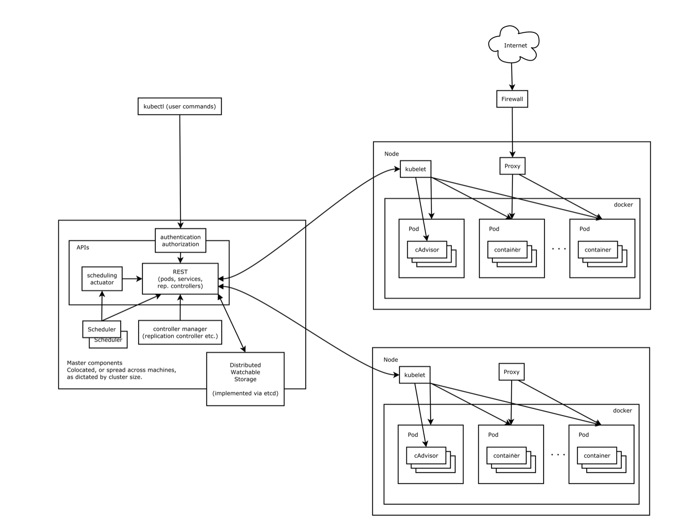

# 1.Kubernetes概述

[中文文档](http://docs.kubernetes.org.cn/230.html)

## 1.1 Kubernetes介绍

kubernetes（k8s）是Google在2014年发布的一个开源项目，用于自动化容器化应用程序的部署，扩展和管理。Kubernetes通常结合docker容器工作，并且整合多个运行这docker容器的主机集群。

[官网地址](https://Kubernetes.io)

[中文社区](https://www.kubernetes.org.cn/docs)

kubernetes的目标是让部署容器化的应用简单并且高效，Kubernetes一个核心特点就是能够自主的管理容器来保证云平台中的容器按照用户的期望运行，以下是Kubernetes相关特性：

- 自动包装
- 横向缩放
- 自动部署和回滚
- 存储编排
- 自我修复
- 服务发现和负载均衡
- 密钥和配置管理


使用kubernetes能做什么

Kubernetes是一个全新的基于容器技术的分布式架构领先方案（源于Brog，是谷歌十几年经验的结晶）

Kubernetes是一个开放的开发平台（无侵入性，现有系统很容易迁移到kubernetes上）；Kubernetes是一个完备的分布式系统支撑平台（完善的集群管理能力）。

使用Kubernetes可以在物理或虚拟即的kubernetes集群上运行容器化应用，Kubernetes能够提供一个以容器为中心的基础架构，满足在生产环境中运行应用的一些常见需求，如：

- 多进程协同工作
- 存储系统挂载
- Distributing secrets
- 应用健康检查
- 应用实例的复制
- Pod自动伸缩扩容
- Narning and discovering
- 负载均衡
- 滚动更新
- 资源监控
- 日志访问
- 调度应用程序
- 提供认证和授权

为什么使用kubernetes

使用Kubernetes最直接的感受是可以轻装上阵的开发复杂的系统；其次Kubernetes是在全面拥抱微服务架构（微服务的核心就是将一个巨大的单体应用拆分成很多笑道互相连接的微服务，一个微服务后面可能是多个实例副本在支撑，副本数量可以随着系统的负载的变化而动态调整）；最后kubernetes系统架构具备超强的横向扩展能力。

## 1.2 快速入门

使用Kubernetes部署Tomcat

- 环境准备

  - 关闭CentOS防火墙

    systemctl disable firewalld

    systemctl stop firewalld

  - 安装etcd和kubernetes软件

    yum update

    yum install -y etcd kubernetes

  - 启动服务

    systemctl start etcd

    systemctl status etcd

    systemctl start docker

    ```txt
    如果docker启动失败，参考（vi /etc/sysconfig/selinux 把selinux后面的改为disabled，重启一波机器reboot -n，在启动docker就可以了）
    ```

    systemctl start kube-apiserver

    systemctl start kube-controller-manager

    systemctl start kube-scheduler

    systemctl start kubelet

    systemctl start kube-proxy

- 配置

  创建目录 

  mkdir /usr/local/k8s

  cd /usr/local/k8s

  新建如下配置文件

  vi mytomcat-rc.yaml

  - tomcat配置

    - mytomcat.rc.yaml

      ```yml
      apiVersion: v1
      kind: ReplicationController
      metadata:
      	name: mytomcat
      spec:
      	replicas: 2
      	selector:
      		app: mytomcat
      	template:
      		metadata:
      			labels:
      				app: mytomcat
      		spec:
      			containers:
      				- name: mytomcat
      				  image: tomcat:7-jre
      				  ports:
      				  - containerPort: 8080
      ```

      kubectl create -f mytomcat-rc.yaml

      kubectl get pods

    - mytomcat-svc.yaml

      vi mytomcat-svc.yaml
      
      ```yaml
      apiVersion: v1
      kind: Service
      metadata:
      	name: mytomcat
      spec:
      	type: NodePort
      ports:
         - port: 8080
           nodePort: 30001
      selector:
    app: mytomcat
      ```

      kubectl create -f mytomcat-svc.yaml
      
      kubectl get svc

- 问题解决：

  - 解决kubectl get pods时No resources found问题，1、vim /etc/kubernetes/apiserver 2、找到`KUBE_ADMISSION_CONTROL=“admission_control=NamespaceLifecycle.NamespaceExists.LimitRanger.SecurityContextDeny.ServiceAccount.ResourceQuota”`，去掉ServiceAccount,保存退出。

    3、systemctl restart kube-apiserver重启此服务

  - docker pull失败

    - 解决方案1

    1. yum install rhsm -y

    2. docker pull registry-access.redhat.com/rhel7/pod-infrastructure:latest

       如果以上两步解决问题了，那么就不需要执行下面操作

    3. docker search pod-infrastructrue

    4. docker pull docker.io/tianyebj/pod-infrastructure

    5. docker tag tianyebj/pod-instructure 192.168.126.143:5000/pod-infrastructure

    6. docker push 192.168.126.143:5000/pod-infrastructure

    7. vi /etc/kubernetes/kubelet

       修改`KUBELET_POD_INFRA_CONTAINER="-pod-infra-container-image=192.168.126.143:5000/pod-infrastructure:latest"`

    8. 重启服务

       ```shell
       systemctl restart kube-apiserver
       systemctl restart kube-controller-manager
       systemctl restart kube-scheduler
       systemctl restart kubelet
       systemctl restart kube-proxy
       ```

    - 解决方案2

    1. docker pull kubernetes/pause

    2. docker tag docker.io/kubernetes/pause:latest 192.168.126.143:5000/google_containers/pause-amd64.3.0

    3. docker push 192.168.126.143:5000/google_containers/pause-amd64.3.0

    4. vi /etc/kubernetes/kubelet配置为：

       `pod_infra_container_image=192.168.126.143:5000/google_containers/pause-amd64.3.0`

    5. 重启kubelet服务 `systemclt restart kubelet`

  - 外部网不能访问

    在搭建好k8s集群内创建的容器，只能在其所在的结点上curl可访问，但在其他任何主机上无法访问容器占用的端口

    解决方案：

    1. vim /etc/sysctl.conf
    2. net.ipv4.ip_forward=1

    ```shell
    #重新替换
    kubectl replace -f mytomcat-rc.yaml
    kubectl delete svc --all
    kubectl create -f mytomcat-svc.yaml
    ```

    


## 1.3kubenetes基本架构与常用术语

Kubernetes集群包含节点代理kubelet和Master组件（APIs、scheduler、etcd），一切都基于分布式的存储系统。

下图中，把服务分为运行在工作节点上的服务和组成集群级别控制板的服务。



Kubernetes节点有运行应用容器必备的服务，而这些都是受Master的控制

每个节点上都要运行Docker，Docker来负责所有具体的镜像下载和容器运行。

### 1.3.1 核心组件

Kubernetes主要由以下几个核心组件构成：

- etcd保存了整个集群的状态；
- apiserver提供了资源操作的唯一入口，并提供认证、授权、访问控制、API注册和发现等机制；
- controller manager负责维护集群的状态，比如故障检测、自动扩展、滚动更新等；
- scheduler负责资源的调度，按照预定的调度策略将Pod调度到相应的机器上；
- kubelet负责维护容器的生命周期，同时也负责Volume（CVI）和网络（CNI）的管理；
- Container runtime负责镜像管理以及Pod和容器的真正运行（CRI）；
- kube-proxy负责为Service提供cluster内部的服务发现和负载均衡；

 

除了核心组件，还有一些推荐的Add-ons：

- kube-dns负责为整个集群提供DNS服务
- Ingress Controller为服务提供外网入口
- Heapster提供资源监控
- Dashboard提供GUI
- Federation提供跨可用区的集群
- Fluentd-elasticsearch提供集群日志采集、存储与查询


### 1.3.2 分层架构

Kubernetes设计理念和功能其实就是一个类似Linux的分层架构：


- 核心层：Kubernetes最核心的功能，对外提供API构建高层的应用，对内提供插件式应用执行环境
- 应用层：部署（无状态应用、有状态应用、批处理任务、集群应用等）和路由（服务发现、DNS解析等）
- 管理层：系统度量（如基础设施、容器和网络的度量），自动化（如自动扩展、动态Provision等）以及策略管理（[RBAC](http://docs.kubernetes.org.cn/148.html)、Quota、PSP、NetworkPolicy等）
- 接口层：[kubectl命令行工具](http://docs.kubernetes.org.cn/61.html)、客户端SDK以及集群联邦
- 生态系统：在接口层之上的庞大容器集群管理调度的生态系统，可以划分为两个范畴 
  - Kubernetes外部：日志、监控、配置管理、CI、CD、Workflow、FaaS、OTS应用、ChatOps等
  - Kubernetes内部：CRI、CNI、CVI、镜像仓库、Cloud Provider、集群自身的配置和管理等

### 1.3.3 Cluster

Cluster是计算、存储和网络资源的集合，Kubernetes利用这些资源运行各种基于容器的应用。

Kubernetes Cluster由Master和Node组成，节点上运行这若干Kubernetes服务。

### 1.3.4 Master

Master主要职责是调度，即决定将应用放在哪里运行。Master运行Linux系统，可以是物理机也可以是虚拟机，Master是Kubernetes Cluster的大脑，运行着的Daemon服务包括kube-apiserver、kube-scheduler、kube-controller-manager、etcd和Pod网络

- API Servre(Kube-apiserver)

  API Server提供HTTP/HTTPS RESTFul API,即Kubernetes API是kubernetes里所有资源的CRUD等操作的唯一入口，也是集群控制的入口进程；

- Scheduler（kube-scheduler）

  Scheduler负责资源调度的里程，简单说，它决定将Pod放在那个Node上运行；

- Controller（kube-controller-manager）

  所有资源对象的自动化控制中心。Controller Manager负责管理Cluster各种资源，保证资源处于预期的状态。Controller Manager有多种，如replicaton controller、endpoints controller、namespace controller、serviceaccounts controller等。

  不同的controller负责不同的资源，如replication controller管理Deployment、StatefulSet、DaemonSet的声明周期，namespace controller管理Namgespace资源

- etcd

  etcd负责保存Kubernetes Cluster的配置信息和各种资源的状态信息。当数据发生变化时，etcd会快速地通知Kubernetes相关组件。

- Pod网络

  Pod要能够互相通信，Kubernetes Cluster必须部署Pod网络，flannel是其中一个可选方案。

### 1.3.5 Node

除了Master，Kubernetes集群中的其它机器被称为Node节点，Node职责是运行容器应用，Node由Master管理，Node负责监控并回报容器的状态，同时根据Master的要求管理容器的生命周期。Node也运行在Linux系统，可以是物理机或虚拟机。

每个Node节点上都运行这以下一组关键进程

- kubelet

  负责Pod对应的容器的创建、启动等任务，同时与Master节点，实现集权管理的基本功能。

- kube-proxy

  实现Kubernetes-Service的通信与负载均衡机制的重要组件

- Docker Enginer

  Docker引擎，负责本机的容器创建和管理工作

### 1.3.6 Pod

Pod是Kubernetes的最小单元，也是最重要和最基本的概念。每一个Pod包含一个或多个容器，Pod的容器会作为一个整体被Master调度到一个Node上运行。Kubernetes为每一个Pod都分配了唯一的IP地址，称为PodIP，一个Pod里的多个容器共享PodIP地址。在Kubernetes里，一个Pod里的容器与另一个主机上的Pod容器是可以直接通信的。

### 1.3.7 Service

Kubernetes Service定义了外界访问的一组特定Pod的方式，Service有自己的IP和端口，Service为Pod提供了负载均衡。他也是Kubernetes最核心的资源对象之一，每个Service其实就是我们经常提起的微服务架构中的一个“微服务”。

### 1.3.8 Replication Controller

Replication Controller(简称RC)是Kubernetes系统中的核心概念之一，它其实是定义了一个期望的场景，即声明某种Pod的副本数量在任意时刻都符合某个预期值，所以RC的定义包含如下几个部分：

- Pod期待的副本数（replicas）

- 用于筛选目标Pod的Label Selector

- 当Pod的副本数量小于期望数量时，用于创建新Pod的Pod模板（template）

  以下是总结的RC的一些特性与作用

  - 在大多数情况下，我们通过定义一个RC实现Pod的创建过程及副本数量的自动控制
  - RC里包括完整的Pod定义模板
  - RC通过Label Selector机制实现对Pod副本的自动控制
  - 通过改变RC里Pod副本数量，可以实现Pod的扩容或缩容功能
  - 通过改变RC里Pod模板中镜像版本，可以实现Pod的滚动升级功能