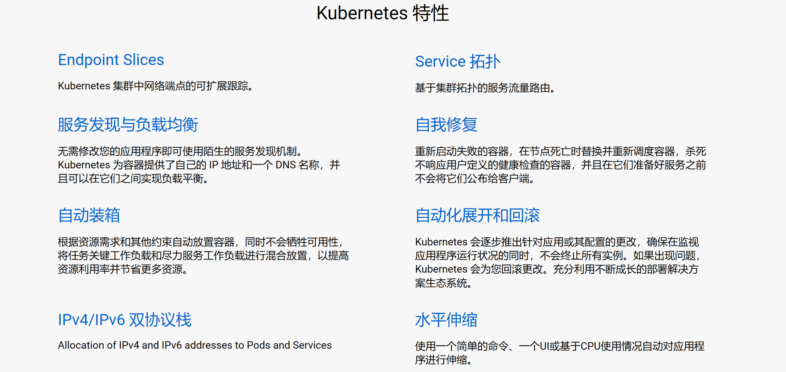

# 1.Kubernetes概述

## 1.1 Kubernetes介绍

kubernetes（k8s）是Google在2014年发布的一个开源项目，用于自动化容器化应用程序的部署，扩展和管理。Kubernetes通常结合docker容器工作，并且整合多个运行这docker容器的主机集群。

[官网地址](https://Kubernetes.io)

[中文社区](https://www.kubernetes.org.cn/docs)

kubernetes的目标是让部署容器化的应用简单并且高效，Kubernetes一个核心特点就是能够自主的管理容器来保证云平台中的容器按照用户的期望运行，以下是Kubernetes相关特性：

- 自动包装
- 横向缩放
- 自动部署和回滚
- 存储编排
- 自我修复
- 服务发现和负载均衡
- 密钥和配置管理



使用kubernetes能做什么

Kubernetes是一个全新的基于容器技术的分布式架构领先方案（源于Brog，是谷歌十几年经验的结晶）

Kubernetes是一个开放的开发平台（无侵入性，现有系统很容易迁移到kubernetes上）；Kubernetes是一个完备的分布式系统支撑平台（完善的集群管理能力）。

使用Kubernetes可以在物理或虚拟即的kubernetes集群上运行容器化应用，Kubernetes能够提供一个以容器为中心的基础架构，满足在生产环境中运行应用的一些常见需求，如：

- 多进程协同工作
- 存储系统挂载
- Distributing secrets
- 应用健康检查
- 应用实例的复制
- Pod自动伸缩扩容
- Narning and discovering
- 负载均衡
- 滚动更新
- 资源监控
- 日志访问
- 调度应用程序
- 提供认证和授权

为什么使用kubernetes

使用Kubernetes最直接的感受是可以轻装上阵的开发复杂的系统；其次Kubernetes是在全面拥抱微服务架构（微服务的核心就是将一个巨大的单体应用拆分成很多笑道互相连接的微服务，一个微服务后面可能是多个实例副本在支撑，副本数量可以随着系统的负载的变化而动态调整）；最后kubernetes系统架构具备超强的横向扩展能力。

1.2 快速入门

- 环境准备

  - 关闭CentOS防火墙

    systemctl disable firewalld

    systemctl stop firewalld

  - 安装etcd和kubernetes软件

    yum update

    yum install -y etcd kubernetes

  - 启动服务

    systemctl start etcd

    systemctl status etcd

    systemctl start docker

    ```txt
    如果docker启动失败，参考（vi /etc/sysconfig/selinux 把selinux后面的改为disabled，重启一波机器reboot -n，在启动docker就可以了）
    ```

    systemctl start kube-apiserver

    systemctl start kube-controller-manager

    systemctl start kube-scheduler

    systemctl start kubelet

    systemctl start kube-proxy

- 配置

  创建目录 

  mkdir /usr/local/k8s

  cd /usr/local/k8s

  新建如下配置文件

  vi mytomcat_rc.yaml

  - tomcat配置

    - mytomcat_rc.yaml

      ```yml
      apiVersion: v1
      kind: ReplicationController
      metadata:
      	name: mytomcat
      spec:
      	replicas: 2
      	selector:
      		app: mytomcat
      	template:
      		metadata:
      			labels:
      				app: mytomcat
      		spec:
      			containers:
      				- name: mytomcat
      				  image: tomcat
      				  ports:
      				  - containerPort: 8080
      ```

      kubectl create -f mytomcat-rc.yaml

      kubectl get pods

    - mytomcat_svc.yaml

      ```yaml
      apiVersion: v1
      kind: Service
      metadata:
      	name: mytomcat
      spec:
      	type: NodePort
      ports:
          port: 8080
          nodePort: 30001
          selector:
          app: mytomcat
      ```

      kubectl create -f mytomcat-svc.yaml

      kubectl get svc