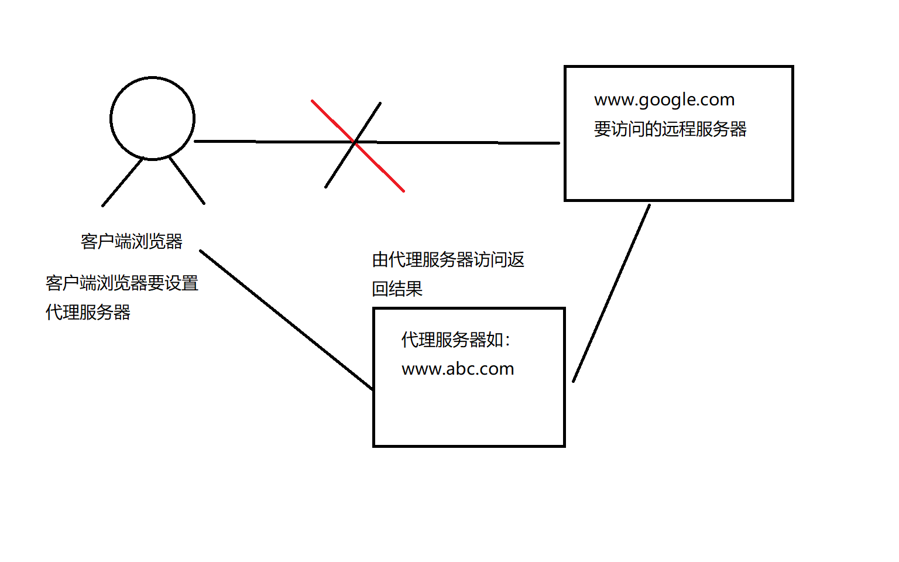
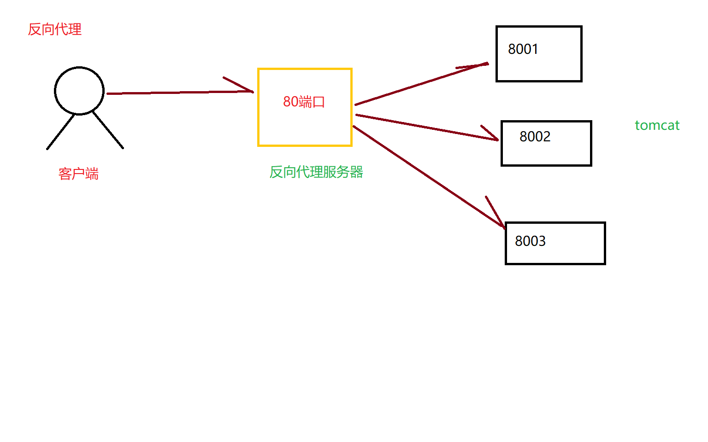

# 1.基本概述

1. Nginx基本概念
   - nginx是什么，能做什么
   - 反向代理
   - 负载均衡
   - 动静分离
2. Nginx安装、常用命令和配置文件
   - 在Linux中安装nginx
   - nginx常用命令
   - nginx配置文件
3. Nginx配置实例 1-反向代理
4. Nginx配置实例 2-负载均衡
5. Nginx配置实例 3-动静分离
6. Nginx配置高可用集群
7. Nginx原理

# 2.Nginx简介

> 1.什么是Nginx
>
> Nginx（“engine x”）是一个高性能的HTTP和反向代理服务器，特点是占有内存少，并发能力强事实上nginx的并发能力确实在同类的网页服务器中表现较好。
>
> Nginx转为高性能而开发，性能是其重要考量，实现上非常注重效率，能经受高负载的考验，有报告表明能支持高达50000个并发连接数。
>
> 2.基本概念
>
> - 反向代理
>
> - 负载均衡
>
> - 动静分离

## 2.1正向代理

> Nginx不仅可以做反向代理，实现负载均衡。还能用作正向代理来进行上网等功能。
>
> 正向代理：如果把局域网外的Internet想象成一个巨大的资源库，则局域网中的客户端要访问Internet，则需要通过代理服务器来访问，这种代理服务，这种代理服务就称为正向代理。
>
> 

## 2.2 反向代理

> 反向代理，其实客户端对代理是无感知的，因为客户端不需要任何配置就可以访问，我们只需要将请求发送到反向大力服务器，由反向代理服务器去选择目标服务器获取数据后，再返回给客户端，此时反向代理服务器和目标服务器对外就是一个服务器，暴露的是代理服务器地址，隐藏了真实服务器IP地址。
>
> 

**理解对比：正向代理和反向代理都走了代理服务器，正向代理需要在客户端之名配置，访问哪个地址映射到具体的代理地址。而反向代理，将映射在服务端配置，对用户透明。**

## 2.3 负载均衡

> 单服务器解决不了，就增加服务器数量，然后将请求分发到各个服务器上，将原先请求集中到单个服务器上的情况改为将请求分发到多个服务器上，将负载分发到不同的服务器，也就是所说的负载均衡。

## 2.4 动静分离

> 为了加快网站的解析速度，可以把动态页面和静态页面由不同的服务器来解析，加快解析速度，降低原来单个服务器的压力。

